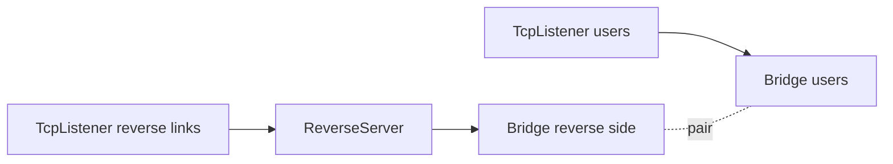
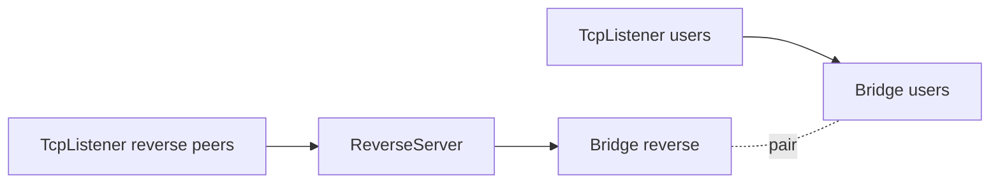

<!-- Written from version 106 of the English doc. -->

# ReverseServer

`ReverseServer` سمت server برای `ReverseClient` است. این نود از یک سمت
connectionهای reverse آماده را از `ReverseClient` می‌گیرد، و از سمت دیگر
connectionهای واقعی user/local را دریافت می‌کند. سپس یک half از هر سمت را با
هم pair می‌کند تا ترافیک از تونل reverse عبور کند.

این نود معمولاً روی ماشینی قرار می‌گیرد که reachable است و می‌تواند هم
connectionهای peer و هم connectionهای user/local را دریافت کند.

## چرا معمولاً Bridge لازم است

`ReverseServer` باید دو منبع connection را به هم وصل کند:

- reverse linkهایی که از `ReverseClient` آمده‌اند
- connectionهای واقعی user/local که باید از آن reverse linkها استفاده کنند

در configهای رایج این دو مسیر با یک جفت `Bridge` وصل می‌شوند:



listener مربوط به peers مسیر reverse linkها را به `ReverseServer` می‌دهد. listener مربوط به users ترافیک واقعی را به Bridge جفت‌شده می‌دهد. سپس `ReverseServer` یک reverse half و یک local/user half را pair می‌کند.

این نکته مهم است: `ReverseServer` یک tunnel ساده چپ به راست نیست؛ یک matcher دینامیک بین دو نوع connection است.

## این نود چه می‌کند؟

- reverse linkهای آمده از `ReverseClient` را می‌پذیرد.
- handshake داخلی reverse link را validate می‌کند.
- connectionهای local/user را از سمت دیگر topology می‌پذیرد.
- تا زمان پیدا شدن peer، مقدار محدودی داده را buffer می‌کند.
- یک reverse half و یک local/user half را pair می‌کند.
- payload، finish، pause و resume را بین دو سمت paired عبور می‌دهد.
- handshakeهای نامعتبر را drop می‌کند.
- اگر داده buffer شده زیاد شود، half منتظر را drop می‌کند.
- برای pair شدن بین workerها می‌تواند reverse half را از مسیر pipe داخلی به worker دیگر منتقل کند.

## جایگاه رایج

```text
peer listener -> ReverseServer -> Bridge(reverse side)
user listener -> Bridge(user side)
```

نمونه topology:



روی listener مربوط به reverse peers معمولاً whitelist می‌گذاریم تا فقط ماشین `ReverseClient` بتواند reverse link باز کند.

## نمونه تنظیم

```json
{
  "name": "reverse-server",
  "type": "ReverseServer",
  "settings": {
    "reverse-secret-length": 640,
    "reverse-secret": "shared-secret"
  },
  "next": "bridge_reverse"
}
```

نمونه کامل با Bridge:

```json
{
  "name": "users_inbound",
  "type": "TcpListener",
  "settings": {
    "address": "0.0.0.0",
    "port": 443,
    "nodelay": true
  },
  "next": "bridge_users"
}
```

```json
{
  "name": "bridge_users",
  "type": "Bridge",
  "settings": {
    "pair": "bridge_reverse"
  }
}
```

```json
{
  "name": "bridge_reverse",
  "type": "Bridge",
  "settings": {
    "pair": "bridge_users"
  }
}
```

```json
{
  "name": "reverse_server",
  "type": "ReverseServer",
  "settings": {},
  "next": "bridge_reverse"
}
```

```json
{
  "name": "reverse_peer_inbound",
  "type": "TcpListener",
  "settings": {
    "address": "0.0.0.0",
    "port": 8443,
    "nodelay": true,
    "whitelist": [
      "203.0.113.10/32"
    ]
  },
  "next": "reverse_server"
}
```

در سناریوی واقعی معمولاً TLS، HTTP، Mux، Reality یا سایر transport/security nodeها قبل از `ReverseServer` اضافه می‌شوند.

## فیلدهای اجباری

فیلدهای top-level:

| فیلد | نوع | توضیح |
| --- | --- | --- |
| `name` | string | نام یکتای نود داخل config. |
| `type` | string | باید دقیقاً `"ReverseServer"` باشد. |
| `next` | string | اجباری در layout های Bridge عملی. معمولاً سمت Bridge که به user/local traffic منتهی می‌شود. |

`settings` می‌تواند حذف شود یا خالی باشد. اگر موجود باشد، باید object باشد.

## تنظیمات اختیاری

| گزینه | نوع | پیش‌فرض | توضیح |
| --- | --- | --- | --- |
| `reverse-secret-length` | integer | `640` | طول handshake داخلی. باید در بازه `1..1024` باشد. |
| `reverse-secret` | ASCII string | unset | byteهای handshake مورد انتظار را با secret به صورت تکرارشونده XOR می‌کند. وقتی تنظیم شود باید ASCII غیرخالی باشد. |

`ReverseServer` و `ReverseClient` و هر `SniffRouter` که reverse link را تشخیص می‌دهد باید مقدارهای یکسانی برای این گزینه‌ها داشته باشند.

## Handshake داخلی

reverse-link side با یک handshake داخلی از `ReverseClient` شناخته می‌شود.

handshake پیش‌فرض مورد انتظار:

```text
640 bytes of 0xFF
```

اگر `reverse-secret` تنظیم شده باشد، همان XOR transformation که توسط `ReverseClient` استفاده می‌شود قبل از مقایسه اعمال می‌شود.

`ReverseServer` byteهای ورودی reverse-link را تا زمانی که داده کافی برای validate کردن کامل handshake وجود داشته باشد buffer می‌کند:

- اگر handshake match کرد، handshake bytes حذف می‌شوند
- هر payload بعد از handshake به عنوان داده buffer شده نگه داشته می‌شود
- اگر handshake اشتباه بود، آن reverse-link half drop می‌شود

## مدل Two-Sided Matching

`ReverseServer` برای هر worker دو لیست انتظار نگه می‌دارد:

| half منتظر | معنی |
| --- | --- |
| reverse-link half | connection آمده از `ReverseClient` که handshake را پاس کرده است. |
| local/user half | connection واقعی که منتظر reverse link است. |

وقتی payload روی یک reverse-link half غیر-paired برسد:

1. byteهای buffer شده در صورت نیاز با payload جدید merge می‌شوند
2. reverse handshake validate می‌شود
3. half به لیست انتظار reverse اضافه می‌شود
4. اگر local/user half در انتظار باشد، دو half pair می‌شوند

وقتی payload روی یک local/user half غیر-paired برسد:

1. byteهای buffer شده در صورت نیاز با payload جدید merge می‌شوند
2. half به لیست انتظار local/user اضافه می‌شود
3. اگر reverse-link half در انتظار باشد، دو half pair می‌شوند

بعد از pair شدن:

| سمت ورودی | رفتار forwarding |
| --- | --- |
| reverse-link payload | به سمت local/user با upstream payload فرستاده می‌شود. |
| local/user payload | به سمت reverse-link با downstream payload فرستاده می‌شود. |
| finish از هر سمت | سمت مقابل را می‌بندد. |
| pause/resume | به paired peer half منعکس می‌شود. |

## مدل جهت‌ها

| Callback | رفتار |
| --- | --- |
| upstream `Init` | یک reverse-link half initialize می‌کند و فوراً downstream establishment به previous side گزارش می‌دهد. |
| upstream `Payload` | handshake `ReverseClient` را قبل از pair شدن پردازش می‌کند؛ بعد از pair، با `tunnelNextUpStreamPayload()` به سمت local/user forward می‌کند. |
| downstream `Init` | یک local/user half initialize می‌کند و فوراً upstream establishment به next side گزارش می‌دهد. |
| downstream `Payload` | منتظر reverse-link half می‌ماند یا با آن pair می‌شود؛ بعد از pair، با `tunnelPrevDownStreamPayload()` به سمت reverse forward می‌کند. |
| `Pause` / `Resume` | فقط بعد از وجود pair forward می‌شود. |
| `Finish` | halfهای منتظر unpaired را حذف یا peer half paired را finish می‌کند. |

callback فوری establishment یعنی half توسط `ReverseServer` پذیرفته شده؛ نه اینکه tunnel حتماً pair شده و payload مفید forward می‌کند.

## Cross-Worker Pairing

لیست‌های انتظار per-worker هستند. اگر یک reverse-link half روی یک worker برسد و یک local/user half روی worker دیگری منتظر باشد، `ReverseServer` می‌تواند reverse-link half را از یک pipe tunnel layer داخلی عبور دهد و pair را روی target worker کامل کند.

به همین دلیل یک reverse setup می‌تواند کار کند حتی اگر دو half توسط worker thread یکسانی accept نشده باشند.

## محدودیت Buffer

هر half که هنوز pair نشده است می‌تواند مقدار محدودی داده buffer کند:

```text
65535 bytes per waiting half
```

اگر این مقدار بیشتر شود، آن half drop می‌شود و finish سمت peer به صورت مناسب propagate می‌شود.

## متادیتای نود

| ویژگی | مقدار |
| --- | --- |
| `can_have_prev` | `true` |
| `can_have_next` | `true` |
| `layer_group` | `kNodeLayerAnything` |
| `required_padding_left` | `0` bytes |

`ReverseServer` بعد از handshake header جدید prepend نمی‌کند و به left padding نیاز ندارد.

## نکته‌های عملی

- تنظیمات reverse secret را در هر دو peer یکسان نگه دارید.
- روی listener ای که reverse linkها را از ماشین `ReverseClient` می‌پذیرد، access control مثل `TcpListener.whitelist` اعمال کنید.
- از `Bridge` برای وصل کردن سمت user/local traffic به شکل تمیز استفاده کنید.
- handshakeهای نامعتبر reverse-link drop می‌شوند.
- payloadهای unpaired بزرگ بعد از تجاوز از محدودیت buffer drop می‌شوند.
- `ReverseServer` با `ReverseClient` کاملاً coupled است؛ آن را با یک client generic که reverse handshake مورد انتظار را نمی‌فرستد pair نکنید.
