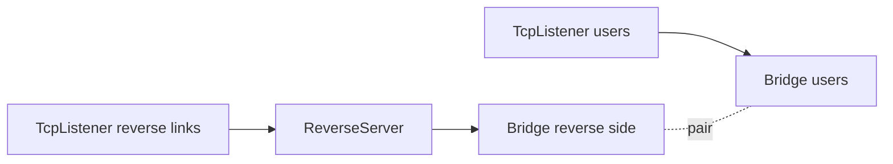
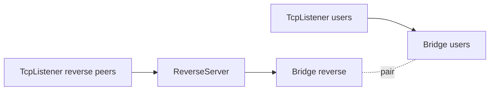

<!--
Documentation version: 152
-->

# ReverseServer

`ReverseServer` همتای سمت server برای `ReverseClient` است. از یک طرف
reverse connectionهای آماده `ReverseClient` و از طرف دیگر connectionهای واقعی
user/local را می‌پذیرد؛ سپس یک half از هر طرف را جفت می‌کند تا ترافیک از reverse
tunnel عبور کند.

این نود معمولاً روی ماشینی در دسترس قرار می‌گیرد که می‌تواند هم connectionهای
peer و هم connectionهای user/local را بپذیرد.

## چرا معمولاً Bridge لازم است

`ReverseServer` باید دو منبع connection را به هم وصل کند:

- reverse linkهایی که از `ReverseClient` آمده‌اند
- connectionهای واقعی user/local که باید از آن reverse linkها استفاده کنند

در configهای رایج این دو مسیر با یک جفت `Bridge` وصل می‌شوند:



listener مربوط به peerها reverse linkها را به `ReverseServer` می‌رساند و listener مربوط به کاربران ترافیک واقعی را به `Bridge` متناظر می‌دهد. سپس `ReverseServer` یک reverse half را با یک local/user half جفت می‌کند.

در نتیجه `ReverseServer` یک tunnel ساده از چپ به راست نیست، بلکه به‌صورت پویا دو نوع connection را با هم تطبیق می‌دهد.

نود بعدی `ReverseServer` باید مستقیماً `Bridge` باشد: `ReverseServer -> Bridge`، بدون هیچ نود واسطه. قاعدهٔ متناظر در سمت کلاینت نیز `Bridge -> ReverseClient` است و بین این دو نود هم نباید نود دیگری قرار بگیرد. رعایت این قواعد در طراحی زنجیره بر عهدهٔ کاربر است؛ کد هیچ‌یک از این دو قاعدهٔ مجاورت را به‌صورت خودکار بررسی و اعمال نمی‌کند.

## این نود چه می‌کند؟

- reverse linkهای آمده از `ReverseClient` را می‌پذیرد.
- handshake داخلی reverse link را اعتبارسنجی می‌کند.
- connectionهای local/user را از سمت دیگر topology می‌پذیرد.
- تا پیدا شدن peer، مقدار محدودی داده را در buffer نگه می‌دارد.
- یک reverse half و یک local/user half را pair می‌کند.
- payload، finish، pause و resume را بین دو سمت paired عبور می‌دهد.
- handshakeهای نامعتبر را کنار می‌گذارد.
- اگر حجم داده ذخیره‌شده در buffer بیش از حد شود، half منتظر را کنار می‌گذارد.
- برای جفت‌سازی میان workerها می‌تواند reverse half را از طریق pipe داخلی به worker دیگری منتقل کند.

## جایگاه رایج

```text
peer listener -> ReverseServer -> Bridge(reverse side)
user listener -> Bridge(user side)
```

نمونه topology:



معمولاً روی listener مربوط به reverse peerها whitelist قرار می‌دهیم تا فقط ماشین `ReverseClient` بتواند reverse link باز کند.

## نمونه تنظیم

```json
{
  "name": "reverse-server",
  "type": "ReverseServer",
  "settings": {
    "reverse-secret-length": 640,
    "reverse-secret": "shared-secret"
  },
  "next": "bridge_reverse"
}
```

نمونه کامل با Bridge:

```json
{
  "name": "users_inbound",
  "type": "TcpListener",
  "settings": {
    "address": "0.0.0.0",
    "port": 443,
    "nodelay": true
  },
  "next": "bridge_users"
}
```

```json
{
  "name": "bridge_users",
  "type": "Bridge",
  "settings": {
    "pair": "bridge_reverse"
  }
}
```

```json
{
  "name": "bridge_reverse",
  "type": "Bridge",
  "settings": {
    "pair": "bridge_users"
  }
}
```

```json
{
  "name": "reverse_server",
  "type": "ReverseServer",
  "settings": {},
  "next": "bridge_reverse"
}
```

```json
{
  "name": "reverse_peer_inbound",
  "type": "TcpListener",
  "settings": {
    "address": "0.0.0.0",
    "port": 8443,
    "nodelay": true,
    "whitelist": [
      "203.0.113.10/32"
    ]
  },
  "next": "reverse_server"
}
```

در سناریوی واقعی معمولاً TLS، HTTP، Mux، Reality یا سایر transport/security nodeها قبل از `ReverseServer` اضافه می‌شوند.

## فیلدهای اجباری

فیلدهای top-level:

| فیلد | نوع | توضیح |
| --- | --- | --- |
| `name` | string | نام یکتای نود داخل config. |
| `type` | string | باید دقیقاً `"ReverseServer"` باشد. |
| `next` | string | اجباری در layout های Bridge عملی. باید نام Bridge مجاور را مشخص کند که به user/local traffic منتهی می‌شود؛ هیچ نود واسطه‌ای مجاز نیست. |

`settings` می‌تواند حذف شود یا خالی باشد. اگر موجود باشد، باید object باشد.

## تنظیمات اختیاری

| گزینه | نوع | پیش‌فرض | توضیح |
| --- | --- | --- | --- |
| `reverse-secret-length` | integer | `640` | طول handshake داخلی. باید در بازه `1..1024` باشد. |
| `reverse-secret` | ASCII string | unset | byteهای handshake مورد انتظار را با secret به‌صورت تکرارشونده XOR می‌کند. وقتی تنظیم شود باید ASCII غیرخالی باشد. |

`ReverseServer` و `ReverseClient` و هر `SniffRouter` که reverse link را تشخیص می‌دهد باید مقدارهای یکسانی برای این گزینه‌ها داشته باشند.

## Handshake داخلی

reverse-link side با یک handshake داخلی از `ReverseClient` شناخته می‌شود.

handshake پیش‌فرض مورد انتظار:

```text
640 bytes of 0xFF
```

اگر `reverse-secret` تنظیم شده باشد، همان XOR transformation که توسط `ReverseClient` استفاده می‌شود قبل از مقایسه اعمال می‌شود.

`ReverseServer` بایت‌های ورودی reverse link را تا زمانی که داده کافی برای اعتبارسنجی کامل handshake برسد در buffer نگه می‌دارد:

- اگر handshake match باشد، بایت‌های آن حذف می‌شوند
- هر payload پس از handshake به‌عنوان داده ذخیره‌شده در buffer نگه داشته می‌شود
- اگر handshake اشتباه باشد، آن reverse-link half کنار گذاشته می‌شود

## مدل Two-Sided Matching

`ReverseServer` برای هر worker دو لیست انتظار نگه می‌دارد:

| half منتظر | معنی |
| --- | --- |
| reverse-link half | connection آمده از `ReverseClient` که handshake را پاس کرده است. |
| local/user half | connection واقعی که منتظر reverse link است. |

وقتی payload روی یک reverse-link half غیر-paired برسد:

1. در صورت نیاز، بایت‌های bufferشده با payload جدید ترکیب می‌شوند
2. reverse handshake اعتبارسنجی می‌شود
3. half به لیست انتظار reverse اضافه می‌شود
4. اگر local/user half در انتظار باشد، دو half pair می‌شوند

وقتی payload روی یک local/user half غیر-paired برسد:

1. در صورت نیاز، بایت‌های bufferشده با payload جدید ترکیب می‌شوند
2. half به لیست انتظار local/user اضافه می‌شود
3. اگر reverse-link half در انتظار باشد، دو half pair می‌شوند

بعد از pair شدن:

| سمت ورودی | رفتار forwarding |
| --- | --- |
| reverse-link payload | در جهت upstream به سمت local/user فرستاده می‌شود. |
| local/user payload | در جهت downstream به سمت reverse link فرستاده می‌شود. |
| finish از هر سمت | سمت مقابل را می‌بندد. |
| pause/resume | به paired peer half منعکس می‌شود. |

## مدل جهت‌ها

| Callback | رفتار |
| --- | --- |
| upstream `Init` | یک reverse-link half را مقداردهی اولیه می‌کند و فوراً برقراری downstream را به previous side گزارش می‌دهد. |
| upstream `Payload` | پیش از جفت شدن، handshake مربوط به `ReverseClient` را پردازش می‌کند؛ پس از جفت شدن نیز payload را با `tunnelNextUpStreamPayload()` به سمت local/user می‌فرستد. |
| downstream `Init` | یک local/user half را مقداردهی اولیه می‌کند و فوراً برقراری upstream را به next side گزارش می‌دهد. |
| downstream `Payload` | منتظر reverse-link half می‌ماند یا با آن جفت می‌شود؛ پس از جفت شدن نیز payload را با `tunnelPrevDownStreamPayload()` به سمت reverse می‌فرستد. |
| `Pause` / `Resume` | فقط پس از جفت شدن دو half عبور داده می‌شوند. |
| `Finish` | halfهای جفت‌نشده منتظر را حذف می‌کند یا peer half جفت‌شده را با `Finish` می‌بندد. |

callback فوری establishment فقط به این معناست که `ReverseServer` آن half را پذیرفته است؛ نه اینکه tunnel حتماً جفت شده و payload مفیدی را عبور می‌دهد.

## Cross-Worker Pairing

لیست‌های انتظار per-worker هستند. اگر یک reverse-link half روی یک worker برسد و یک local/user half روی worker دیگری منتظر باشد، `ReverseServer` می‌تواند reverse-link half را از یک pipe tunnel layer داخلی عبور دهد و pair را روی target worker کامل کند.

به همین دلیل reverse setup حتی زمانی کار می‌کند که دو half را worker thread یکسانی نپذیرفته باشد.

## محدودیت Buffer

هر half که هنوز جفت نشده است می‌تواند مقدار محدودی داده را در buffer نگه دارد:

```text
65535 bytes per waiting half
```

اگر داده از این مقدار فراتر برود، آن half کنار گذاشته و `Finish` به شکل مناسب به سمت peer فرستاده می‌شود.

`ReverseServer` پس از پردازش handshake، header تازه‌ای به ابتدای payload اضافه نمی‌کند و به left padding نیاز ندارد.

## نکته‌های عملی

- تنظیمات reverse secret را در هر دو peer یکسان نگه دارید.
- روی listener ای که reverse linkها را از ماشین `ReverseClient` می‌پذیرد، access control مثل `TcpListener.whitelist` اعمال کنید.
- از `Bridge` برای وصل کردن سمت user/local traffic به شکل تمیز استفاده کنید.
- handshakeهای نامعتبر reverse link کنار گذاشته می‌شوند.
- payloadهای بزرگ و جفت‌نشده پس از عبور از محدودیت buffer کنار گذاشته می‌شوند.
- `ReverseServer` کاملاً به `ReverseClient` وابسته است؛ آن را با client عمومی‌ای که reverse handshake مورد انتظار را نمی‌فرستد جفت نکنید.

## متادیتای نود

متادیتای برگرفته از کد منبع:

| ویژگی | مقدار |
| --- | --- |
| node flags | `kNodeFlagNone` |
| `can_have_prev` | `true` |
| `can_have_next` | `true` |
| `layer_group` | `kNodeLayer4` |
| `layer_group_prev_node` | `kNodeLayer4` |
| `layer_group_next_node` | `kNodeLayer4` |
| `required_padding_left` | `0` bytes |
