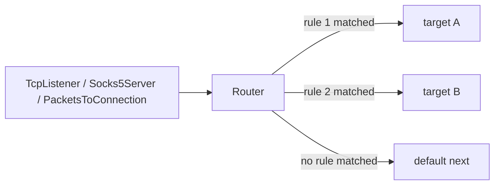

<!-- Written from version 110 of the English doc. -->

# Router

`Router` نود rule-based برای شاخه‌بندی connectionها در WaterWall است. این نود
در میانه زنجیره قرار می‌گیرد، روی اولین upstream payload هر line تصمیم می‌گیرد
و کل آن connection را فقط به یک شاخه انتخاب‌شده می‌فرستد.

از آن زمانی استفاده کنید که یک مسیر inbound باید بر اساس source IP، port ورودی،
destination IP، destination domain، نوع شبکه، protocol تشخیص‌داده‌شده، HTTP
Upgrade flag یا username/password احراز هویت‌شده به چند مسیر outbound تقسیم شود.



## مدل ذهنی

`Router` را به عنوان یک branch selector با تأخیر در نظر بگیرید:

- در زمان `Init` شاخه را انتخاب نمی‌کند.
- منتظر اولین upstream payload می‌ماند تا در صورت نیاز به تشخیص protocol، HTTP
  Host/:authority، TLS/QUIC SNI یا HTTP `Upgrade` بتواند byteهای قابل مشاهده را بررسی کند.
- آن byteهای اول را تا تصمیم‌گیری buffer می‌کند.
- بعد از اینکه یک rule برنده شد، branch انتخابی را initialize می‌کند و byteهای
  buffer شده را به همان branch replay می‌کند.
- تصمیم یک‌بار به ازای هر connection گرفته می‌شود. payloadهای بعدی مستقیم از
  همان branch عبور می‌کنند.
- ترافیک downstream از branch انتخابی از مسیر Router به نود قبلی برمی‌گردد.

اگر هیچ ruleای match نشود، connection به top-level `next` می‌رود. آن `next`
مسیر default است.

:::warning
`Router` نیاز دارد client اول داده بفرستد. برای protocolهایی که server باید
اول صحبت کند، Branch انتخاب نمی‌شود تا زمانی که upstream payload اول برسد.
:::

## جایگاه رایج

مسیریابی یک TCP listener عادی:

```text
TcpListener -> Router
                 |-- target: tls_path
                 |-- target: ssh_path
                 `-- next: default_path
```

بعد از proxy server که metadata مقصد را از قبل parse کرده:

```text
Socks5Server -> Router -> TcpConnector
```

بعد از تبدیل packet به connection:

```text
TunDevice -> PacketsToConnection -> Router -> TcpConnector
```

`Router` یک نود لایه ۴ است. WaterWall lineها را route می‌کند، نه raw packetها را
مستقیماً. برای packet chainها، اگر routing در سطح connection می‌خواهید، اول از
`PacketsToConnection` استفاده کنید.

## نمونه کامل

این مثال از یک listener ورودی استفاده می‌کند و connectionها را به این صورت توزیع می‌کند:

- کاربر authenticate‌شده `alice` به مسیر premium
- TLS برای `*.example.org` به مسیر domain-specific
- SSH به مسیر SSH
- بقیه به مسیر direct پیش‌فرض

```json
{
  "name": "inbound",
  "type": "TcpListener",
  "settings": {
    "address": "0.0.0.0",
    "port": 443,
    "nodelay": true
  },
  "next": "router"
}
```

```json
{
  "name": "router",
  "type": "Router",
  "settings": {
    "sniffing": [
      "http1",
      "tls"
    ],
    "rules": [
      {
        "username": "alice",
        "target": "premium_path"
      },
      {
        "destination-domain": [
          "*.example.org"
        ],
        "protocol": "tls",
        "target": "example_tls_path"
      },
      {
        "destination-port": 22,
        "target": "ssh_path"
      }
    ]
  },
  "next": "direct_path"
}
```

```json
{
  "name": "direct_path",
  "type": "TcpConnector",
  "settings": {
    "address": "203.0.113.10",
    "port": 443
  }
}
```

targetهایی مثل `premium_path`، `example_tls_path` و `ssh_path` باید نام nodeهای
واقعی در همان config باشند. هر target یک branch entry است و می‌تواند به یک
connector، protocol tunnel، `Bridge` یا segment دیگری از chain اشاره کند.

## فیلدهای اصلی

| فیلد | نوع | توضیح |
| --- | --- | --- |
| `name` | string | نام نود. باید داخل فایل config یکتا باشد. |
| `type` | string | باید دقیقاً `"Router"` باشد. |
| `next` | string | اجباری؛ مسیر default وقتی هیچ ruleای match نشود. |

`settings` می‌تواند خالی یا حذف‌شده باشد. در این حالت همه connectionها به
`next` می‌روند. اگر `sniffing` فعال باشد و domain sniffing برای line مجاز باشد،
Router ممکن است قبل از forward کردن، payload اول را برای پر کردن
`dest_ctx.domain` بررسی کند. اگر `rules` وجود دارد، باید array غیرخالی باشد.

## تنظیمات

| گزینه | نوع | پیش‌فرض | توضیح |
| --- | --- | --- | --- |
| `rules` | array | unset | لیست ruleها به ترتیب. Missing یعنی همه ترافیک به `next` می‌رود. آرایه خالی نامعتبر است. |
| `sniffing` | array | unset | modeهای domain sniffing. مقدارهای مجاز: `"http1"`، `"http2"`، `"http"`، `"tls"`، `"quic"` و `"http3"`. |
| `sniff-even-if-domain-is-already-provided` | boolean | `false` | وقتی `false` باشد، Router برای مقصدهایی که از قبل `dest_ctx.domain` دارند، Host/:authority/SNI domain sniffing را اجرا نمی‌کند. اگر `true` باشد، domain sniff شده می‌تواند domain موجود را جایگزین کند. |
| `resolve-domains` | boolean | `false` | قبل از Router یک `DomainResolver` داخلی می‌گذارد. |
| `geoip-db-path` | string | unset | فقط وقتی لازم است که rule از `geoip:<cc>` استفاده کند. |
| `geosite-db-path` | string | unset | فقط وقتی لازم است که rule از `geosite:<list>` استفاده کند. |

`"http"` alias برای HTTP/1 Host به اضافه cleartext HTTP/2 authority sniffing
است. این مقدار شامل HTTP/3 نیست؛ اگر QUIC/HTTP/3 SNI هم می‌خواهید، `"http3"`
را هم اضافه کنید.

## مبانی Rule

هر rule یک `target` به اضافه حداقل یک شرط است:

```json
{
  "destination-port": [
    80,
    443
  ],
  "network": "tcp",
  "target": "web_path"
}
```

منطق matching:

| سطح | منطق |
| --- | --- |
| مقدارهای داخل یک condition | OR. `destination-port: [80, 443]` هر کدام از portها را match می‌کند. |
| conditionهای داخل یک rule | AND. همه شرط‌های تنظیم‌شده باید match شوند. |
| ruleهای داخل `rules` | اولین match کامل برنده است؛ رuleهای بعدی رد می‌شوند. |
| بدون match | connection به top-level `next` می‌رود. |

فیلدهای ناشناخته داخل یک rule با warning نادیده گرفته می‌شوند. rule فقط با `target` و بدون هیچ شرطی نامعتبر است.

## شرط‌های قابل استفاده

| شرط | ورودی | توضیح |
| --- | --- | --- |
| `source-ips` | string یا array | IP/CIDR مبدا یا `geoip:<cc>`. |
| `source-port` | integer یا array | port local/inbound که peer به آن وصل شده است. |
| `source-port-range` | array دو عددی | بازه inclusive برای source/local listener port. |
| `destination-ip` | string یا array | IP/CIDR مقصد یا `geoip:<cc>`. مقصد domain-only بدون resolve شدن match نمی‌شود. |
| `destination-port` | integer یا array | port مقصد داخل `dest_ctx.port`. |
| `destination-port-range` | array دو عددی | بازه inclusive برای destination port. |
| `destination-domain` | string یا array | domain مقصد، از جمله domain sniff شده از HTTP Host/:authority یا TLS/QUIC SNI وقتی root `sniffing` فعال باشد و domain sniffing برای line مجاز باشد؛ همچنین wildcard `*` یا `geosite:<list>`. |
| `network` | string یا array | فلگ‌های transport: `tcp`، `udp`، `icmp`، `packet`. ترکیب مثل `"tcp,udp"` هم قبول می‌شود. |
| `protocol` | string یا array | protocol تشخیص داده‌شده از payload اول: `http1`، `tls`، `bittorrent`. |
| `attributes` | array غیرخالی | مشخصات boolean sniff شده. فعلاً فقط `http_upgrade_present`. |
| `username` | string یا array | match دقیق و case-sensitive روی markerهای credential authenticated شده روی line. |
| `password` | string یا array | match دقیق و case-sensitive روی markerهای credential authenticated شده روی line. |

مقادیر port باید integer در بازه `0..65535` باشند. port range باید دقیقاً دو integer داشته باشد و اولی کوچکتر یا مساوی دومی باشد.

## شرط‌های Source

### `source-ips`

`source-ips` با آدرس source مطابقت دارد:

```json
{
  "source-ips": [
    "10.0.0.0/8",
    "192.0.2.10",
    "geoip:ir"
  ],
  "target": "local_or_iran_path"
}
```

مقدارهای مجاز: IPv4/IPv6 تکی، IPv4/IPv6 CIDR، یا `geoip:<ISO-3166-alpha-2>` مثل `geoip:ir`.

### `source-port` و `source-port-range`

در رفتار listener فعلی، `source-port` port local/inbound است که peer به آن وصل
شده، نه port ephemeral تصادفی peer.

برای multiport listener مفید است:

```json
{
  "source-port": [
    80,
    443
  ],
  "target": "web_path"
}
```

می‌توانید `source-port` و `source-port-range` را با هم در یک rule ترکیب کنید:

```json
{
  "source-port": 443,
  "source-port-range": [
    10000,
    10100
  ],
  "target": "selected_inbound_ports"
}
```

## شرط‌های Destination

### `destination-ip`

`destination-ip` با `dest_ctx` مطابقت دارد وقتی مقصد IP است:

```json
{
  "destination-ip": [
    "198.51.100.0/24",
    "geoip:us"
  ],
  "target": "us_path"
}
```

اگر مقصد فقط domain باشد، این شرط match نمی‌شود. برای routing بر اساس GeoIP روی مقصدهای domain، از `resolve-domains: true` استفاده کنید.

### `destination-port` و `destination-port-range`

```json
{
  "destination-port": [
    80,
    443
  ],
  "target": "web_path"
}
```

```json
{
  "destination-port-range": [
    1000,
    2000
  ],
  "target": "range_path"
}
```

### `destination-domain`

```json
{
  "destination-domain": [
    "example.com",
    "*.example.org",
    "geosite:cn"
  ],
  "target": "domain_path"
}
```

| pattern | معنی |
| --- | --- |
| `example.com` | match دقیق، case-insensitive. |
| `*.example.com` | subdomainها مثل `www.example.com` را match می‌کند؛ خود `example.com` را نه. |
| `*` | هر domain غیرخالی. |
| `geosite:cn` | لیست نام‌دار GeoSite که از `geosite-db-path` بارگذاری شده. |

برای مقصدهای IP-only، root `sniffing` را فعال کنید تا Router مقدار HTTP
Host/:authority یا TLS/QUIC SNI را در `dest_ctx.domain` ذخیره کند و
`destination-domain` بتواند match شود، بدون اینکه IP endpoint اصلی پاک شود.

## شرط‌های Network و Protocol

### `network`

```json
{
  "network": "tcp,udp",
  "target": "tcp_or_udp_path"
}
```

مقدارهای مجاز: `tcp`، `udp`، `icmp`، `packet`. می‌توانید string تکی، آرایه‌ای از stringها یا ترکیب‌شده با comma بدهید.

### `protocol`

`protocol` از اولین upstream payload تشخیص داده می‌شود:

```json
{
  "protocol": [
    "tls",
    "bittorrent"
  ],
  "target": "special_protocol_path"
}
```

| مقدار | تشخیص |
| --- | --- |
| `http1` | prefix متد HTTP/1 مثل `GET ` یا `CONNECT `. |
| `tls` | TLS ClientHello. |
| `bittorrent` | handshake بیت‌تورنت. |

`protocol` به root `sniffing` نیاز ندارد. اگر ruleای از `protocol` استفاده کند، Router detector لازم را خودش اجرا می‌کند.

مقدارهای ناشناخته خطای fatal config هستند. `http`، `http2`، `quic` و `http3`
فقط mode/alias برای root `settings.sniffing` هستند و مقدارهای `protocol`
نیستند.

## Attributes

`attributes` با حقایق boolean sniff شده از اولین payload مطابقت دارد:

| attribute | معنی |
| --- | --- |
| `http_upgrade_present` | اولین HTTP/1 request شامل header با نام `Upgrade:` است. |

```json
{
  "attributes": [
    "http_upgrade_present"
  ],
  "target": "websocket_path"
}
```

برای این attribute باید root `sniffing` شامل `"http1"` باشد:

```json
{
  "sniffing": [
    "http1"
  ],
  "rules": [
    {
      "attributes": [
        "http_upgrade_present"
      ],
      "target": "websocket_path"
    }
  ]
}
```

اگر `http1` sniffing فعال نباشد، rule هیچ‌وقت match نمی‌شود و Router در startup یک warning می‌دهد. نام‌های attribute ناشناخته خطای fatal config هستند.

## Authenticated Identity

`username` و `password` با markerهای credential که توسط tunnelهای upstream دارای authentication به line اضافه شده‌اند مطابقت دارند:

```json
{
  "username": [
    "alice",
    "bob"
  ],
  "target": "premium_path"
}
```

```json
{
  "password": "customer-secret",
  "target": "customer_path"
}
```

matching دقیق و case-sensitive است. اگر line username یا password authenticated نداشته باشد، شرط مربوطه match نمی‌شود. اگر یک rule هم `username` و هم `password` داشته باشد، هر دو باید با همان marker credential مطابقت کنند؛ authenticationهای stacked، username یک layer را با password یک layer دیگر ترکیب نمی‌کنند.

نمونه‌هایی از tunnelهایی که می‌توانند credentials را populate کنند: `Socks5Server`، `TrojanServer` و `VlessServer`.

## Domain Sniffing

`sniffing` در سطح root به Router اجازه می‌دهد domain را از اولین payload بخواند:

بعضی tunnelهای upstream ممکن است قبل از رسیدن line به Router، مقدار
`dest_ctx.domain` را از قبل فراهم کرده باشند، برای مثال:

```text
... -> Socks5Server -> Router -> ...
... -> TrojanServer / VlessServer -> Router -> ...
```

این به چیزی بستگی دارد که client درخواست کرده است. یک client مربوط به SOCKS،
Trojan یا VLESS ممکن است domain بفرستد، اما ممکن است IP مستقیم هم بفرستد. ممکن
است client از قبل IP را بداند، نام را local resolve کرده باشد، از DoH/DoT یا یک
مسیر DNS دیگر قبل از اتصال استفاده کرده باشد، یا اساساً ترافیک IP-only را
forward کند. در این حالت‌ها ممکن است Router در `dest_ctx.domain` هیچ destination
domainای نبیند، و `sniffing` می‌تواند برای تعیین domain مقصد از
Host/:authority/SNI مفید باشد.

```json
{
  "sniffing": [
    "http",
    "tls",
    "http3"
  ]
}
```

| مقدار | می‌خواند |
| --- | --- |
| `http1` | HTTP/1 header با نام `Host`. |
| `http2` | cleartext HTTP/2 prior-knowledge `:authority`، با fallback به `host`. |
| `http` | alias برای `http1` به اضافه `http2`. |
| `tls` | TLS ClientHello SNI. |
| `quic` | QUIC Initial TLS ClientHello SNI. |
| `http3` | alias برای `quic`. |

مقدارها case-insensitive parse می‌شوند. اگر `sniffing` حذف شود یا خالی باشد،
domain sniffing غیرفعال است.

`http` عمداً HTTP/3 را شامل نمی‌شود. برای همه نسخه‌های HTTP، هر دو مقدار را
استفاده کنید:

```json
{
  "sniffing": [
    "http",
    "http3"
  ]
}
```

HTTP/2 sniffing فقط domain sniffing است: Router فقط requestهای cleartext HTTP/2
prior-knowledge را روی destination contextهای TCP تشخیص می‌دهد و `:authority`
را از اولین request HEADERS می‌خواند. h2c upgrade همچنان از مسیر HTTP/1 Host
sniffing پوشش داده می‌شود.

HTTP/2 sniffing وقتی در دسترس است که WaterWall با
`router_enable_http2_sniffing=ON` ساخته شده باشد (پیش‌فرض `ON`). QUIC/HTTP3
sniffing وقتی در دسترس است که build با `router_enable_quic_sniffing=ON` باشد
(پیش‌فرض `ON`). چون `http` به `http1` به‌علاوه `http2` گسترش می‌یابد، به گزینه
build مربوط به HTTP/2 هم نیاز دارد. نام‌های `http`، `http2`، `quic` و `http3` فقط برای root
`settings.sniffing` هستند و `rules[].protocol` را تغییر نمی‌دهند.

این بیشتر برای مقصدهای IP-backed کاربرد دارد که destination اصلی IP است اما routing بر اساس domain می‌خواهید:

```json
{
  "sniffing": [
    "tls"
  ],
  "rules": [
    {
      "destination-domain": "*.example.org",
      "target": "example_path"
    }
  ]
}
```

به صورت پیش‌فرض، Router برای lineای که از قبل `dest_ctx.domain` دارد اصلاً
Host/:authority/SNI domain sniffing را اجرا نمی‌کند. این رفتار جلوی جایگزین شدن
domain انتخاب‌شده توسط config یا tunnel قبلی با داده‌ای که client داخل connection
فرستاده را می‌گیرد. تشخیص `protocol` و sniffing مربوط به `attributes` جدا هستند
و می‌توانند همچنان اجرا شوند، چون `dest_ctx.domain` را جایگزین نمی‌کنند.

اگر عمداً می‌خواهید Host/:authority/SNI به domain قبلی اولویت داشته باشد، از
`sniff-even-if-domain-is-already-provided: true` استفاده کنید.

وقتی Host/:authority/SNI پیدا شود و Router اجازه ذخیره آن را داشته باشد، مقدار
در `dest_ctx.domain` نوشته می‌شود، اما فیلدهای endpoint مثل IP، port، transport
flags، optional protocol flags و address type پاک نمی‌شوند.

| شکل destination | نتیجه |
| --- | --- |
| IP مشخص بدون domain قبلی | domain ذخیره می‌شود، `domain_resolved = true`؛ connectorهای بعدی همان IP اصلی را استفاده می‌کنند و نام sniff شده را resolve نمی‌کنند. |
| IP wildcard/any مثل `0.0.0.0` یا `::` بدون domain قبلی | domain ذخیره می‌شود، اما resolved حساب نمی‌شود چون endpoint IP مشخصی وجود ندارد. |
| domain موجود، تنظیم پیش‌فرض | Host/:authority/SNI domain sniffing اجرا نمی‌شود و `dest_ctx.domain` جایگزین نمی‌شود. |
| مقصد فقط domain، با `sniff-even-if-domain-is-already-provided: true` | domain sniff شده جایگزین `dest_ctx.domain` می‌شود، `domain_resolved = false`؛ connector بعدی نام جدید را DNS-resolve می‌کند و به آن وصل می‌شود. |

## بافر کردن Payload اول

Router برای تصمیم‌گیری payload اول را buffer می‌کند. detectorها ممکن است برای
HTTP ناقص، HTTP/2 preface/HEADERS ناقص، TLS ClientHello یا BitTorrent handshake
ناقص درخواست bytes بیشتر کنند.

حد پنجره sniffing:

```text
8192 bytes
```

اگر اطلاعات لازم تا این حد پیدا نشود، detector آن را missing در نظر می‌گیرد و Router با اطلاعاتی که دارد ادامه می‌دهد.

نتایج عملی:

- ruleهایی که از `protocol`، `destination-domain` با `sniffing` یا `http_upgrade_present` استفاده می‌کنند ممکن است انتخاب branch را تا رسیدن bytes کافی به تأخیر بیندازند.
- بعد از انتخاب route، payloadهای بعدی دوباره classify نمی‌شوند.

## GeoIP

`geoip:<cc>` در `source-ips` و `destination-ip` قابل استفاده است:

```json
{
  "geoip-db-path": "/var/lib/waterwall/GeoLite2-Country.mmdb",
  "rules": [
    {
      "source-ips": "geoip:ir",
      "target": "iran_path"
    },
    {
      "destination-ip": [
        "geoip:us",
        "geoip:de"
      ],
      "target": "western_path"
    }
  ]
}
```

نکته‌ها:

- `geoip-db-path` فقط وقتی اجباری است که rule واقعاً از `geoip:` استفاده کند.
- دیتابیس باید MaxMind country database باشد.
- country code دو حرفی ISO-3166 و case-insensitive است.
- اگر IP در دیتابیس نباشد، شرط GeoIP match نمی‌شود.
- مقصد domain-only باید قبل از matching با `destination-ip: geoip:...` resolve شود.

## GeoSite

`geosite:<list>` در `destination-domain` استفاده می‌شود:

```json
{
  "geosite-db-path": "/var/lib/waterwall/geosite_generated.json",
  "sniffing": [
    "http",
    "tls",
    "http3"
  ],
  "rules": [
    {
      "destination-domain": [
        "geosite:cn",
        "geosite:category-ads-all"
      ],
      "target": "special_domain_path"
    }
  ]
}
```

`geosite-db-path` فقط وقتی اجباری است که rule از token `geosite:` استفاده کند. Router دیتابیس JSON را در startup بارگذاری و اعتبارسنجی می‌کند.

نوع‌های پشتیبانی‌شده در GeoSite:

| نوع | رفتار |
| --- | --- |
| `full` | match دقیق domain. |
| `domain` / `root_domain` | root domain و subdomainها. |
| `plain` / `keyword` | substring case-insensitive. |
| `regex` / `regexp` | الگوی STC `cregex`، case-insensitive. |

فایل GeoSite با generator داخل سورس ساخته می‌شود:

```text
tunnels/Router/geosite_ww_style_generator/do_the_job.py
```

## resolve-domains

اگر `resolve-domains` برابر `true` باشد، Router یک `DomainResolver` داخلی قبل
از خودش می‌سازد:

```json
{
  "resolve-domains": true,
  "geoip-db-path": "/var/lib/waterwall/GeoLite2-Country.mmdb",
  "rules": [
    {
      "destination-ip": "geoip:us",
      "target": "us_path"
    }
  ]
}
```

این برای حالتی خوب است که مقصد به صورت domain آمده، اما می‌خواهید بر اساس `destination-ip` یا GeoIP تصمیم بگیرید.

نکات مهم:

- resolver داخلی قبل از classification اول Router اجرا می‌شود.
- فقط مقصدهای domain unresolved را resolve می‌کند.
- domainهایی را که بعداً از HTTP Host/:authority یا TLS/QUIC SNI sniff می‌شوند دوباره resolve نمی‌کند.
- مقصدهای IP-only بدون تغییر از resolver عبور می‌کنند.

## Target Branchها

`target` نام یک node واقعی در همان config است. Router در زمان ساخت chain، این
targetها را وارد chain خودش می‌کند تا:

- targetها line state داشته باشند.
- downstream traffic از branchها دوباره از Router برگردد.
- lifecycle chain حفظ شود.

قوانین مهم:

- target باید وجود داشته باشد.
- target نباید خود Router باشد.
- یک target نباید قبلاً به previous ناسازگار وصل شده باشد.
- چند rule می‌توانند یک target مشترک داشته باشند.

اگر branch شما جای دیگری در config است، از `Bridge` به عنوان target استفاده کنید.

```text
TcpListener -> Router
               |-- target: bridge_to_special_path
               `-- next: direct_path
```

## جهت و Lifecycle

رفتار callback:

| callback | رفتار |
| --- | --- |
| upstream `Init` | فقط state داخلی Router را initialize می‌کند و `dest_ctx.optional_flags` را پاک می‌کند. هنوز branch initialize نمی‌کند. |
| اولین upstream `Payload` | payload را buffer می‌کند، در صورت نیاز sniff می‌کند، ruleها را evaluate می‌کند، branch انتخابی را initialize می‌کند، byteهای buffer شده را replay می‌کند. |
| payloadهای بعدی upstream | مستقیم به target انتخابی یا default `next` می‌روند. |
| upstream `Pause` / `Resume` | فقط بعد از انتخاب route forward می‌شوند. |
| upstream `Finish` | state داخلی را destroy می‌کند و target/default branch انتخابی را finish می‌کند اگر وجود داشته باشد. |
| downstream `Payload` / `Pause` / `Resume` / `Est` | به نود قبلی برمی‌گردند. |
| downstream `Finish` | state داخلی را destroy می‌کند سپس finish را به نود قبلی forward می‌کند. |

Router عمداً `dest_ctx.optional_flags` را در upstream `Init` پاک می‌کند تا protocol bits تشخیص داده‌شده توسط یک Router به Router بعدی روی همان line نشت نکنند.

## دستورالعمل‌ها

### مسیریابی بر اساس domain با default fallback

```json
{
  "name": "router",
  "type": "Router",
  "settings": {
    "sniffing": [
      "http",
      "tls",
      "http3"
    ],
    "rules": [
      {
        "destination-domain": [
          "*.example.com",
          "api.vendor.test"
        ],
        "target": "domain_path"
      }
    ]
  },
  "next": "default_path"
}
```

### مسیریابی GeoIP

```json
{
  "name": "router",
  "type": "Router",
  "settings": {
    "geoip-db-path": "/var/lib/waterwall/GeoLite2-Country.mmdb",
    "rules": [
      {
        "source-ips": [
          "geoip:ir",
          "10.0.0.0/8"
        ],
        "target": "regional_path"
      }
    ]
  },
  "next": "default_path"
}
```

### جداسازی WebSocket Upgrade

```json
{
  "name": "router",
  "type": "Router",
  "settings": {
    "sniffing": [
      "http1"
    ],
    "rules": [
      {
        "attributes": [
          "http_upgrade_present"
        ],
        "target": "websocket_path"
      }
    ]
  },
  "next": "plain_http_path"
}
```

### ترکیب چند شرط با AND

```json
{
  "name": "router",
  "type": "Router",
  "settings": {
    "rules": [
      {
        "network": "tcp",
        "destination-port": 443,
        "protocol": "tls",
        "target": "tls_443_path"
      }
    ]
  },
  "next": "default_path"
}
```

این rule فقط وقتی match می‌شود که connection TCP باشد، destination port برابر `443` باشد، و payload اول به عنوان TLS تشخیص داده شود.

### مسیریابی بر اساس کاربر authenticate‌شده

```json
{
  "name": "router",
  "type": "Router",
  "settings": {
    "rules": [
      {
        "username": [
          "alice",
          "bob"
        ],
        "target": "premium_path"
      },
      {
        "username": "guest",
        "target": "limited_path"
      }
    ]
  },
  "next": "anonymous_path"
}
```

Router را بعد از tunnel که authenticate می‌کند و credentials را روی line ذخیره می‌کند قرار دهید.

## اشتباه‌های رایج

### انتظار priority-free بودن ترتیب ruleها

Ruleها همه evaluate و score نمی‌شوند. اولین rule که کامل match شود برنده است. ruleهای specificتر را بالاتر و ruleهای broad/catch-all را پایین‌تر بگذارید.

### استفاده از match-all rule

Rule فقط با `target` و بدون شرط نامعتبر است. برای مسیر پیش‌فرض از top-level `next` استفاده کنید. اگر یک broad rule صریح قبل از default می‌خواهید، از یک شرط واقعی مثل `"destination-domain": "*"` برای domain-only routing استفاده کنید.

### انتظار کار کردن `destination-domain` روی traffic IP-only بدون sniffing

برای flowهای IP-only، `dest_ctx.domain` خالی است مگر اینکه نود قبلی آن را داده
باشد یا Router، وقتی domain sniffing برای line مجاز است، آن را از HTTP
Host/:authority یا TLS/QUIC SNI sniff کرده باشد.
برای این حالت root `sniffing` را فعال کنید.

### انتظار اینکه `protocol` به root `sniffing` نیاز داشته باشد

تشخیص `protocol` از sniffing مربوط به Host/:authority/SNI جدا است. اگر ruleای
از `protocol` استفاده کند، Router detectorهای لازم برای protocol را خودش اجرا
می‌کند.

### اشتباه گرفتن `source-port` با port ephemeral کلاینت

برای listenerهای رایج، `source-port` همان port local/inbound است که peer به آن وصل شده. از آن برای multiport listener routing استفاده کنید.

### Routing برای protocolهای server-first

Router بر اساس اولین upstream payload classify می‌کند. اگر server باید قبل از اینکه client چیزی بفرستد صحبت کند، Router تا رسیدن client data نمی‌تواند branch را initialize کند.

## متادیتای نود

| ویژگی | مقدار |
| --- | --- |
| node flags | `kNodeFlagNone` |
| `can_have_prev` | `true` |
| `can_have_next` | `true` |
| `layer_group` | `kNodeLayer4` |
| `layer_group_prev_node` | `kNodeLayerAnything` |
| `layer_group_next_node` | `kNodeLayerAnything` |
| `required_padding_left` | `0` bytes |

`Router` header جدید prepend نمی‌کند و به left padding نیاز ندارد.
