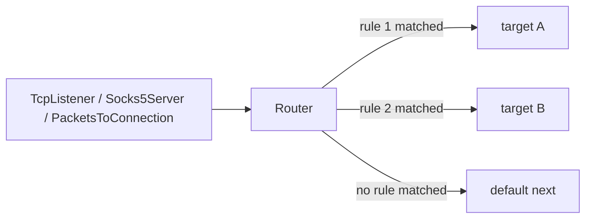

<!--
Documentation version: 152
-->

# Router

`Router` نودی مبتنی بر rule برای تقسیم connectionها میان شاخه‌های مختلف
واتروال است. این نود در میانه chain قرار می‌گیرد، پس از دیدن نخستین upstream
payload هر line مسیر را انتخاب می‌کند و تمام آن connection را فقط از همان شاخه
عبور می‌دهد.

زمانی از آن استفاده کنید که یک مسیر inbound باید بر اساس source IP، port ورودی،
destination IP یا domain، نوع شبکه، protocol تشخیص‌داده‌شده، وجود HTTP Upgrade
یا username/password احرازشده میان چند مسیر outbound تقسیم شود.



## مدل ذهنی

`Router` را یک انتخاب‌گر شاخه در نظر بگیرید که تصمیم خود را کمی به تأخیر می‌اندازد:

- در زمان `Init` شاخه را انتخاب نمی‌کند.
- منتظر نخستین upstream payload می‌ماند تا در صورت نیاز، بایت‌های قابل مشاهده
  را برای تشخیص protocol، مقدار HTTP Host/:authority، مقدار TLS/QUIC SNI یا
  وجود HTTP `Upgrade` بررسی کند.
- آن بایت‌های ابتدایی را تا زمان تصمیم‌گیری در buffer نگه می‌دارد.
- پس از match شدن یک rule، شاخه انتخابی را مقداردهی اولیه می‌کند و بایت‌های
  bufferشده را روی همان شاخه دوباره پخش می‌کند.
- برای هر connection فقط یک‌بار تصمیم می‌گیرد و payloadهای بعدی مستقیم از همان
  شاخه عبور می‌کنند.
- ترافیک downstream شاخه انتخابی از راه `Router` به نود قبلی برمی‌گردد.

اگر هیچ ruleای match نشود، connection به `next` در سطح اصلی می‌رود؛ این همان
مسیر پیش‌فرض است.

:::warning
`Router` برای انتخاب مسیر باید ابتدا از client داده بگیرد. در protocolهای
server-first تا پیش از رسیدن نخستین upstream payload هیچ شاخه‌ای انتخاب نمی‌شود.
:::

## جایگاه رایج

مسیریابی یک TCP listener عادی:

```text
TcpListener -> Router
                 |-- target: tls_path
                 |-- target: ssh_path
                 `-- next: default_path
```

پس از proxy serverی که metadata مقصد را از قبل خوانده است:

```text
Socks5Server -> Router -> TcpConnector
```

بعد از تبدیل packet به connection:

```text
TunDevice -> PacketsToConnection -> Router -> TcpConnector
```

`Router` یک نود لایه ۴ است و lineهای واتروال را route می‌کند، نه packetهای خام
را. اگر در یک packet chain به routing در سطح connection نیاز دارید، ابتدا از
`PacketsToConnection` استفاده کنید.

## نمونه کامل

در این مثال connectionهای یک listener ورودی به این شکل تقسیم می‌شوند:

- کاربر authenticate‌شده `alice` به مسیر premium
- TLS برای `*.example.org` به مسیر domain-specific
- SSH به مسیر SSH
- بقیه به مسیر direct پیش‌فرض

```json
{
  "name": "inbound",
  "type": "TcpListener",
  "settings": {
    "address": "0.0.0.0",
    "port": 443,
    "nodelay": true
  },
  "next": "router"
}
```

```json
{
  "name": "router",
  "type": "Router",
  "settings": {
    "sniffing": [
      "http1",
      "tls"
    ],
    "rules": [
      {
        "username": "alice",
        "target": "premium_path"
      },
      {
        "destination-domain": [
          "*.example.org"
        ],
        "protocol": "tls",
        "target": "example_tls_path"
      },
      {
        "destination-port": 22,
        "target": "ssh_path"
      }
    ]
  },
  "next": "direct_path"
}
```

```json
{
  "name": "direct_path",
  "type": "TcpConnector",
  "settings": {
    "address": "203.0.113.10",
    "port": 443
  }
}
```

targetهایی مانند `premium_path`، `example_tls_path` و `ssh_path` باید نام نودهای
واقعی در همان config باشند. هر target ورودی یک شاخه است و می‌تواند به یک
connector، protocol tunnel، `Bridge` یا segment دیگری از chain اشاره کند.

## فیلدهای اصلی

| فیلد | نوع | توضیح |
| --- | --- | --- |
| `name` | string | نام نود. باید داخل فایل config یکتا باشد. |
| `type` | string | باید دقیقاً `"Router"` باشد. |
| `next` | string | اجباری؛ مسیر default وقتی هیچ ruleای match نشود. |

`settings` می‌تواند خالی باشد یا اصلاً نوشته نشود. در این حالت همه connectionها به
`next` می‌روند. اگر `sniffing` فعال باشد و domain sniffing برای line مجاز باشد،
ممکن است `Router` پیش از فرستادن payload اول، آن را برای پر کردن
`dest_ctx.domain` بررسی کند. اگر `rules` وجود دارد، باید array غیرخالی باشد.

## تنظیمات

| گزینه | نوع | پیش‌فرض | توضیح |
| --- | --- | --- | --- |
| `rules` | array | unset | فهرست مرتب ruleها. نبودن این گزینه یعنی تمام ترافیک به `next` می‌رود؛ آرایه خالی معتبر نیست. |
| `sniffing` | array | unset | modeهای domain sniffing. مقدارهای مجاز: `"http1"`، `"http2"`، `"http"`، `"tls"`، `"quic"` و `"http3"`. |
| `sniff-even-if-domain-is-already-provided` | boolean | `false` | وقتی `false` باشد، Router برای مقصدهایی که از قبل `dest_ctx.domain` دارند، Host/:authority/SNI domain sniffing را اجرا نمی‌کند. اگر `true` باشد، domain sniff شده می‌تواند domain موجود را جایگزین کند. |
| `resolve-domains` | boolean | `false` | قبل از Router یک `DomainResolver` داخلی می‌گذارد. |
| `geoip-db-path` | string | unset | فقط وقتی لازم است که rule از `geoip:<cc>` استفاده کند. |
| `geosite-db-path` | string | unset | فقط وقتی لازم است که rule از `geosite:<list>` استفاده کند. |

`"http"` نام مستعار sniff کردن HTTP/1 Host و authority در HTTP/2 cleartext است.
این مقدار HTTP/3 را شامل نمی‌شود؛ برای QUIC/HTTP/3 SNI باید `"http3"` را نیز
اضافه کنید.

## مبانی Rule

هر rule باید یک `target` و دست‌کم یک شرط داشته باشد:

```json
{
  "destination-port": [
    80,
    443
  ],
  "network": "tcp",
  "target": "web_path"
}
```

منطق matching:

| سطح | منطق |
| --- | --- |
| مقدارهای داخل یک condition | رابطه OR دارند؛ `destination-port: [80, 443]` با هر یک از این دو port match می‌شود. |
| conditionهای داخل یک rule | رابطه AND دارند؛ همه شرط‌های تنظیم‌شده باید match شوند. |
| ruleهای داخل `rules` | نخستین match کامل برنده است و ruleهای بعدی دیگر بررسی نمی‌شوند. |
| بدون match | connection به top-level `next` می‌رود. |

فیلدهای ناشناخته درون rule با ثبت warning نادیده گرفته می‌شوند. ruleای که فقط `target` داشته باشد و هیچ شرطی نداشته باشد معتبر نیست.

## شرط‌های قابل استفاده

| شرط | ورودی | توضیح |
| --- | --- | --- |
| `source-ips` | string یا array | IP/CIDR مبدا یا `geoip:<cc>`. |
| `source-port` | integer یا array | port محلی/inbound که peer به آن وصل شده و در `src_ctx.port` ذخیره شده است. |
| `source-port-range` | آرایه دو عددی | بازه بسته برای source/local listener port. |
| `destination-ip` | string یا array | IP/CIDR مقصد یا `geoip:<cc>`. مقصد فقط-domain تا پیش از resolve شدن با این شرط مطابقت ندارد. |
| `destination-port` | integer یا array | port مقصد داخل `dest_ctx.port`. |
| `destination-port-range` | آرایه دو عددی | بازه بسته برای destination port. |
| `destination-domain` | string یا array | domain مقصد، از جمله domain sniff شده از HTTP Host/:authority یا TLS/QUIC SNI وقتی root `sniffing` فعال باشد و domain sniffing برای line مجاز باشد؛ همچنین wildcard `*` یا `geosite:<list>`. |
| `network` | string یا array | فلگ‌های transport: `tcp`، `udp`، `icmp`، `packet`. ترکیب مثل `"tcp,udp"` هم قبول می‌شود. |
| `protocol` | string یا array | protocol تشخیص داده‌شده از payload اول: `http1`، `tls`، `bittorrent`. |
| `attributes` | array غیرخالی | مشخصات boolean sniff شده. فعلاً فقط `http_upgrade_present`. |
| `username` | string یا array | match دقیق و case-sensitive روی markerهای credential authenticated شده روی line. |
| `password` | string یا array | match دقیق و case-sensitive روی markerهای credential authenticated شده روی line. |

مقدارهای port باید integer در بازه `0..65535` باشند. بازه port دقیقاً دو integer دارد و مقدار نخست باید کوچک‌تر یا مساوی دومی باشد.

## شرط‌های Source

### `source-ips`

`source-ips` با source address تطبیق داده می‌شود:

```json
{
  "source-ips": [
    "10.0.0.0/8",
    "192.0.2.10",
    "geoip:ir"
  ],
  "target": "local_or_iran_path"
}
```

مقدارهای پشتیبانی‌شده:

- آدرس IPv4 یا IPv6
- بازه CIDR مربوط به IPv4 یا IPv6
- `geoip:<ISO-3166-alpha-2>` مانند `geoip:ir` یا `geoip:us`

IPهای تکی به شکل host route در نظر گرفته می‌شوند: `/32` برای IPv4 و `/128` برای IPv6.

### `source-port` و `source-port-range`

در پیاده‌سازی فعلی listener، `source-port` همان port محلی/inbound است که peer به
آن متصل شده، نه port موقت و تصادفی peer.

برای multiport listener مفید است:

```json
{
  "source-port": [
    80,
    443
  ],
  "target": "web_path"
}
```

می‌توانید portهای دقیق و یک بازه را در یک rule با هم ترکیب کنید؛ این دو با رابطه OR بررسی می‌شوند:

```json
{
  "source-port": 443,
  "source-port-range": [
    10000,
    10100
  ],
  "target": "selected_inbound_ports"
}
```

## شرط‌های Destination

### `destination-ip`

`destination-ip` با `dest_ctx` مطابقت دارد وقتی مقصد IP است:

```json
{
  "destination-ip": [
    "198.51.100.0/24",
    "geoip:us"
  ],
  "target": "us_path"
}
```

اگر مقصد فقط domain باشد، این شرط مطابقت ندارد. برای routing بر پایه GeoIP روی چنین مقصدی، از `resolve-domains: true` استفاده کنید.

### `destination-port` و `destination-port-range`

`destination-port` با port سرویس مقصد مقایسه می‌شود:

```json
{
  "destination-port": [
    80,
    443
  ],
  "target": "web_path"
}
```

دو سر بازه در `destination-port-range` نیز جزو بازه هستند:

```json
{
  "destination-port-range": [
    1000,
    2000
  ],
  "target": "range_path"
}
```

### `destination-domain`

`destination-domain` با `dest_ctx.domain` مقایسه می‌شود.

```json
{
  "destination-domain": [
    "example.com",
    "*.example.org",
    "geosite:cn"
  ],
  "target": "domain_path"
}
```

الگوهای پشتیبانی‌شده:

| pattern | معنی |
| --- | --- |
| `example.com` | match دقیق، case-insensitive. |
| `*.example.com` | با subdomainهایی مانند `www.example.com` مطابقت دارد، اما با خود `example.com` نه. |
| `*` | هر domain غیرخالی. |
| `geosite:cn` | لیست نام‌دار GeoSite که از `geosite-db-path` بارگذاری شده. |

برای مقصدهای فقط-IP، `sniffing` را در سطح اصلی فعال کنید تا `Router` مقدار HTTP
Host/:authority یا TLS/QUIC SNI را در `dest_ctx.domain` ذخیره کند و
شرط `destination-domain` بتواند برقرار شود، بدون آن‌که IP endpoint اصلی پاک شود.

## شرط‌های Network و Protocol

### `network`

`network` با flagهای transport مقصد مقایسه می‌شود:

```json
{
  "network": "tcp,udp",
  "target": "tcp_or_udp_path"
}
```

مقدارهای پشتیبانی‌شده:

- `tcp`
- `udp`
- `icmp`
- `packet`

می‌توانید یک string، آرایه‌ای از stringها یا stringهای جداشده با comma بدهید. مقدارهای داخل این فیلد با رابطه OR بررسی می‌شوند.

### `protocol`

`protocol` از اولین upstream payload تشخیص داده می‌شود:

```json
{
  "protocol": [
    "tls",
    "bittorrent"
  ],
  "target": "special_protocol_path"
}
```

| مقدار | تشخیص |
| --- | --- |
| `http1` | prefix متد HTTP/1 مانند `GET `، `POST ` یا `CONNECT `. |
| `tls` | TLS ClientHello. |
| `bittorrent` | handshake بیت‌تورنت. |

`protocol` به `sniffing` در سطح اصلی نیاز ندارد. اگر ruleای از آن استفاده کند، `Router` detector لازم را خودش اجرا می‌کند.

مقدارهای ناشناخته خطای fatal config هستند. `http`، `http2`، `quic` و `http3`
فقط mode/alias برای root `settings.sniffing` هستند و مقدارهای `protocol`
نیستند.

## Attributes

`attributes` با ویژگی‌های boolean استخراج‌شده از نخستین payload تطبیق داده می‌شود:

| attribute | معنی |
| --- | --- |
| `http_upgrade_present` | اولین HTTP/1 request شامل header با نام `Upgrade:` است. |

```json
{
  "attributes": [
    "http_upgrade_present"
  ],
  "target": "websocket_path"
}
```

برای این attribute باید root `sniffing` شامل `"http1"` باشد:

```json
{
  "sniffing": [
    "http1"
  ],
  "rules": [
    {
      "attributes": [
        "http_upgrade_present"
      ],
      "target": "websocket_path"
    }
  ]
}
```

اگر sniffing مربوط به `http1` فعال نباشد، rule هرگز برقرار نمی‌شود و `Router` هنگام startup یک warning ثبت می‌کند. نام attribute ناشناخته نیز خطای fatal در config است.

## Authenticated Identity

`username` و `password` با markerهای credential که توسط tunnelهای upstream دارای authentication به line اضافه شده‌اند مطابقت دارند:

```json
{
  "username": [
    "alice",
    "bob"
  ],
  "target": "premium_path"
}
```

```json
{
  "password": "customer-secret",
  "target": "customer_path"
}
```

تطبیق دقیق و case-sensitive است. اگر line، username یا password احرازشده نداشته باشد، شرط متناظر برقرار نمی‌شود. اگر یک rule هم `username` و هم `password` داشته باشد، هر دو باید به همان marker مربوط به credential تعلق داشته باشند؛ در authenticationهای چندلایه، username یک لایه با password لایه‌ای دیگر ترکیب نمی‌شود.

نمونه‌هایی از tunnelهایی که می‌توانند credentials را populate کنند: `Socks5Server`، `TrojanServer` و `VlessServer`.

## Domain Sniffing

گزینه `sniffing` در سطح اصلی به `Router` اجازه می‌دهد domain را از نخستین payload بخواند.

بعضی tunnelهای upstream ممکن است قبل از رسیدن line به Router، مقدار
`dest_ctx.domain` را از قبل فراهم کرده باشند، برای مثال:

```text
... -> Socks5Server -> Router -> ...
... -> TrojanServer / VlessServer -> Router -> ...
```

این به چیزی بستگی دارد که client درخواست کرده است. یک client مربوط به SOCKS،
Trojan یا VLESS ممکن است domain بفرستد، اما ممکن است IP مستقیم هم بفرستد. ممکن
است client از قبل IP را بداند، نام را به‌صورت local resolve کرده باشد، از DoH/DoT یا یک
مسیر DNS دیگر قبل از اتصال استفاده کرده باشد، یا اساساً ترافیک IP-only را
عبور دهد. در این حالت‌ها ممکن است `Router` در `dest_ctx.domain` هیچ destination
domainای نبیند؛ در نتیجه `sniffing` می‌تواند domain مقصد را از
Host/:authority/SNI مفید باشد.

```json
{
  "sniffing": [
    "http",
    "tls",
    "http3"
  ]
}
```

| مقدار | می‌خواند |
| --- | --- |
| `http1` | HTTP/1 header با نام `Host`. |
| `http2` | cleartext HTTP/2 prior-knowledge `:authority`، با fallback به `host`. |
| `http` | alias برای `http1` به اضافه `http2`. |
| `tls` | TLS ClientHello SNI. |
| `quic` | QUIC Initial TLS ClientHello SNI. |
| `http3` | alias برای `quic`. |

مقدارها بدون حساسیت به حروف کوچک و بزرگ خوانده می‌شوند. اگر `sniffing` حذف شود یا خالی باشد،
domain sniffing غیرفعال است.

`http` عمداً HTTP/3 را شامل نمی‌شود. برای همه نسخه‌های HTTP، هر دو مقدار را
استفاده کنید:

```json
{
  "sniffing": [
    "http",
    "http3"
  ]
}
```

HTTP/2 sniffing فقط domain sniffing است: Router فقط requestهای cleartext HTTP/2
prior-knowledge را روی destination contextهای TCP تشخیص می‌دهد و `:authority`
را از اولین request HEADERS می‌خواند. h2c upgrade همچنان از مسیر HTTP/1 Host
sniffing پوشش داده می‌شود.

HTTP/2 sniffing وقتی در دسترس است که WaterWall با
`router_enable_http2_sniffing=ON` ساخته شده باشد (پیش‌فرض `ON`). QUIC/HTTP3
sniffing وقتی در دسترس است که build با `router_enable_quic_sniffing=ON` باشد
(پیش‌فرض `ON`). چون `http` به `http1` به‌علاوه `http2` گسترش می‌یابد، به گزینه
build مربوط به HTTP/2 هم نیاز دارد. نام‌های `http`، `http2`، `quic` و `http3` فقط برای root
`settings.sniffing` هستند و `rules[].protocol` را تغییر نمی‌دهند.

این قابلیت بیشتر برای مقصدهایی به کار می‌آید که endpoint اصلی آن‌ها IP است اما می‌خواهید routing بر اساس domain انجام شود:

```json
{
  "sniffing": [
    "tls"
  ],
  "rules": [
    {
      "destination-domain": "*.example.org",
      "target": "example_path"
    }
  ]
}
```

به‌صورت پیش‌فرض، `Router` برای lineای که از قبل `dest_ctx.domain` دارد
Host/:authority/SNI domain sniffing را اجرا نمی‌کند. این رفتار جلوی جایگزین شدن
domain انتخاب‌شده توسط config یا tunnel قبلی با داده‌ای که client داخل connection
فرستاده را می‌گیرد. تشخیص `protocol` و sniffing مربوط به `attributes` جدا هستند
و می‌توانند همچنان اجرا شوند، چون `dest_ctx.domain` را جایگزین نمی‌کنند.

اگر می‌خواهید مقدار Host/:authority/SNI عمداً بر domain قبلی اولویت داشته باشد، از
`sniff-even-if-domain-is-already-provided: true` استفاده کنید.

وقتی Host/:authority/SNI پیدا شود و Router اجازه ذخیره آن را داشته باشد، مقدار
در `dest_ctx.domain` نوشته می‌شود، اما فیلدهای endpoint مثل IP، port، transport
flags، optional protocol flags و address type پاک نمی‌شوند.

| شکل destination | نتیجه |
| --- | --- |
| IP مشخص بدون domain قبلی | domain ذخیره می‌شود، `domain_resolved = true`؛ connectorهای بعدی همان IP اصلی را استفاده می‌کنند و نام sniff شده را resolve نمی‌کنند. |
| IP wildcard/any مثل `0.0.0.0` یا `::` بدون domain قبلی | domain ذخیره می‌شود، اما resolved حساب نمی‌شود چون endpoint IP مشخصی وجود ندارد. |
| domain موجود، تنظیم پیش‌فرض | Host/:authority/SNI domain sniffing اجرا نمی‌شود و `dest_ctx.domain` جایگزین نمی‌شود. |
| مقصد فقط domain، با `sniff-even-if-domain-is-already-provided: true` | domain sniff شده جایگزین `dest_ctx.domain` می‌شود، `domain_resolved = false`؛ connector بعدی نام جدید را DNS-resolve می‌کند و به آن وصل می‌شود. |

## بافر کردن Payload اول

`Router` برای تصمیم‌گیری، payload نخست را در buffer نگه می‌دارد. detectorها ممکن است برای
HTTP ناقص، HTTP/2 preface/HEADERS ناقص، TLS ClientHello یا BitTorrent handshake
ناقص درخواست bytes بیشتر کنند.

حد پنجره sniffing:

```text
8192 bytes
```

اگر اطلاعات لازم تا رسیدن به این حد پیدا نشود، detector آن را موجود نمی‌داند و `Router` با همان اطلاعاتی که دارد تصمیم می‌گیرد.

نتایج عملی:

- ruleهایی که از `protocol`، از `destination-domain` همراه `sniffing` یا از `http_upgrade_present` استفاده می‌کنند، ممکن است انتخاب شاخه را تا رسیدن بایت‌های کافی به تأخیر بیندازند.
- protocolهایی که مطابقت ندارند معمولاً زود تعیین تکلیف می‌شوند، چون بایت‌های ابتدایی آن‌ها شبیه prefixهای شناخته‌شده نیست.
- بعد از انتخاب route، payloadهای بعدی دوباره classify نمی‌شوند.

## GeoIP

`geoip:<cc>` در `source-ips` و `destination-ip` قابل استفاده است:

```json
{
  "settings": {
    "geoip-db-path": "/var/lib/waterwall/GeoLite2-Country.mmdb",
    "rules": [
      {
        "source-ips": "geoip:ir",
        "target": "iran_path"
      },
      {
        "destination-ip": [
          "geoip:us",
          "geoip:de"
        ],
        "target": "western_path"
      }
    ]
  },
  "next": "default_path"
}
```

نکته‌ها:

- `geoip-db-path` فقط وقتی اجباری است که rule واقعاً از `geoip:` استفاده کند.
- دیتابیس باید MaxMind country database باشد.
- country code دو حرفی ISO-3166 و case-insensitive است.
- اگر IP در دیتابیس نباشد، شرط GeoIP برقرار نمی‌شود.
- مقصد فقط-domain باید پیش از تطبیق با `destination-ip: geoip:...` resolve شود.

## GeoSite

`geosite:<list>` در `destination-domain` استفاده می‌شود:

```json
{
  "settings": {
    "geosite-db-path": "/var/lib/waterwall/geosite_generated.json",
    "sniffing": [
      "http",
      "tls",
      "http3"
    ],
    "rules": [
      {
        "destination-domain": [
          "geosite:cn",
          "geosite:category-ads-all"
        ],
        "target": "special_domain_path"
      }
    ]
  },
  "next": "default_path"
}
```

`geosite-db-path` تنها زمانی الزامی است که rule از token مربوط به `geosite:` استفاده کند. `Router` دیتابیس JSON را هنگام startup بارگذاری و اعتبارسنجی می‌کند.

نوع‌های پشتیبانی‌شده در GeoSite:

| نوع | رفتار |
| --- | --- |
| `full` | match دقیق domain. |
| `domain` / `root_domain` | root domain و subdomainها. |
| `plain` / `keyword` | substring case-insensitive. |
| `regex` / `regexp` | الگوی STC `cregex`، case-insensitive. |

فایل GeoSite با generator داخل سورس ساخته می‌شود:

```text
tunnels/Router/geosite_ww_style_generator/do_the_job.py
```

## resolve-domains

اگر `resolve-domains` برابر `true` باشد، Router یک `DomainResolver` داخلی قبل
از خودش می‌سازد:

```json
{
  "settings": {
    "resolve-domains": true,
    "geoip-db-path": "/var/lib/waterwall/GeoLite2-Country.mmdb",
    "rules": [
      {
        "destination-ip": "geoip:us",
        "target": "us_path"
      }
    ]
  },
  "next": "default_path"
}
```

این گزینه زمانی مفید است که مقصد به‌صورت domain آمده، اما تصمیم routing باید بر اساس `destination-ip` یا GeoIP گرفته شود.

نکات مهم:

- resolver داخلی قبل از classification اول Router اجرا می‌شود.
- فقط مقصدهای domain حل‌نشده را resolve می‌کند.
- domainهایی را که بعداً از HTTP Host/:authority یا TLS/QUIC SNI به دست می‌آیند دوباره resolve نمی‌کند.
- مقصدهای IP-only بدون تغییر از resolver عبور می‌کنند.

## Target Branchها

`target` نام یک نود واقعی در همان config است. `Router` هنگام ساخت chain، این
targetها را وارد chain خودش می‌کند تا:

- targetها line state داشته باشند.
- downstream traffic از branchها دوباره از Router برگردد.
- lifecycle chain حفظ شود.

قوانین مهم:

- target باید وجود داشته باشد.
- target نباید خود Router باشد.
- یک target نباید قبلاً به previous ناسازگار وصل شده باشد.
- چند rule می‌توانند یک target مشترک داشته باشند.

اگر branch شما جای دیگری در config است، از `Bridge` به‌عنوان target استفاده کنید.

```text
TcpListener -> Router
               |-- target: bridge_to_special_path
               `-- next: direct_path
```

## جهت و Lifecycle

رفتار callback:

| callback | رفتار |
| --- | --- |
| upstream `Init` | فقط state داخلی `Router` را مقداردهی اولیه و `dest_ctx.optional_flags` را پاک می‌کند؛ هنوز شاخه‌ای آماده نمی‌شود. |
| اولین upstream `Payload` | payload را در buffer نگه می‌دارد، در صورت نیاز محتوای آن را بررسی می‌کند، ruleها را ارزیابی و شاخه انتخابی را مقداردهی اولیه می‌کند و سپس بایت‌های bufferشده را روی همان شاخه بازپخش می‌کند. |
| payloadهای بعدی upstream | مستقیم به target انتخابی یا default `next` می‌روند. |
| upstream `Pause` / `Resume` | فقط پس از انتخاب route فرستاده می‌شوند. |
| upstream `Finish` | state داخلی را از بین می‌برد و اگر شاخه target/default انتخاب شده باشد، آن را با `Finish` می‌بندد. |
| downstream `Payload` / `Pause` / `Resume` / `Est` | به نود قبلی برمی‌گردند. |
| downstream `Finish` | state داخلی را از بین می‌برد و سپس `Finish` را به نود قبلی می‌فرستد. |

`Router` عمداً در upstream `Init` مقدار `dest_ctx.optional_flags` را پاک می‌کند تا بیت‌های protocol تشخیص‌داده‌شده در یک `Router` به `Router` بعدی روی همان line منتقل نشوند.

## دستورالعمل‌ها

### مسیریابی بر اساس domain با default fallback

```json
{
  "name": "router",
  "type": "Router",
  "settings": {
    "sniffing": [
      "http",
      "tls",
      "http3"
    ],
    "rules": [
      {
        "destination-domain": [
          "*.example.com",
          "api.vendor.test"
        ],
        "target": "domain_path"
      }
    ]
  },
  "next": "default_path"
}
```

### مسیریابی GeoIP

```json
{
  "name": "router",
  "type": "Router",
  "settings": {
    "geoip-db-path": "/var/lib/waterwall/GeoLite2-Country.mmdb",
    "rules": [
      {
        "source-ips": [
          "geoip:ir",
          "10.0.0.0/8"
        ],
        "target": "regional_path"
      }
    ]
  },
  "next": "default_path"
}
```

### جداسازی WebSocket Upgrade

```json
{
  "name": "router",
  "type": "Router",
  "settings": {
    "sniffing": [
      "http1"
    ],
    "rules": [
      {
        "attributes": [
          "http_upgrade_present"
        ],
        "target": "websocket_path"
      }
    ]
  },
  "next": "plain_http_path"
}
```

### ترکیب چند شرط با AND

```json
{
  "name": "router",
  "type": "Router",
  "settings": {
    "rules": [
      {
        "network": "tcp",
        "destination-port": 443,
        "protocol": "tls",
        "target": "tls_443_path"
      }
    ]
  },
  "next": "default_path"
}
```

این rule فقط زمانی برقرار می‌شود که connection از نوع TCP، destination port برابر `443` و نخستین payload از نوع TLS تشخیص داده شود.

### مسیریابی بر اساس کاربر authenticate‌شده

```json
{
  "name": "router",
  "type": "Router",
  "settings": {
    "rules": [
      {
        "username": [
          "alice",
          "bob"
        ],
        "target": "premium_path"
      },
      {
        "username": "guest",
        "target": "limited_path"
      }
    ]
  },
  "next": "anonymous_path"
}
```

`Router` را پس از tunnelی قرار دهید که احراز هویت را انجام می‌دهد و credentialها را روی line ذخیره می‌کند.

## اشتباه‌های رایج

### انتظار priority-free بودن ترتیب ruleها

همه ruleها ارزیابی و امتیازدهی نمی‌شوند؛ نخستین rule که به‌طور کامل برقرار شود برنده است. ruleهای مشخص‌تر را بالاتر و ruleهای عمومی‌تر را پایین‌تر قرار دهید.

### استفاده از match-all rule

ruleای که فقط `target` داشته باشد و شرطی نداشته باشد نامعتبر است. برای مسیر پیش‌فرض از `next` در سطح اصلی استفاده کنید. اگر پیش از مسیر پیش‌فرض یک rule عمومی صریح می‌خواهید، برای routing فقط-domain شرطی واقعی مانند `"destination-domain": "*"` قرار دهید.

### انتظار کار کردن `destination-domain` روی traffic IP-only بدون sniffing

برای flowهای IP-only، `dest_ctx.domain` خالی است مگر اینکه نود قبلی آن را داده
باشد یا Router، وقتی domain sniffing برای line مجاز است، آن را از HTTP
Host/:authority یا TLS/QUIC SNI sniff کرده باشد.
برای این حالت root `sniffing` را فعال کنید.

### انتظار اینکه `protocol` به root `sniffing` نیاز داشته باشد

تشخیص `protocol` از sniffing مربوط به Host/:authority/SNI جدا است. اگر ruleای
از `protocol` استفاده کند، Router detectorهای لازم برای protocol را خودش اجرا
می‌کند.

### اشتباه گرفتن `source-port` با port ephemeral کلاینت

در listenerهای معمول، `source-port` همان port محلی/inbound است که peer به آن وصل شده است. از آن برای routing روی listenerهای چندپورتی استفاده کنید.

### Routing برای protocolهای server-first

`Router` بر اساس نخستین upstream payload تصمیم می‌گیرد. اگر server باید پیش از فرستادن داده از سوی client صحبت کند، `Router` تا رسیدن داده client نمی‌تواند شاخه را مقداردهی اولیه کند.

`Router` header تازه‌ای به ابتدای payload اضافه نمی‌کند و به left padding نیاز ندارد.

## متادیتای نود

متادیتای برگرفته از کد منبع:

| ویژگی | مقدار |
| --- | --- |
| node flags | `kNodeFlagNone` |
| `can_have_prev` | `true` |
| `can_have_next` | `true` |
| `layer_group` | `kNodeLayer4` |
| `layer_group_prev_node` | `kNodeLayer4` |
| `layer_group_next_node` | `kNodeLayer4` |
| `required_padding_left` | `0` bytes |
