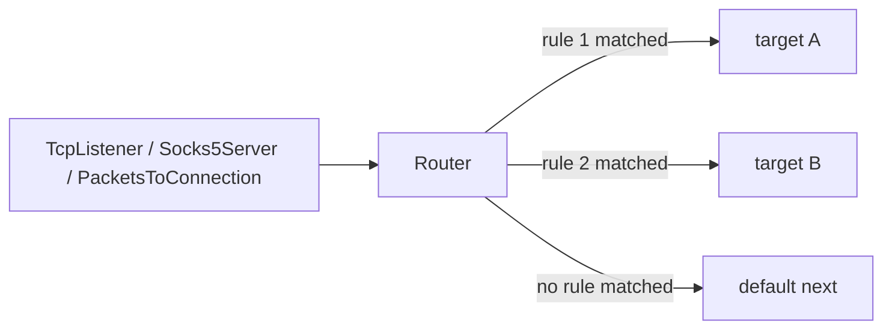

# Router

`Router` نود rule-based برای شاخه‌بندی connectionها در WaterWall است. این نود
در میانه زنجیره قرار می‌گیرد، روی اولین upstream payload هر line تصمیم می‌گیرد
و کل آن connection را فقط به یک شاخه انتخاب‌شده می‌فرستد.

اگر هیچ ruleای match نشود، connection به `next` خود Router می‌رود. بنابراین
`next` مسیر پیش‌فرض یا default route است.



## مدل ذهنی

`Router` در زمان `Init` شاخه را انتخاب نمی‌کند. دلیلش این است که بعضی ruleها
به payload اول نیاز دارند؛ مثل تشخیص `protocol`، خواندن HTTP Host، خواندن TLS
SNI یا بررسی HTTP `Upgrade`.

رفتار کلی:

- upstream `Init` فقط state داخلی Router را آماده می‌کند.
- اولین upstream payload موقتاً buffer می‌شود.
- sniffing و rule matching انجام می‌شود.
- اولین rule که همه شرط‌هایش match شود انتخاب می‌شود.
- branch انتخاب‌شده initialize می‌شود.
- payload buffer شده به همان branch replay می‌شود.
- payloadهای بعدی دیگر دوباره classify نمی‌شوند و مستقیم از همان branch عبور
  می‌کنند.

:::warning
`Router` برای مسیرهایی مناسب است که client اول داده می‌فرستد. اگر protocol از
نوع server-first باشد و server باید قبل از client چیزی بفرستد، Router تا وقتی
upstream payload نرسد branch را initialize نمی‌کند.
:::

## جایگاه رایج

```text
TcpListener -> Router
                 |-- target: tls_path
                 |-- target: ssh_path
                 `-- next: default_path
```

بعد از proxy server:

```text
Socks5Server -> Router -> TcpConnector
```

بعد از تبدیل packet به connection:

```text
TunDevice -> PacketsToConnection -> Router -> TcpConnector
```

`Router` یک نود لایه ۴ است و خودش raw packet router نیست. برای packet chainها
اگر routing در سطح connection می‌خواهید، اول از نودهایی مثل
`PacketsToConnection` استفاده کنید.

## نمونه کامل

```json
{
  "name": "router",
  "type": "Router",
  "settings": {
    "sniffing": [
      "http1",
      "tls"
    ],
    "rules": [
      {
        "username": "alice",
        "target": "premium_path"
      },
      {
        "destination-domain": [
          "*.example.org"
        ],
        "protocol": "tls",
        "target": "example_tls_path"
      },
      {
        "destination-port": 22,
        "target": "ssh_path"
      }
    ]
  },
  "next": "direct_path"
}
```

در این مثال:

- کاربر authenticate شده با username برابر `alice` به `premium_path` می‌رود.
- TLS برای دامنه‌های `*.example.org` به `example_tls_path` می‌رود.
- مقصد port `22` به `ssh_path` می‌رود.
- بقیه connectionها به `direct_path` می‌روند.

## فیلدهای اصلی

| فیلد | نوع | توضیح |
| --- | --- | --- |
| `name` | string | نام نود. |
| `type` | string | باید دقیقاً `"Router"` باشد. |
| `next` | string | اجباری؛ مسیر default وقتی هیچ ruleای match نشود. |

`settings` می‌تواند خالی یا حذف‌شده باشد. در این حالت همه connectionها به
`next` می‌روند. اگر `rules` وجود دارد، باید array غیرخالی باشد.

## تنظیمات

| گزینه | نوع | پیش‌فرض | توضیح |
| --- | --- | --- | --- |
| `rules` | array | unset | لیست ruleها به ترتیب priority. |
| `sniffing` | array | unset | modeهای domain sniffing: مقدارهای مجاز `http1` و `tls`. |
| `sniff-even-if-domain-is-already-provided` | boolean | `false` | اگر `true` باشد، Host/SNI می‌تواند domain موجود را جایگزین کند. |
| `resolve-domains` | boolean | `false` | قبل از Router یک `DomainResolver` داخلی می‌گذارد تا domain destinationهای unresolved قبل از routing resolve شوند. |
| `geoip-db-path` | string | unset | فقط وقتی لازم است که rule از `geoip:<cc>` استفاده کند. |
| `geosite-db-path` | string | unset | فقط وقتی لازم است که rule از `geosite:<list>` استفاده کند. |

مقدار قدیمی `http` برای sniffing یا protocol دیگر معتبر نیست؛ از `http1`
استفاده کنید.

## قانون‌های Matching

هر rule باید `target` و حداقل یک شرط داشته باشد.

```json
{
  "destination-port": [
    80,
    443
  ],
  "network": "tcp",
  "target": "web_path"
}
```

منطق matching:

| سطح | منطق |
| --- | --- |
| مقدارهای داخل یک condition | OR |
| conditionهای داخل یک rule | AND |
| ruleهای داخل `rules` | اولین match برنده است |
| بدون match | مسیر `next` استفاده می‌شود |

یعنی rule بالا فقط وقتی match می‌شود که network برابر TCP باشد و destination
port یکی از `80` یا `443` باشد.

## شرط‌های قابل استفاده

| شرط | ورودی | توضیح |
| --- | --- | --- |
| `source-ips` | string یا array | IP/CIDR مبدا یا `geoip:<cc>`. |
| `source-port` | integer یا array | port local/inbound که peer به آن وصل شده است. |
| `source-port-range` | array دو عددی | بازه inclusive برای source port. |
| `destination-ip` | string یا array | IP/CIDR مقصد یا `geoip:<cc>`. مقصد domain-only بدون resolve شدن match نمی‌شود. |
| `destination-port` | integer یا array | port مقصد. |
| `destination-port-range` | array دو عددی | بازه inclusive برای destination port. |
| `destination-domain` | string یا array | domain مقصد، domain sniff شده، wildcard، `*` یا `geosite:<list>`. |
| `network` | string یا array | یکی از `tcp`، `udp`، `icmp`، `packet` یا ترکیب مثل `"tcp,udp"`. |
| `protocol` | string یا array | protocol تشخیص داده‌شده از payload اول: `http1`، `tls`، `bittorrent`. |
| `attributes` | array غیرخالی | فعلاً فقط `http_upgrade_present`. |
| `username` | string یا array | username authenticate شده روی line، exact و case-sensitive. |
| `password` | string یا array | password authenticate شده روی line، exact و case-sensitive. |

## Domain و Sniffing

برای routing بر اساس domain:

```json
{
  "sniffing": [
    "http1",
    "tls"
  ],
  "rules": [
    {
      "destination-domain": [
        "*.example.com",
        "geosite:cn"
      ],
      "target": "domain_path"
    }
  ]
}
```

`http1` مقدار HTTP Host را می‌خواند. `tls` مقدار SNI را از ClientHello می‌خواند.
اگر destination از قبل domain داشته باشد، Router به صورت پیش‌فرض آن را با
Host/SNI جایگزین نمی‌کند. این کار باعث می‌شود domain انتخاب‌شده توسط config یا
نود قبلی با داده‌ای که client داخل payload فرستاده عوض نشود.

اگر واقعاً می‌خواهید Host/SNI domain قبلی را override کند:

```json
{
  "sniff-even-if-domain-is-already-provided": true
}
```

## Protocol Detection

`protocol` از payload اول تشخیص داده می‌شود و به root `sniffing` نیاز ندارد.
اگر ruleای از `protocol` استفاده کند، Router detector لازم را خودش اجرا می‌کند.

مقدارهای مجاز:

| مقدار | تشخیص |
| --- | --- |
| `http1` | prefix متد HTTP/1 مثل `GET ` یا `CONNECT `. |
| `tls` | TLS ClientHello. |
| `bittorrent` | handshake بیت‌تورنت. |

## Attributes

تنها attribute فعلی:

```json
{
  "attributes": [
    "http_upgrade_present"
  ],
  "target": "websocket_path"
}
```

این شرط وقتی match می‌شود که درخواست HTTP/1 اول header با نام `Upgrade:` داشته
باشد. برای این attribute باید root `sniffing` شامل `http1` باشد، وگرنه rule
هیچ‌وقت match نمی‌شود.

## GeoIP

`geoip:<cc>` در `source-ips` و `destination-ip` قابل استفاده است:

```json
{
  "geoip-db-path": "/var/lib/waterwall/GeoLite2-Country.mmdb",
  "rules": [
    {
      "source-ips": "geoip:ir",
      "target": "iran_path"
    }
  ]
}
```

نکته‌ها:

- `geoip-db-path` فقط وقتی اجباری است که rule واقعاً `geoip:` داشته باشد.
- دیتابیس باید MaxMind country database باشد.
- country code دو حرفی و case-insensitive است.
- برای `destination-ip` اگر مقصد هنوز domain-only است، باید قبل از matching
  resolve شود.

## GeoSite

`geosite:<list>` در `destination-domain` استفاده می‌شود:

```json
{
  "geosite-db-path": "/var/lib/waterwall/geosite_generated.json",
  "sniffing": [
    "http1",
    "tls"
  ],
  "rules": [
    {
      "destination-domain": [
        "geosite:cn",
        "geosite:category-ads-all"
      ],
      "target": "geosite_path"
    }
  ]
}
```

فایل GeoSite با generator داخل سورس ساخته می‌شود:

```text
tunnels/Router/geosite_ww_style_generator/do_the_job.py
```

نوع‌های پشتیبانی‌شده در GeoSite:

| نوع | رفتار |
| --- | --- |
| `full` | match دقیق domain. |
| `domain` / `root_domain` | root domain و subdomainها. |
| `plain` / `keyword` | substring. |
| `regex` / `regexp` | regex با STC `cregex`. |

## resolve-domains

اگر `resolve-domains` برابر `true` باشد، Router یک `DomainResolver` داخلی قبل
از خودش می‌سازد. این برای حالتی خوب است که مقصد به صورت domain آمده، اما شما
می‌خواهید بر اساس `destination-ip` یا GeoIP تصمیم بگیرید.

```json
{
  "resolve-domains": true,
  "geoip-db-path": "/var/lib/waterwall/GeoLite2-Country.mmdb",
  "rules": [
    {
      "destination-ip": "geoip:us",
      "target": "us_path"
    }
  ]
}
```

این resolver فقط domainهای unresolved را resolve می‌کند و domainهایی را که
بعداً از HTTP Host یا TLS SNI sniff می‌شوند دوباره resolve نمی‌کند.

## Target Branchها

`target` نام یک node واقعی در همان config است. Router در زمان ساخت chain، این
targetها را وارد chain خودش می‌کند تا:

- targetها line state داشته باشند.
- downstream traffic از branchها دوباره از Router برگردد.
- lifecycle chain حفظ شود.

قوانین مهم:

- target باید وجود داشته باشد.
- target نباید خود Router باشد.
- یک target نباید قبلاً به previous ناسازگار وصل شده باشد.
- چند rule می‌توانند یک target مشترک داشته باشند.

اگر branch شما جای دیگری در config است، می‌توانید از `Bridge` به عنوان target
استفاده کنید.

## بافر کردن Payload اول

Router برای تصمیم‌گیری payload اول را buffer می‌کند. detectorها ممکن است برای
HTTP/TLS/BitTorrent ناقص درخواست bytes بیشتر کنند.

حد پنجره sniffing:

```text
8192 bytes
```

بعد از انتخاب مسیر، payloadهای بعدی دیگر دوباره classify نمی‌شوند.

## اشتباه‌های رایج

- ترتیب ruleها مهم است؛ اولین match برنده است. ruleهای خاص را بالاتر بگذارید.
- rule بدون condition و فقط با `target` معتبر نیست؛ برای مسیر پیش‌فرض از
  `next` استفاده کنید.
- `destination-domain` روی مقصد IP-only بدون `sniffing` کار نمی‌کند.
- `protocol` به root `sniffing` نیاز ندارد.
- `source-port` معمولاً port local/inbound listener است، نه port تصادفی client.
- برای protocolهای server-first، Router تا رسیدن اولین upstream payload مسیر را
  انتخاب نمی‌کند.

## Metadata نود

| ویژگی | مقدار |
| --- | --- |
| node flags | `kNodeFlagNone` |
| `can_have_prev` | `true` |
| `can_have_next` | `true` |
| `layer_group` | `kNodeLayer4` |
| `layer_group_prev_node` | `kNodeLayerAnything` |
| `layer_group_next_node` | `kNodeLayerAnything` |
| `required_padding_left` | `0` bytes |

`Router` header جدید prepend نمی‌کند، بنابراین به left padding نیاز ندارد.
