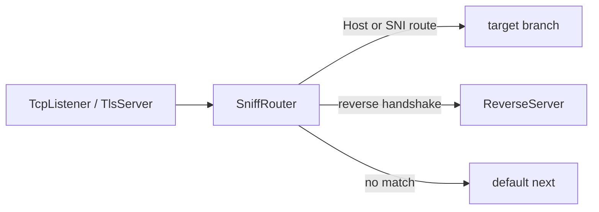

<!--
Documentation version: 152
-->

# SniffRouter

`SniffRouter` در درجه اول یک نود ساده و راحت برای سناریوهای متداول domain
sniffing در لایه ۴ است. این نود نخستین upstream payload هر connection را بررسی
می‌کند، بر اساس بایت‌های قابل مشاهده تصمیم می‌گیرد و تمام connection را از
نخستین route مناسب عبور می‌دهد.

بیشتر تنظیمات HTTP/1 Host و TLS ClientHello SNI را می‌توان با نود انعطاف‌پذیرتر
[`Router`](./Router.mdx) نیز پیاده کرد. وقتی یک نگاشت کوتاه از domain به مقصد
می‌خواهید، `SniffRouter` مناسب است. برای HTTP/2 یا HTTP/3 sniffing، تطبیق
source/destination IP یا port، ‏GeoIP/GeoSite، هویت احراز‌شده، شرط‌های ترکیبی و
سناریوهای پیشرفته‌تر routing از `Router` استفاده کنید.

استثنای فعلی، تشخیص reverse-link handshake است: `SniffRouter` می‌تواند handshake
ارسال‌شده توسط `ReverseClient` را تشخیص دهد، اما `Router` هنوز این detector را
ندارد. قرار است این قابلیت در آینده به `Router` اضافه شود؛ بنابراین این تفاوت
یک محدودیت فعلی است، نه یک تفاوت معماری دائمی.

## مدل ذهنی

- upstream `Init` بلافاصله به شاخه‌ها فرستاده نمی‌شود.
- نود منتظر اولین upstream payload می‌ماند.
- payload نخست به‌طور موقت در buffer نگه داشته می‌شود.
- routeها به ترتیب JSON بررسی می‌شوند.
- نخستین route مطابق، برنده است.
- اگر هیچ routeای match نشود، مسیر top-level `next` استفاده می‌شود.
- شاخه انتخاب‌شده مقداردهی اولیه می‌شود و بایت‌های bufferشده روی همان شاخه دوباره
  پخش می‌شوند.
- payloadهای بعدی دیگر دوباره classify نمی‌شوند.



:::warning
`SniffRouter` برای انتخاب مسیر باید بایت‌هایی از سمت client ببیند. در
protocolهای server-first تا رسیدن upstream payload هیچ شاخه‌ای انتخاب نمی‌شود.
:::

## جایگاه رایج

بعد از TLS termination برای HTTP Host:

```text
TcpListener -> TlsServer -> SniffRouter
                              |-- host a.example.com -> backend_a
                              |-- host b.example.com -> backend_b
                              `-- default next       -> camouflage_site
```

قبل از TLS termination برای SNI:

```text
TcpListener -> SniffRouter
                 |-- SNI a.example.com -> tls_site_a
                 |-- SNI b.example.com -> tls_site_b
                 `-- default next      -> default_tls_site
```

برای جدا کردن reverse tunnel از سایت camouflage بعد از decrypt شدن stream:

```text
TcpListener -> TlsServer -> SniffRouter
                              |-- reverse handshake -> ReverseServer
                              `-- default next      -> TcpConnector nginx
```

برای تشخیص reverse، handshake باید در حالت decrypt‌شده دیده شود. اگر `SniffRouter`
پیش از TLS termination باشد، handshake هنوز رمز شده است و قابل تشخیص نیست.

## نمونه تنظیم

HTTP Host routing:

```json
{
  "name": "sniff-router",
  "type": "SniffRouter",
  "settings": {
    "routes": [
      {
        "domains": [
          "a.example.com",
          "b.example.com"
        ],
        "next": "example_backend"
      },
      {
        "domains": [
          "*.static.example.com"
        ],
        "next": "static_backend"
      }
    ]
  },
  "next": "default_backend"
}
```

TLS SNI routing:

```json
{
  "name": "sniff-router",
  "type": "SniffRouter",
  "settings": {
    "routes": [
      {
        "detection": "tls",
        "domains": [
          "site-a.example.com"
        ],
        "next": "tls_site_a"
      },
      {
        "detection": "tls",
        "domains": [
          "site-b.example.com"
        ],
        "next": "tls_site_b"
      }
    ]
  },
  "next": "default_tls_site"
}
```

## فیلدهای اصلی

| فیلد | نوع | توضیح |
| --- | --- | --- |
| `name` | string | نام نود. |
| `type` | string | باید دقیقاً `"SniffRouter"` باشد. |
| `next` | string | اجباری؛ مسیر fallback وقتی هیچ routeای match نشود. |

`settings` می‌تواند حذف شود یا خالی باشد. در نبود route، همه connectionها به `next`
می‌روند.

## تنظیمات

| گزینه | نوع | پیش‌فرض | توضیح |
| --- | --- | --- | --- |
| `routes` | array | unset | فهرست routeها به ترتیب اولویت. اگر نوشته شود باید آرایه‌ای غیرخالی باشد. |
| `reverse-secret-length` | integer | `640` | طول handshake برای reverse detection. بازه معتبر `1..1024`. |
| `reverse-secret` | ASCII string | unset | secret مورد استفاده برای ساخت signature مربوط به reverse handshake. باید با نودهای Reverse یکسان باشد. |

تنظیمات reverse handshake حتی در نبود route مربوط به reverse نیز خوانده می‌شوند،
اما فقط برای routeهایی اثر دارند که مقدار `detection` آن‌ها شامل `reverse` است.

## Route Object

| فیلد | نوع | ضروری | توضیح |
| --- | --- | --- | --- |
| `domains` | string یا array | برای `http1` و `tls` ضروری | domain patternها. |
| `domain` | string | نه | alias برای یک domain. با `domains` هم‌زمان استفاده نشود. |
| `detection` | string یا array | نه | پیش‌فرض `"http1"`. |
| `next` | string | بله | target node برای route. |
| `target` | string | نه | alias برای route `next`. |

مقدارهای `detection`:

| مقدار | معنی |
| --- | --- |
| `http1` | خواندن HTTP/1 Host. |
| `tls` | خواندن TLS ClientHello SNI. |
| `reverse` | تشخیص reverse-link handshake. |
| `reverse-tls` | alias برای `reverse`. |
| `reverse-handshake` | alias برای `reverse`. |

مقدارهای حذف‌شده:

| مقدار قدیمی | مقدار جدید |
| --- | --- |
| `http` | `http1` |
| `client-hello` | `tls` |
| `tls-client-hello` | `tls` |

اگر route شامل `reverse` باشد، تشخیص reverse به `domains` وابسته نیست. با این
حال اگر در همان route مقدار `http1` یا `tls` نیز وجود داشته باشد، برای آن
روش‌های تشخیص مبتنی بر domain همچنان `domains` لازم است.

## ترتیب Routeها

routeها به ترتیب نوشته‌شده در JSON بررسی می‌شوند و نخستین match برنده است. routeهای خاص را
قبل از wildcardها قرار دهید.

```json
{
  "routes": [
    {
      "domain": "api.example.com",
      "next": "api_backend"
    },
    {
      "domain": "*.example.com",
      "next": "wildcard_backend"
    }
  ]
}
```

در این مثال، `api.example.com` به `api_backend` می‌رود، چون route دقیق پیش از
wildcard آمده است. اگر ترتیب برعکس بود، wildcard در صورت تطبیق الگو آن را
می‌گرفت. توجه کنید که `*.example.com` با subdomainها مطابقت دارد، اما با خود
`example.com` نه.

## Domain Matching

matching مربوط به domain به حروف کوچک و بزرگ حساس نیست. الگوهای config به lowercase تبدیل می‌شوند و نقطه
انتهایی حذف می‌شود.

| pattern | معنی |
| --- | --- |
| `example.com` | match دقیق. |
| `*.example.com` | با subdomainهایی مانند `www.example.com` مطابقت دارد، اما با خود `example.com` نه. |
| `*` | هر Host/SNI غیرخالی. |

الگوهای نامعتبر:

- رشته خالی
- `*.` بدون suffix
- wildcardهایی غیر از فرم `*.example.com`
- URL مثل `https://example.com`
- host:port مثل `example.com:443`
- مقدارهای شامل `/` یا `\`

اگر HTTP Host روی wire شامل port باشد، sniffer آن را پیش از matching حذف
می‌کند؛ برای نمونه `Host: example.com:443` با الگوی `example.com` مطابقت دارد.

## HTTP Host Detection

روش تشخیص پیش‌فرض routeها `http1` است:

```json
{
  "domains": [
    "app.example.com"
  ],
  "next": "app_backend"
}
```

در حالت `http1`، `SniffRouter` انتظار دارد نخستین payload قابل مشاهده یک request
از نوع HTTP/1 باشد. سپس header مربوط به `Host` را می‌خواند و آن را با الگوهای
domain در route مقایسه می‌کند.

برای HTTPS معمولاً SniffRouter را بعد از `TlsServer` می‌گذاریم:

```text
TcpListener -> TlsServer -> SniffRouter
```

preface مربوط به HTTP/2 cleartext، HTTP/1 Host ندارد؛ بنابراین در نبود match از
روش دیگری، ترافیک به `next` می‌رود.

## TLS SNI Detection

برای تطبیق TLS ClientHello SNI از `detection: "tls"` استفاده کنید:

```json
{
  "detection": "tls",
  "domains": [
    "*.example.com"
  ],
  "next": "tls_branch"
}
```

این حالت معمولاً قبل از TLS termination استفاده می‌شود:

```text
TcpListener -> SniffRouter -> TlsServer
```

اگر SNI پیدا نشود یا با routeها match نشود، مسیر fallback یعنی top-level `next`
استفاده می‌شود.

## Reverse Detection

`reverse` handshake داخلی `ReverseClient`/`ReverseServer` را تشخیص می‌دهد:

```json
{
  "name": "sniff-router",
  "type": "SniffRouter",
  "settings": {
    "routes": [
      {
        "detection": "reverse",
        "next": "reverse_server"
      }
    ]
  },
  "next": "tcp_to_nginx"
}
```

این قابلیت زمانی مفید است که یک TLS entrypoint هم reverse tunnel و هم سایت
camouflage را با SNI یکسان حمل می‌کند. routing بر پایه Host/SNI نمی‌تواند این
دو را جدا کند، اما reverse link پس از decrypt شدن signature مشخصی دارد.

signature پیش‌فرض:

```text
640 bytes of 0xFF
```

اگر `reverse-secret-length` یا `reverse-secret` تنظیم شود، `SniffRouter` همان
الگوریتم `ReverseClient` و `ReverseServer` را استفاده می‌کند: byteهای handshake
پیش‌فرض تکرار می‌شوند و با byteهای ASCII مربوط به `reverse-secret` به‌صورت
تکرارشونده XOR می‌شوند.

این تنظیمات باید با Reverse nodeها یکی باشند:

```json
{
  "settings": {
    "reverse-secret-length": 640,
    "reverse-secret": "shared-secret",
    "routes": [
      {
        "detection": "reverse",
        "next": "reverse_server"
      }
    ]
  },
  "next": "camouflage_site"
}
```

نکته‌های مهم:

- handshake باید دقیقاً ابتدای decrypted stream باشد.
- `SniffRouter` فقط بایت‌ها را نگاه می‌کند و آن‌ها را دست‌نخورده برای `ReverseServer` بازپخش
  می‌کند.
- `ReverseServer` دوباره handshake را اعتبارسنجی می‌کند و از stream برمی‌دارد.
- reverse route به `domains` نگاه نمی‌کند.
- اگر payload نخست فقط بخشی از prefix مربوط به handshake باشد، `SniffRouter` یک warning ثبت می‌کند و
  مستقیم مسیر default `next` را انتخاب می‌کند.
- اگر proxy جلویی PROXY protocol header اضافه می‌کند، باید قبل از SniffRouter
  حذف شود.

## بافر Payload اول

`SniffRouter` بایت‌های ابتدایی upstream را تا زمان تعیین route در buffer نگه می‌دارد.

برای HTTP Host و TLS SNI، `SniffRouter` می‌تواند تا کامل شدن request یا
ClientHello مقدار بیشتری byte بخواهد. پنجره sniffing مشترک محدود است:

```text
8192 bytes
```

تشخیص reverse سخت‌گیرانه‌تر است: اگر payload نخست فقط prefix ناقصی از reverse handshake باشد، نود منتظر بایت‌های بیشتر نمی‌ماند و از `next` در سطح اصلی به‌عنوان fallback استفاده می‌کند.

پس از انتخاب route، payloadهای بعدی مستقیماً به target انتخاب‌شده یا `next` پیش‌فرض می‌روند و connection دوباره بررسی نمی‌شود.

## Target Branchها

`next` یا `target` در هر route نام یک نود واقعی در همان config است.
`SniffRouter` هنگام ساخت chain، targetها را وارد chain خودش می‌کند تا:

- targetها line state داشته باشند.
- downstream traffic از branchها دوباره از SniffRouter برگردد.
- lifecycle chain حفظ شود.

قوانین target:

- target node باید وجود داشته باشد
- target نمی‌تواند خود SniffRouter باشد
- شاخه target نباید از قبل به previous ناسازگاری متصل شده باشد
- target می‌تواند همان node مربوط به top-level `next` باشد

اگر شاخه در بخش دیگری از config قرار دارد، یک `Bridge` را به‌عنوان target قرار دهید.

## Lifecycle

| callback | رفتار |
| --- | --- |
| upstream `Init` | فقط state داخلی `SniffRouter` را مقداردهی اولیه می‌کند. |
| اولین upstream `Payload` | داده را در buffer نگه می‌دارد، route را انتخاب و target/default را مقداردهی اولیه می‌کند و سپس داده را بازپخش می‌کند. |
| payloadهای بعدی | مستقیم به target یا default می‌روند. |
| upstream `Pause` / `Resume` | فقط پس از انتخاب route فرستاده می‌شوند. |
| upstream `Est` | فقط به شاخه پیش‌فرض فرستاده می‌شود. targetهای route اغلب نودهای adapter/server هستند که upstream `Est` برای آن‌ها معتبر نیست. |
| upstream `Finish` | state داخلی را از بین می‌برد و شاخه انتخاب‌شده را با `Finish` می‌بندد. |
| downstream callbacks | به previous node برمی‌گردند. |
| downstream `Finish` | پیش از فرستادن `Finish` به previous node، state داخلی را از بین می‌برد. |

## SniffRouter یا Router؟

برای domain sniffing ساده HTTP/1، در حالتی که نود قبلی هنوز destination domain
را تعیین نکرده است، دو تنظیم از نظر مفهومی بسیار شبیه‌اند. این `SniffRouter` سه
domain را به سه مقصد جدا می‌فرستد:

```json
{
  "name": "sniff-router",
  "type": "SniffRouter",
  "settings": {
    "routes": [
      { "domain": "one.example.com", "next": "destination_one" },
      { "domain": "two.example.com", "next": "destination_two" },
      { "domain": "three.example.com", "next": "destination_three" }
    ]
  },
  "next": "default_destination"
}
```

تنظیم معادل با `Router` چنین است:

```json
{
  "name": "router",
  "type": "Router",
  "settings": {
    "sniffing": ["http1"],
    "rules": [
      { "destination-domain": "one.example.com", "target": "destination_one" },
      { "destination-domain": "two.example.com", "target": "destination_two" },
      { "destination-domain": "three.example.com", "target": "destination_three" }
    ]
  },
  "next": "default_destination"
}
```

در هر دو حالت، ورودی‌ها به‌ترتیب بررسی می‌شوند و top-level `next` مسیر fallback
است. `SniffRouter` از `domain`/`domains` و `next` در route استفاده می‌کند؛
`Router` از `destination-domain` و `target` در rule استفاده می‌کند و می‌تواند
شرط‌های دیگری را نیز به همان rule اضافه کند.

از `SniffRouter` استفاده کنید اگر فقط این‌ها را لازم دارید:

- HTTP Host routing
- TLS SNI routing
- تنظیم کوتاه‌تر برای یک domain split ساده
- در شرایط فعلی، تشخیص reverse handshake برای reverse tunnelی که یک TLS entrypoint را با سایت camouflage شریک است

اگر این قابلیت‌ها را می‌خواهید، [مستندات `Router`](./Router.mdx) را ببینید:

- domain sniffing برای HTTP/2 یا QUIC/HTTP/3
- source/destination IP یا port
- GeoIP یا GeoSite
- username/password
- ترکیب `protocol` یا `attributes` با شرط‌های دیگر
- چند شرط ترکیبی با AND یا ruleهای انعطاف‌پذیرتر

`Router` در حال حاضر handshake مربوط به `ReverseClient` را تشخیص نمی‌دهد. انتظار
می‌رود این detector در آینده به `Router` اضافه شود.

`SniffRouter` header تازه‌ای به ابتدای payload اضافه نمی‌کند و به left padding نیاز ندارد.

## متادیتای نود

متادیتای برگرفته از کد منبع:

| ویژگی | مقدار |
| --- | --- |
| node flags | `kNodeFlagNone` |
| `can_have_prev` | `true` |
| `can_have_next` | `true` |
| `layer_group` | `kNodeLayer4` |
| `layer_group_prev_node` | `kNodeLayer4` |
| `layer_group_next_node` | `kNodeLayer4` |
| `required_padding_left` | `0` bytes |
