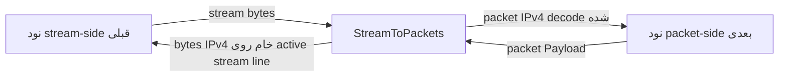

<!-- Written from version 106 of the English doc. -->

# StreamToPackets

`StreamToPackets` adapter معکوس `PacketsToStream` است. این نود یک stream line معمولی را از سمت قبلی می‌گیرد، stream را مجموعه‌ای از packetهای خام IPv4 پشت‌سرهم در نظر می‌گیرد، مرز آن‌ها را با فیلد `total-length` بازیابی می‌کند و هر packet را به نود packet-oriented بعدی می‌فرستد.

پیاده‌سازی فعلی فقط از IPv4 پشتیبانی می‌کند و headerless است:

```text
IPv4 packet bytes + IPv4 packet bytes + IPv4 packet bytes + ...
```

هیچ length prefix دوبایتی وجود ندارد. در مستندات قدیمی ممکن است نام `DataAsPacket` را ببینید، اما نام نوع فعلی نود `StreamToPackets` است.

## کار این نود

- یک stream line واتروال را از سمت قبلی می‌پذیرد.
- برای هر worker یک active stream line نگه می‌دارد تا packetهای برگشتی را روی آن بنویسد.
- بایت‌های stream در مسیر upstream را تا کامل شدن یک packet IPv4 در buffer نگه می‌دارد.
- packetها را با استفاده از فیلد `total-length` استخراج می‌کند.
- در صورت تنظیم، packetهای decodeشده را پیش از فرستادن به سمت packet اعتبارسنجی می‌کند.
- packetهای decodeشده را در جهت upstream به نود packet-oriented بعدی می‌فرستد.
- payloadهای برگشتی از سمت packet را به شکل packet خام IPv4 روی active stream line می‌نویسد.
- IPv6، payloadهای غیر IPv4، packetهای نامعتبر IPv4 و خروجی سمت packet در نبود active stream line را کنار می‌گذارد.

این نود فقط مرز packetها را از stream بازیابی می‌کند و TCP/UDP flow را بازسازی نمی‌کند؛ برای آن کار از `PacketsToConnection` استفاده کنید.

## جایگاه رایج

stream input به packet output:

```text
TcpListener -> StreamToPackets -> TunDevice
```

جفت با `PacketsToStream` روی سرور دیگر:

```text
server1: TunDevice -> PacketsToStream -> TcpConnector
server2: TcpListener -> StreamToPackets -> TunDevice
```

`StreamToPackets` انتظار دارد stream را `PacketsToStream` یا peer دیگری تولید کرده باشد که همین قالب packetهای خام IPv4 پشت‌سرهم را به کار می‌برد.

## نمونه تنظیم

```json
{
  "name": "stream-to-packet",
  "type": "StreamToPackets",
  "settings": {
    "sensitive-mode": true,
    "packet-validation-level": "hard"
  },
  "next": "packet-node"
}
```

## تنظیمات

فیلدهای سطح بالا:

| فیلد | نوع | اجباری | توضیح |
| --- | --- | --- | --- |
| `name` | string | بله | نام دلخواه نود. باید داخل فایل config یکتا باشد. |
| `type` | string | بله | باید دقیقاً `"StreamToPackets"` باشد. |
| `settings` | object | خیر | object تنظیمات اختیاری. |
| `next` | string | بله | نود packet-oriented که packetهای بازسازی‌شده را دریافت می‌کند. |

فیلدهای اختیاری `settings`:

| گزینه | نوع | پیش‌فرض | توضیح |
| --- | --- | --- | --- |
| `sensitive-mode` | boolean | `false` | فعال‌سازی مدیریت heartbeat برای packetهای ping IPv4 tagged از `PacketsToStream`. |
| `packet-validation-level` | string | `"none"` | حالت اعتبارسنجی برای packetهای decode شده از data stream upstream. مقادیر: `"none"`، `"loose"`، `"hard"`. |

روی `StreamToPackets` تنظیم `interval-ms` یا `tolerance-ms` وجود ندارد. آن timerها به `PacketsToStream` تعلق دارند که heartbeat را آغاز می‌کند.

## فرمت wire

stream شامل packetهای IPv4 کامل پشت سر هم است:

```text
packet A: N bytes, where IPv4 total-length = N
packet B: M bytes, where IPv4 total-length = M
packet C: K bytes, where IPv4 total-length = K
```

`StreamToPackets` هیچ length prefixی نمی‌خواند. ابتدا header مربوط به IPv4 را می‌خواند، از فیلد `total-length` فقط برای تعیین اندازه packet استفاده می‌کند و تا جمع شدن کل packet در buffer منتظر می‌ماند.

packetهای برگشتی از packet side با همان فرمت packet IPv4 خام به active stream line نوشته می‌شوند.

## مدل جریان



خلاصه جهت:

| جهت | رفتار |
| --- | --- |
| stream side به packet side | بایت‌ها را در buffer جمع می‌کند، packetهای IPv4 را استخراج و در صورت تنظیم اعتبارسنجی می‌کند، سپس آن‌ها را به نود بعدی می‌فرستد. |
| packet side به stream side | payload packet IPv4 معتبر را به‌عنوان byte خام به active stream line می‌فرستد. |

## Active Stream Line و bootstrap packet-line

`StreamToPackets` میان stream lineهای معمول و worker packet lineهای مشترک پل می‌زند.

هنگام startup، برای هر worker یک upstream packet-line `Init` در صف می‌گذارد تا tunnel بعدی در سمت packet، پس از startup مربوط به node manager، worker packet line را دریافت کند.

هنگام مقداردهی اولیه یک stream line در جهت upstream:

- `StreamToPackets` آن line را به‌عنوان active stream line برای آن worker ذخیره می‌کند
- state مربوط به parser را برای آن stream line مقداردهی اولیه می‌کند
- packet-line paused flag را پاک می‌کند
- downstream `Est` را به stream side قبلی برمی‌گرداند

اگر stream line تازه‌ای روی همان worker جای active line قبلی را بگیرد، payloadهای برگشتی به جدیدترین active line فرستاده می‌شوند.

## استخراج packet

data stream upstream ورودی به یک read buffer per-stream اضافه می‌شود. decoder:

1. منتظر حداقل یک IPv4 header حداقل می‌ماند
2. بررسی می‌کند آیا ابتدای stream شبیه یک IPv4 packet معتبر است
3. فیلد IPv4 total-length را می‌خواند
4. منتظر می‌ماند تا همان تعداد بایت در buffer جمع شود
5. دقیقاً آن تعداد byte را به‌عنوان یک packet استخراج می‌کند
6. در صورت فعال بودن sensitive-mode، packetهای ping را مدیریت می‌کند
7. اختیاراً packet decode شده را اعتبارسنجی می‌کند
8. packet را به نود packet-oriented بعدی می‌فرستد

اگر ابتدای stream شروع معتبر یک packet IPv4 نباشد، decoder در یک پنجره محدود به دنبال نقطه resync می‌گردد و بایت‌ها را تا header معتبر بعدی کنار می‌گذارد. پیشرفت parser تضمین شده است؛ بنابراین ورودی نامعتبر نمی‌تواند آن را متوقف کند.

حد overflow فعلی read stream:

```text
65536 * 2 bytes
```

اگر data buffer از آن اندازه تجاوز کند، read stream خالی می‌شود.

## اعتبارسنجی packet

`packet-validation-level` روی packetهایی اعمال می‌شود که از data stream upstream decode شده‌اند، قبل از اینکه به packet side ارسال شوند.

| سطح | رفتار |
| --- | --- |
| `"none"` | پیش‌فرض. هیچ اعتبارسنجی configurable بعد از استخراج ندارد. extractor هنوز بررسی‌های structural سبک انجام می‌دهد تا بتواند مرز packetها را پیدا کند. |
| `"loose"` | packetهای غیر IPv4 و packetهای نامعتبر IPv4 را کنار می‌گذارد. حداقل اندازه header، version، طول header مربوط به IPv4 و برابری total length با طول packet را بررسی می‌کند. |
| `"hard"` | `loose` را اعمال می‌کند، IPv4 header checksum را verify می‌کند، و checksumهای TCP، UDP و ICMP را برای packetهای non-fragmented verify می‌کند. IPv4 UDP checksum برابر `0` پذیرفته می‌شود. |

برای packetهای IPv4 fragmented در حالت `"hard"`، فقط IPv4 header checksum verify می‌شود. transport checksumها نیاز به reassembly دارند و skip می‌شوند.

وقتی یک packet decodeشده در اعتبارسنجی رد شود، tunnel سطح اعتبارسنجی و دلیل را به‌صورت warning در log می‌نویسد.

payload برگشتی از سمت packet تحت این اعتبارسنجی قابل‌تنظیم قرار نمی‌گیرد، اما پیش از نوشته شدن روی stream line همچنان باید یک packet سازگار IPv4 باشد.

## مسیر برگشت به stream

وقتی payload packet از سمت بعدی می‌رسد:

- tunnel active stream line را برای worker packet line پیدا می‌کند
- اگر active stream line وجود نداشته باشد، packet کنار گذاشته می‌شود
- اگر active stream line pause یا dead باشد، packet کنار گذاشته می‌شود
- اگر payload از `kMaxAllowedPacketLength` بزرگ‌تر باشد، کنار گذاشته می‌شود
- اگر checksum recalculation روی packet line درخواست شده باشد، checksum کامل packet IPv4 دوباره محاسبه می‌شود
- اگر payload یک packet سازگار IPv4 نباشد، کنار گذاشته می‌شود
- در غیر این صورت bytes IPv4 خام downstream به stream line قبلی ارسال می‌شوند

این همان فرمت stream بدون header استفاده شده توسط `PacketsToStream` را حفظ می‌کند.

## Sensitive Mode

`StreamToPackets` سمت responder برای heartbeat sensitive-mode است.

وقتی فعال است:

- اگر packet decode شده upstream یک packet IPv4 حداقلی با protocol `0xFD` و payload پنج‌بایتی پر از `0xFF` باشد، به‌عنوان heartbeat ping در نظر گرفته می‌شود
- ping به سمت packet فرستاده نمی‌شود
- `StreamToPackets` یک heartbeat pong متناظر روی همان stream line برمی‌گرداند
- pong یک packet IPv4 حداقلی با protocol `0xFD` و payload پنج‌بایتی پر از `0xDD` است
- pong به سمت packet فرستاده نمی‌شود

`StreamToPackets` timer جداگانه‌ای برای heartbeat ندارد. timeout و ساخت دوباره stream line بر عهده `PacketsToStream` است.

## Pause، Resume و Finish

رفتار callback:

| callback دریافت‌شده توسط `StreamToPackets` | رفتار |
| --- | --- |
| upstream `Init` | stream line ورودی را به‌عنوان active line برای آن worker ذخیره می‌کند و downstream `Est` را به سمت قبلی می‌فرستد. |
| upstream `Payload` | بایت‌های stream را در buffer جمع می‌کند، packetهای IPv4 را استخراج می‌کند، heartbeat ping را مدیریت و packetها را اعتبارسنجی می‌کند و سپس آن‌ها را به نود بعدی می‌فرستد. |
| upstream `Pause` | active stream line را برای نوشتن برگشت packet-side paused علامت می‌زند. |
| upstream `Resume` | paused flag را برای active stream line پاک می‌کند. |
| upstream `Finish` | اگر active stream line همان line باشد آن را پاک می‌کند و state مربوط به parser را از بین می‌برد. |
| upstream `Est` | warning log؛ انتظار نمی‌رود. |
| downstream `Payload` | payload packet IPv4 معتبر را به active stream line می‌فرستد. |
| downstream `Est` | No-op. tunnelهای packet معمولاً `Est` نمی‌فرستند. |
| downstream `Init` | fatal guard؛ جهت نامعتبر. |
| downstream `Finish` | fatal guard؛ جهت نامعتبر. |
| downstream `Pause` / `Resume` | warning log؛ از packet side انتظار نمی‌رود. |

وقتی active stream line در حالت pause باشد، packet برگشتی به‌جای قرار گرفتن در صف کنار گذاشته می‌شود.

## محاسبه مجدد Checksum

اگر `line->recalculate_checksum` روی packet line تنظیم باشد و payload یک IPv4 باشد، `StreamToPackets` checksum کامل packet IPv4 را قبل از نوشتن به active stream line دوباره محاسبه می‌کند، سپس flag را پاک می‌کند.

## متادیتای نود

| ویژگی | مقدار |
| --- | --- |
| node flags | `kNodeFlagNone` |
| `can_have_prev` | `true` |
| `can_have_next` | `true` |
| `layer_group` | لایه 3 و لایه 4 (`kNodeLayer3`، `kNodeLayer4`) |
| `layer_group_prev_node` | `kNodeLayerAnything` |
| `layer_group_next_node` | `kNodeLayerAnything` |
| `required_padding_left` | `0` |

tunnel هیچ بایتی به ابتدای payload اضافه نمی‌کند؛ بنابراین به left padding اضافی نیاز ندارد.

## نکته‌های عملی

- آن را با `PacketsToStream` در سمت مقابل جفت کنید.
- آن را با stream packet قدیمی 2-byte-prefix تغذیه نکنید؛ parsing فعلی از فیلد IPv4 total-length استفاده می‌کند.
- از `packet-validation-level: "hard"` وقتی می‌خواهید اعتبارسنجی قوی‌تری از packetهای decode شده از stream داشته باشید استفاده کنید.
- اگر active stream line وجود نداشته باشد یا در حالت pause باشد، packetهای برگشتی ممکن است از دست بروند.
- از `PacketsToConnection` به‌جای این نود استفاده کنید وقتی هدف بازسازی TCP/UDP flow است نه بازسازی packet boundary.
