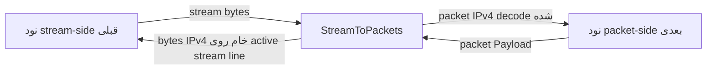

# StreamToPackets

`StreamToPackets` adapter معکوس `PacketsToStream` است. این نود یک stream line معمولی از سمت قبلی می‌گیرد، آن stream را به عنوان concatenation خام packetهای IPv4 در نظر می‌گیرد، مرز packetها را از فیلد IPv4 `total-length` بازسازی می‌کند، و هر packet را به نود packet-oriented بعدی forward می‌کند.

پیاده‌سازی فعلی فقط از IPv4 پشتیبانی می‌کند و headerless است:

```text
IPv4 packet bytes + IPv4 packet bytes + IPv4 packet bytes + ...
```

هیچ length prefix دو بایتی وجود ندارد. مستندات قدیمی ممکن است این نود را `DataAsPacket` بنامند، اما نوع فعلی نود `StreamToPackets` است.

## کار این نود

- یک WaterWall stream line از سمت قبلی می‌پذیرد.
- یک active stream line به ازای هر worker برای نوشتن برگشت سمت packet نگه می‌دارد.
- bytes stream upstream را تا در دسترس بودن یک packet IPv4 کامل buffer می‌کند.
- packetها را با استفاده از فیلد total-length هر packet IPv4 استخراج می‌کند.
- اختیاراً packetهای decode شده را قبل از forward کردن به packet side اعتبارسنجی می‌کند.
- packetهای decode شده را upstream به نود packet-oriented بعدی می‌فرستد.
- payload packetهای برگشتی از packet side را به عنوان packetهای IPv4 خام به active stream line برمی‌گرداند.
- IPv6، payload غیر IPv4، packetهای IPv4 malformed، و خروجی packet-side را وقتی active stream line وجود ندارد drop می‌کند.

این نود مرز packetها را از stream بازسازی می‌کند. یک نود بازسازی TCP/UDP flow نیست؛ برای آن کار از `PacketsToConnection` استفاده کنید.

## جایگاه رایج

stream input به packet output:

```text
TcpListener -> StreamToPackets -> TunDevice
```

جفت با `PacketsToStream` روی سرور دیگر:

```text
server1: TunDevice -> PacketsToStream -> TcpConnector
server2: TcpListener -> StreamToPackets -> TunDevice
```

`StreamToPackets` انتظار دارد stream تولید شده توسط `PacketsToStream` یا peer دیگری باشد که از همان فرمت raw IPv4 concatenation استفاده می‌کند.

## نمونه تنظیم

```json
{
  "name": "stream-to-packet",
  "type": "StreamToPackets",
  "settings": {
    "sensitive-mode": true,
    "packet-validation-level": "hard"
  },
  "next": "packet-node"
}
```

## تنظیمات

فیلدهای سطح بالا:

| فیلد | نوع | اجباری | توضیح |
| --- | --- | --- | --- |
| `name` | string | بله | نام دلخواه نود. باید داخل فایل config یکتا باشد. |
| `type` | string | بله | باید دقیقاً `"StreamToPackets"` باشد. |
| `settings` | object | خیر | object تنظیمات اختیاری. |
| `next` | string | بله | نود packet-oriented که packetهای بازسازی‌شده را دریافت می‌کند. |

فیلدهای اختیاری `settings`:

| گزینه | نوع | پیش‌فرض | توضیح |
| --- | --- | --- | --- |
| `sensitive-mode` | boolean | `false` | فعال‌سازی مدیریت heartbeat برای packetهای ping IPv4 tagged از `PacketsToStream`. |
| `packet-validation-level` | string | `"none"` | حالت اعتبارسنجی برای packetهای decode شده از data stream upstream. مقادیر: `"none"`، `"loose"`، `"hard"`. |

روی `StreamToPackets` تنظیم `interval-ms` یا `tolerance-ms` وجود ندارد. آن timerها به `PacketsToStream` تعلق دارند که heartbeat را آغاز می‌کند.

## فرمت wire

stream شامل packetهای IPv4 کامل پشت سر هم است:

```text
packet A: N bytes, where IPv4 total-length = N
packet B: M bytes, where IPv4 total-length = M
packet C: K bytes, where IPv4 total-length = K
```

`StreamToPackets` هیچ length prefix نمی‌خواند. IPv4 header را می‌خواند، فقط به اندازه کافی به فیلد total-length اعتماد می‌کند تا بداند چند byte یک packet را تشکیل می‌دهد، و منتظر می‌ماند تا packet کامل buffer شود.

packetهای برگشتی از packet side با همان فرمت packet IPv4 خام به active stream line نوشته می‌شوند.

## مدل جریان



خلاصه جهت:

| جهت | رفتار |
| --- | --- |
| stream side به packet side | bytes را buffer می‌کند، packetهای IPv4 را استخراج می‌کند، اختیاراً اعتبارسنجی می‌کند، سپس packetها را به نود بعدی می‌فرستد. |
| packet side به stream side | payload packet IPv4 معتبر را به عنوان byte خام به active stream line می‌فرستد. |

## Active Stream Line و bootstrap packet-line

`StreamToPackets` بین stream lineهای معمولی و worker packet lineهای مشترک پل می‌زند.

در startup، upstream packet-line `Init` را روی هر worker queue می‌کند تا tunnel packet-side بعدی بعد از startup node-manager worker packet line را ببیند.

وقتی یک stream line upstream initialize می‌شود:

- `StreamToPackets` آن line را به عنوان active stream line برای آن worker ذخیره می‌کند
- parser state را برای آن stream line initialize می‌کند
- packet-line paused flag را پاک می‌کند
- downstream `Est` را به stream side قبلی برمی‌گرداند

اگر یک stream line بعدی active را روی همان worker جایگزین کند، payload packetهای برگشتی به جدیدترین active line می‌روند.

## استخراج packet

data stream upstream ورودی به یک read buffer per-stream اضافه می‌شود. decoder:

1. منتظر حداقل یک IPv4 header حداقل می‌ماند
2. بررسی می‌کند آیا ابتدای stream شبیه یک IPv4 packet معتبر است
3. فیلد IPv4 total-length را می‌خواند
4. منتظر می‌ماند تا آن تعداد byte buffer شود
5. دقیقاً آن تعداد byte را به عنوان یک packet استخراج می‌کند
6. در صورت فعال بودن sensitive-mode، packetهای ping را مدیریت می‌کند
7. اختیاراً packet decode شده را اعتبارسنجی می‌کند
8. packet را به نود packet-oriented بعدی می‌فرستد

اگر ابتدای stream نتواند شروع معتبر یک IPv4 packet باشد، decoder یک پنجره resync محدود اسکن می‌کند و bytes را تا header IPv4 معتبر بعدی دور می‌اندازد. پیشرفت تضمین شده است، بنابراین input malformed نمی‌تواند parser را متوقف کند.

حد overflow فعلی read stream:

```text
65536 * 2 bytes
```

اگر data buffer از آن اندازه تجاوز کند، read stream خالی می‌شود.

## اعتبارسنجی packet

`packet-validation-level` روی packetهایی اعمال می‌شود که از data stream upstream decode شده‌اند، قبل از اینکه به packet side ارسال شوند.

| سطح | رفتار |
| --- | --- |
| `"none"` | پیش‌فرض. هیچ اعتبارسنجی configurable بعد از استخراج ندارد. extractor هنوز بررسی‌های structural سبک انجام می‌دهد تا بتواند مرز packetها را پیدا کند. |
| `"loose"` | packetهای non-IPv4 و IPv4 malformed را drop می‌کند. minimum header، version، IPv4 header length و تطابق total length با packet length را بررسی می‌کند. |
| `"hard"` | `loose` را اعمال می‌کند، IPv4 header checksum را verify می‌کند، و checksumهای TCP، UDP و ICMP را برای packetهای non-fragmented verify می‌کند. IPv4 UDP checksum برابر `0` پذیرفته می‌شود. |

برای packetهای IPv4 fragmented در حالت `"hard"`، فقط IPv4 header checksum verify می‌شود. transport checksumها نیاز به reassembly دارند و skip می‌شوند.

وقتی اعتبارسنجی یک packet decode شده را drop می‌کند، tunnel یک warning log با سطح اعتبارسنجی و دلیل می‌نویسد.

payload برگشتی packet side توسط این مرحله اعتبارسنجی configurable پردازش نمی‌شود، اما هنوز باید قبل از نوشتن روی stream line، packetهای IPv4 self-consistent باشند.

## مسیر برگشت به stream

وقتی payload packet از سمت بعدی می‌رسد:

- tunnel active stream line را برای worker packet line پیدا می‌کند
- اگر active stream line وجود نداشته باشد، packet drop می‌شود
- اگر active stream line pause باشد یا dead باشد، packet drop می‌شود
- اگر payload از `kMaxAllowedPacketLength` بزرگتر باشد، drop می‌شود
- اگر checksum recalculation روی packet line درخواست شده باشد، checksum کامل packet IPv4 دوباره محاسبه می‌شود
- اگر payload یک packet IPv4 self-consistent نباشد، drop می‌شود
- در غیر این صورت bytes IPv4 خام downstream به stream line قبلی ارسال می‌شوند

این همان فرمت stream بدون header استفاده شده توسط `PacketsToStream` را حفظ می‌کند.

## Sensitive Mode

`StreamToPackets` سمت responder برای heartbeat sensitive-mode است.

وقتی فعال است:

- اگر packet decode شده upstream یک packet IPv4 حداقلی با protocol `0xFD` و payload پنج‌بایتی پر از `0xFF` باشد، به عنوان heartbeat ping در نظر گرفته می‌شود
- ping به packet side forward نمی‌شود
- `StreamToPackets` یک heartbeat pong متناظر روی همان stream line برمی‌گرداند
- pong یک packet IPv4 حداقلی با protocol `0xFD` و payload پنج‌بایتی پر از `0xDD` است
- pong به packet side forward نمی‌شود

`StreamToPackets` heartbeat timer ندارد. timeout و ساختن مجدد stream line توسط `PacketsToStream` مدیریت می‌شوند.

## Pause، Resume و Finish

رفتار callback:

| callback دریافت‌شده توسط `StreamToPackets` | رفتار |
| --- | --- |
| upstream `Init` | stream line ورودی را به عنوان active line برای آن worker ذخیره می‌کند و downstream `Est` را به سمت قبلی می‌فرستد. |
| upstream `Payload` | bytes stream را buffer می‌کند، packetهای IPv4 را استخراج می‌کند، heartbeat ping را مدیریت می‌کند، اعتبارسنجی می‌کند، و packetها را به نود بعدی forward می‌کند. |
| upstream `Pause` | active stream line را برای نوشتن برگشت packet-side paused علامت می‌زند. |
| upstream `Resume` | paused flag را برای active stream line پاک می‌کند. |
| upstream `Finish` | active stream line را پاک می‌کند اگر match کند و parser state را برای آن stream line destroy می‌کند. |
| upstream `Est` | warning log؛ انتظار نمی‌رود. |
| downstream `Payload` | payload packet IPv4 معتبر را به active stream line می‌فرستد. |
| downstream `Est` | No-op. tunnelهای packet معمولاً `Est` نمی‌فرستند. |
| downstream `Init` | fatal guard؛ جهت نامعتبر. |
| downstream `Finish` | fatal guard؛ جهت نامعتبر. |
| downstream `Pause` / `Resume` | warning log؛ از packet side انتظار نمی‌رود. |

وقتی active stream line pause است، خروجی packet برگشتی به سمت stream به جای queue شدن drop می‌شود.

## محاسبه مجدد Checksum

اگر `line->recalculate_checksum` روی packet line تنظیم باشد و payload یک IPv4 باشد، `StreamToPackets` checksum کامل packet IPv4 را قبل از نوشتن به active stream line دوباره محاسبه می‌کند، سپس flag را پاک می‌کند.

## متادیتای نود

| ویژگی | مقدار |
| --- | --- |
| node flags | `kNodeFlagNone` |
| `can_have_prev` | `true` |
| `can_have_next` | `true` |
| `layer_group` | لایه 3 و لایه 4 (`kNodeLayer3`، `kNodeLayer4`) |
| `layer_group_prev_node` | `kNodeLayerAnything` |
| `layer_group_next_node` | `kNodeLayerAnything` |
| `required_padding_left` | `0` |

tunnel هیچ byte prepend نمی‌کند، پس نیاز به left-padding اضافه ندارد.

## نکته‌های عملی

- آن را با `PacketsToStream` در سمت مقابل جفت کنید.
- آن را با stream packet قدیمی 2-byte-prefix تغذیه نکنید؛ parsing فعلی از فیلد IPv4 total-length استفاده می‌کند.
- از `packet-validation-level: "hard"` وقتی می‌خواهید اعتبارسنجی قوی‌تری از packetهای decode شده از stream داشته باشید استفاده کنید.
- خروجی packet برگشتی در حالی که active stream line pause یا absent است lossy است.
- از `PacketsToConnection` به جای این نود استفاده کنید وقتی هدف بازسازی TCP/UDP flow است نه بازسازی packet boundary.
