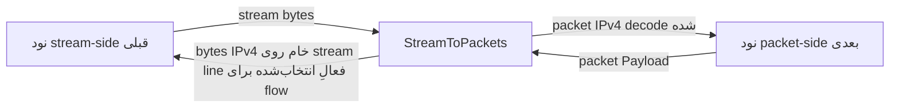

<!-- Written from version 107 of the English doc. -->

# StreamToPackets

`StreamToPackets` adapter معکوس `PacketsToStream` است. این نود یک stream line معمولی را از سمت قبلی می‌گیرد، stream را مجموعه‌ای از packetهای خام IPv4 پشت‌سرهم در نظر می‌گیرد، مرز آن‌ها را با فیلد `total-length` بازیابی می‌کند و هر packet را به نود packet-oriented بعدی می‌فرستد.

پیاده‌سازی فعلی فقط از IPv4 پشتیبانی می‌کند و headerless است:

```text
IPv4 packet bytes + IPv4 packet bytes + IPv4 packet bytes + ...
```

هیچ length prefix دوبایتی وجود ندارد. در مستندات قدیمی ممکن است نام `DataAsPacket` را ببینید، اما نام نوع فعلی نود `StreamToPackets` است.

## کار این نود

- یک stream line واتروال را از سمت قبلی می‌پذیرد.
- برای کل نود یک source IP فعال نگه می‌دارد؛ چند stream line اعتبارسنجی‌شده از همان IP می‌توانند هم‌زمان ترافیک حمل کنند.
- بایت‌های stream در مسیر upstream را تا کامل شدن یک packet IPv4 در buffer نگه می‌دارد.
- packetها را با استفاده از فیلد `total-length` استخراج می‌کند.
- در صورت تنظیم، packetهای decodeشده را پیش از فرستادن به سمت packet اعتبارسنجی می‌کند.
- پیش از تحویل packet decodeشده به packet chain، affinity مربوط به inner flow را بازیابی می‌کند.
- packetهای decodeشده را در جهت upstream به نود packet-oriented بعدی می‌فرستد.
- payloadهای برگشتی از سمت packet را روی یک stream line فعال که برای هر inner flow انتخاب می‌شود، به شکل packet خام IPv4 می‌نویسد.
- IPv6، payloadهای غیر IPv4، packetهای نامعتبر IPv4 و خروجی سمت packet را وقتی هیچ stream line فعال و unpaused وجود ندارد کنار می‌گذارد.

این نود فقط مرز packetها را از stream بازیابی می‌کند و TCP/UDP flow را بازسازی نمی‌کند؛ برای آن کار از `PacketsToConnection` استفاده کنید.

## جایگاه رایج

stream input به packet output:

```text
TcpListener -> StreamToPackets -> TunDevice
```

جفت با `PacketsToStream` روی سرور دیگر:

```text
server1: TunDevice -> PacketsToStream -> TcpConnector
server2: TcpListener -> StreamToPackets -> TunDevice
```

`StreamToPackets` انتظار دارد stream را `PacketsToStream` یا peer دیگری تولید کرده باشد که همین قالب packetهای خام IPv4 پشت‌سرهم را به کار می‌برد.

## نمونه تنظیم

```json
{
  "name": "stream-to-packet",
  "type": "StreamToPackets",
  "settings": {
    "sensitive-mode": true,
    "packet-validation-level": "hard"
  },
  "next": "packet-node"
}
```

## تنظیمات

فیلدهای سطح بالا:

| فیلد | نوع | اجباری | توضیح |
| --- | --- | --- | --- |
| `name` | string | بله | نام دلخواه نود. باید داخل فایل config یکتا باشد. |
| `type` | string | بله | باید دقیقاً `"StreamToPackets"` باشد. |
| `settings` | object | خیر | object تنظیمات اختیاری. |
| `next` | string | بله | نود packet-oriented که packetهای بازسازی‌شده را دریافت می‌کند. |

فیلدهای اختیاری `settings`:

| گزینه | نوع | پیش‌فرض | توضیح |
| --- | --- | --- | --- |
| `sensitive-mode` | boolean | `false` | فعال‌سازی مدیریت heartbeat برای packetهای ping IPv4 tagged از `PacketsToStream`. |
| `packet-validation-level` | string | `"none"` | حالت اعتبارسنجی برای packetهای decode شده از data stream upstream. مقادیر: `"none"`، `"loose"`، `"hard"`. |

روی `StreamToPackets` تنظیم `interval-ms` یا `tolerance-ms` وجود ندارد. آن timerها به `PacketsToStream` تعلق دارند که heartbeat را آغاز می‌کند.

## فرمت wire

stream شامل packetهای IPv4 کامل پشت سر هم است:

```text
packet A: N bytes, where IPv4 total-length = N
packet B: M bytes, where IPv4 total-length = M
packet C: K bytes, where IPv4 total-length = K
```

`StreamToPackets` هیچ length prefixی نمی‌خواند. ابتدا header مربوط به IPv4 را می‌خواند، از فیلد `total-length` فقط برای تعیین اندازه packet استفاده می‌کند و تا جمع شدن کل packet در buffer منتظر می‌ماند.

packetهای برگشتی از packet side با همان فرمت packet IPv4 خام روی یکی از stream lineهای source فعال نوشته می‌شوند.

## مدل جریان



خلاصه جهت:

| جهت | رفتار |
| --- | --- |
| stream side به packet side | بایت‌ها را در buffer جمع می‌کند، packetهای IPv4 را استخراج و در صورت تنظیم اعتبارسنجی می‌کند، سپس آن‌ها را به نود بعدی می‌فرستد. |
| packet side به stream side | برای هر inner flow یک stream line فعال و unpaused انتخاب می‌کند و payload معتبر IPv4 را به‌صورت byte خام روی آن می‌فرستد. |

## Source فعال، pool مربوط به lineها و bootstrap packet-line

`StreamToPackets` میان stream lineهای معمول و worker packet lineهای مشترک پل می‌زند.

هنگام startup، برای هر worker یک upstream packet-line `Init` در صف می‌گذارد تا tunnel بعدی در سمت packet، پس از startup مربوط به node manager، worker packet line را دریافت کند.

### هویت source

مالکیت در سطح کل نود است، نه برای هر worker: در هر لحظه حداکثر یک source IP
مشخص فعال است. هویت فقط از source IP تشکیل می‌شود و port عمداً در آن دخالت
ندارد؛ زیرا `TcpListener` در آن قسمت port مربوط به listener را نگه می‌دارد و
reconnectها از ephemeral port تازه استفاده می‌کنند. lineهایی که source IP مشخصی
ندارند ــ برای مثال ترکیب مستقیم و in-process از
`PacketsToStream -> StreamToPackets` ــ یک هویت anonymous مشترک دارند. در نتیجه
این ترکیب‌ها کار می‌کنند، اما دو peer از نوع anonymous از هم قابل تشخیص نیستند.

### Candidateها و فعال‌سازی

هنگام مقداردهی اولیه یک stream line در جهت upstream:

- state مربوط به parser را برای آن stream line مقداردهی اولیه می‌کند
- line را به‌عنوان یک **candidate** ثبت می‌کند
- downstream `Est` را به stream side قبلی برمی‌گرداند

candidate دنبال می‌شود، اما هرگز برای ترافیک برگشتی قابل انتخاب نیست. اولین
packet معتبر IPv4 که از آن decode شود، یا یک heartbeat معتبر در sensitive mode،
آن را فعال می‌کند. بایت‌های malformed، overflow و اعتبارسنجی ناموفق هرگز اثبات
protocol نیستند؛ بنابراین نه candidate را فعال می‌کنند و نه source فعال را
تغییر می‌دهند.

### جابه‌جایی مالکیت

| وضعیت | نتیجه |
| --- | --- |
| source فعالی وجود ندارد | candidate اعتبارسنجی‌شده به source فعال تبدیل می‌شود و generation تازه‌ای برای source باز می‌کند. |
| source با source فعال یکسان است | line به generation موجود می‌پیوندد و همه lineهای اعتبارسنجی‌شده آن IP هم‌زمان قابل استفاده می‌مانند. |
| source متفاوت است | **جدیدترین source اعتبارسنجی‌شده برنده است.** generation تازه‌ای publish می‌شود و همه lineهای source قبلی، از جمله candidateهای idle، روی worker خودشان و از سمت قبلی بسته می‌شوند. |
| آخرین line فعال finish می‌شود | source فعال پاک می‌شود و تا اعتبارسنجی یک line تازه، ترافیک برگشتی کنار گذاشته می‌شود. |

lineای که در takeover کنار گذاشته شده است، حتی اگر یکی از callbackهای payload
آن از قبل در حال اجرا باشد، دیگر نمی‌تواند مالکیت را پس بگیرد. یک connection
واقعاً تازه از IP قدیمی می‌تواند پس از تولید ترافیک معتبر دوباره takeover کند؛
بنابراین روی listenerهای غیرقابل اعتماد پیش از این نود authentication یا
allowlisting قرار دهید.

پس از آغاز stop این instance توسط node manager، line تازه‌ای ثبت نمی‌شود و هیچ
candidateای promote نمی‌شود. lineهایی که از قبل فعال هستند همچنان drain می‌شوند؛
در نتیجه shutdown نه ownership epoch تازه‌ای باز می‌کند و نه کار eviction را
روی workerهایی که در حال خاموش شدن هستند queue می‌کند.

هر line کنارگذاشته‌شده با taskای روی worker خودش بسته می‌شود. اگر post کردن آن
task به دلیلی غیر از shutdown ــ مانند تمام شدن message pool یا نپذیرفتن wakeup
توسط loop ــ ممکن نباشد و takeover روی worker همان line اجرا شود، line همان‌جا
بسته می‌شود. در غیر این صورت کانال دومی برای دسترسی به آن worker وجود ندارد؛ پس
نود به‌صورت fail-closed عمل می‌کند: orderly shutdown برنامه را درخواست می‌کند و
اگر worker صفر handoff را نپذیرد، به abort فوری برمی‌گردد. connection مربوط به
source قدیمی هرگز در حال اجرا رها نمی‌شود.

## Affinity مربوط به Inner Flow

worker مالک outer connection را socket manager انتخاب می‌کند و این worker چیزی
درباره مالک inner IP flow مشخص نمی‌کند. بنابراین `StreamToPackets` affinity را
از خود packet decodeشده دوباره به دست می‌آورد:

1. symmetric flow hash مشترک inner packet را محاسبه می‌کند
2. `packet_line[hash % workers]` را انتخاب می‌کند
3. اگر مقصد worker فعلی باشد packet را مستقیم forward می‌کند؛ در غیر این صورت آن را روی worker مقصد queue می‌کند

هر دو جهت یک flow hash یکسانی تولید می‌کنند؛ بنابراین ترافیک forward و reverse
روی یک packet worker باقی می‌ماند. اگر hash کردن inner flow یک packet decodeشده
ممکن نباشد، آن packet با ثبت log کنار گذاشته می‌شود و round-robin نمی‌شود، زیرا
مالکیت worker برای state آن قابل تعیین نیست.

## استخراج packet

data stream upstream ورودی به یک read buffer per-stream اضافه می‌شود. decoder:

1. منتظر حداقل یک IPv4 header حداقل می‌ماند
2. بررسی می‌کند آیا ابتدای stream شبیه یک IPv4 packet معتبر است
3. فیلد IPv4 total-length را می‌خواند
4. منتظر می‌ماند تا همان تعداد بایت در buffer جمع شود
5. دقیقاً آن تعداد byte را به‌عنوان یک packet استخراج می‌کند
6. در صورت فعال بودن sensitive-mode، packetهای ping را مدیریت می‌کند
7. اختیاراً packet decode شده را اعتبارسنجی می‌کند
8. packet را به نود packet-oriented بعدی می‌فرستد

اگر ابتدای stream شروع معتبر یک packet IPv4 نباشد، decoder در یک پنجره محدود به دنبال نقطه resync می‌گردد و بایت‌ها را تا header معتبر بعدی کنار می‌گذارد. پیشرفت parser تضمین شده است؛ بنابراین ورودی نامعتبر نمی‌تواند آن را متوقف کند.

حد overflow فعلی read stream:

```text
65536 * 2 bytes
```

اگر data buffer از آن اندازه تجاوز کند، read stream خالی می‌شود.

## اعتبارسنجی packet

`packet-validation-level` روی packetهایی اعمال می‌شود که از data stream upstream decode شده‌اند، قبل از اینکه به packet side ارسال شوند.

| سطح | رفتار |
| --- | --- |
| `"none"` | پیش‌فرض. هیچ اعتبارسنجی configurable بعد از استخراج ندارد. extractor هنوز بررسی‌های structural سبک انجام می‌دهد تا بتواند مرز packetها را پیدا کند. |
| `"loose"` | packetهای غیر IPv4 و packetهای نامعتبر IPv4 را کنار می‌گذارد. حداقل اندازه header، version، طول header مربوط به IPv4 و برابری total length با طول packet را بررسی می‌کند. |
| `"hard"` | `loose` را اعمال می‌کند، IPv4 header checksum را verify می‌کند، و checksumهای TCP، UDP و ICMP را برای packetهای non-fragmented verify می‌کند. IPv4 UDP checksum برابر `0` پذیرفته می‌شود. |

برای packetهای IPv4 fragmented در حالت `"hard"`، فقط IPv4 header checksum verify می‌شود. transport checksumها نیاز به reassembly دارند و skip می‌شوند.

وقتی یک packet decodeشده در اعتبارسنجی رد شود، tunnel سطح اعتبارسنجی و دلیل را به‌صورت warning در log می‌نویسد.

payload برگشتی از سمت packet تحت این اعتبارسنجی قابل‌تنظیم قرار نمی‌گیرد، اما پیش از نوشته شدن روی stream line همچنان باید یک packet سازگار IPv4 باشد.

## مسیر برگشت به stream

وقتی payload packet از سمت بعدی می‌رسد:

- اگر payload از `kMaxAllowedPacketLength` بزرگ‌تر باشد، کنار گذاشته می‌شود
- اگر checksum recalculation روی packet line درخواست شده باشد، checksum کامل packet IPv4 دوباره محاسبه می‌شود
- اگر payload یک packet سازگار IPv4 نباشد، کنار گذاشته می‌شود
- symmetric flow hash مربوط به packet با **rendezvous hashing** یک carrier را از میان lineهای فعال و unpaused در generation فعلی source انتخاب می‌کند
- اگر چنین lineای وجود نداشته باشد، packet کنار گذاشته می‌شود؛ candidateها، lineهای paused و lineهای generation منقضی‌شده هرگز به‌عنوان fallback استفاده نمی‌شوند
- در غیر این صورت bytes خام IPv4 روی همان line و worker خودش در جهت downstream ارسال می‌شوند

تا وقتی pool واجد شرایط تغییری نکند، یک flow همیشه همان line را انتخاب می‌کند و
tuple معکوس نیز همان line را برمی‌گزیند. flowهای متفاوت در pool پخش می‌شوند، حتی
اگر packet worker مشترکی داشته باشند.

اضافه شدن، pause، resume یا حذف یک line، pool واجد شرایط را تغییر می‌دهد و ممکن
است بعضی flowها را به carrier دیگری منتقل کند. بنابراین در اطراف این تغییرها
مقداری reordering ممکن است رخ دهد: packet فرستاده‌شده روی carrier جدید می‌تواند
از packetی که هنوز روی carrier قبلی در حال انتقال است جلو بزند. این مسیر packet
است و inner protocol درست مانند هر شبکه دیگری مسئول ordering است. peerای که به
تحویل کاملاً مرتب packetهای برگشتی نیاز دارد نباید هنگام اضافه یا حذف شدن stream
lineها به این نود متکی باشد. round-robin برای هر packet هرگز استفاده نمی‌شود.

این همان فرمت stream بدون header استفاده شده توسط `PacketsToStream` را حفظ می‌کند.

## Sensitive Mode

`StreamToPackets` سمت responder برای heartbeat sensitive-mode است.

وقتی فعال است:

- اگر packet decode شده upstream یک packet IPv4 حداقلی با protocol `0xFD` و payload پنج‌بایتی پر از `0xFF` باشد، به‌عنوان heartbeat ping در نظر گرفته می‌شود
- ping به سمت packet فرستاده نمی‌شود
- `StreamToPackets` یک heartbeat pong متناظر روی همان stream line برمی‌گرداند
- pong یک packet IPv4 حداقلی با protocol `0xFD` و payload پنج‌بایتی پر از `0xDD` است
- pong به سمت packet فرستاده نمی‌شود

`StreamToPackets` timer جداگانه‌ای برای heartbeat ندارد. timeout و ساخت دوباره stream line بر عهده `PacketsToStream` است.

## Pause، Resume و Finish

رفتار callback:

| callback دریافت‌شده توسط `StreamToPackets` | رفتار |
| --- | --- |
| upstream `Init` | stream line ورودی را به‌عنوان candidate ثبت می‌کند و downstream `Est` را به سمت قبلی می‌فرستد. |
| upstream `Payload` | بایت‌های stream را در buffer جمع می‌کند، packetهای IPv4 را استخراج می‌کند، heartbeat ping را مدیریت و packetها را اعتبارسنجی می‌کند و سپس آن‌ها را به نود بعدی می‌فرستد. |
| upstream `Pause` | همان stream line را paused می‌کند و از انتخاب‌های تازه flow کنار می‌گذارد؛ lineهای فعال دیگر تغییری نمی‌کنند. |
| upstream `Resume` | paused flag همان line را پاک می‌کند و دوباره آن را قابل انتخاب می‌سازد. |
| upstream `Finish` | line را از registry حذف و state مربوط به parser آن را destroy می‌کند، بدون اینکه چیزی به سمت فرستنده برگرداند. اگر آن line آخرین line فعال باشد، source فعال را پاک می‌کند. |
| upstream `Est` | warning log؛ انتظار نمی‌رود. |
| downstream `Payload` | برای هر inner flow یک stream line فعال انتخاب می‌کند و payload معتبر IPv4 را روی آن می‌فرستد. |
| downstream `Est` | No-op. tunnelهای packet معمولاً `Est` نمی‌فرستند. |
| downstream `Init` | fatal guard؛ جهت نامعتبر. |
| downstream `Finish` | fatal guard؛ جهت نامعتبر. |
| downstream `Pause` / `Resume` | warning log؛ از packet side انتظار نمی‌رود. |

line paused در انتخاب شرکت نمی‌کند و flowهای آن به بقیه pool منتقل می‌شوند. اگر
همه lineهای فعال paused باشند، خروجی packet برگشتی به‌جای قرار گرفتن در یک صف
سراسری نامحدود کنار گذاشته می‌شود.

stream lineهای ورودی borrowed هستند: `StreamToPackets` هیچ‌کدام را destroy
نمی‌کند و هرگز worker packet line را finish یا destroy نمی‌کند. takeover یک line
مربوط به source قدیمی را با اجرای task روی worker خود آن line و فرستادن Finish
به سمت قبلی می‌بندد؛ owner در همان سمت destruction را انجام می‌دهد.

## محاسبه مجدد Checksum

اگر `line->recalculate_checksum` روی packet line تنظیم باشد و payload یک IPv4 باشد، `StreamToPackets` checksum کامل packet IPv4 را قبل از نوشتن به stream line انتخاب‌شده دوباره محاسبه می‌کند، سپس flag را پاک می‌کند.

## متادیتای نود

| ویژگی | مقدار |
| --- | --- |
| node flags | `kNodeFlagNone` |
| `can_have_prev` | `true` |
| `can_have_next` | `true` |
| `layer_group` | لایه 3 و لایه 4 (`kNodeLayer3`، `kNodeLayer4`) |
| `layer_group_prev_node` | `kNodeLayerAnything` |
| `layer_group_next_node` | `kNodeLayerAnything` |
| `required_padding_left` | `0` |

tunnel هیچ بایتی به ابتدای payload اضافه نمی‌کند؛ بنابراین به left padding اضافی نیاز ندارد.

## نکته‌های عملی

- آن را با `PacketsToStream` در سمت مقابل جفت کنید.
- آن را با stream packet قدیمی 2-byte-prefix تغذیه نکنید؛ parsing فعلی از فیلد IPv4 total-length استفاده می‌کند.
- از `packet-validation-level: "hard"` وقتی می‌خواهید اعتبارسنجی قوی‌تری از packetهای decode شده از stream داشته باشید استفاده کنید.
- اگر همه lineهای فعال paused باشند یا اصلاً source فعالی وجود نداشته باشد، packetهای برگشتی ممکن است از دست بروند.
- ترافیک برگشتی می‌تواند روی هر line از pool مربوط به source فعال برسد؛ بنابراین peer باید packet decodeشده را روی هر یک از lineهای خود بپذیرد. `PacketsToStream` این کار را انجام می‌دهد.
- مالکیت برای کل نود متعلق به یک source IP است. روی listenerهای غیرقابل اعتماد، پیش از این نود authentication یا allowlisting قرار دهید.
- از `PacketsToConnection` به‌جای این نود استفاده کنید وقتی هدف بازسازی TCP/UDP flow است نه بازسازی packet boundary.
