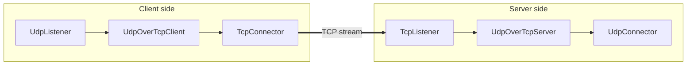

<!-- Written from version 107 of the English doc. -->

# UdpOverTcpClient

`UdpOverTcpClient` packetهای UDP-style را روی یک byte stream از نوع TCP-style حمل می‌کند. برای حفظ مرز packetها، یک فیلد دو بایتی length به ابتدای هر payload اضافه می‌کند و نتیجه را به نود stream-facing بعدی می‌فرستد.

این نود معمولاً با `UdpOverTcpServer` در سمت مقابل استفاده می‌شود.

## چرا این نود وجود دارد؟

UDP بر پایه message است، اما TCP فقط یک stream پیوسته از byteها می‌دهد. اگر UDP packet را مستقیم وارد TCP stream کنیم، گیرنده راهی برای تشخیص پایان یک packet و شروع packet بعدی ندارد.

`UdpOverTcpClient` این مشکل را با framing هر packet حل می‌کند:

```text
2-byte length prefix + original packet payload
```

`UdpOverTcpServer` در سمت مقابل stream را می‌خواند، frameهای کامل را بیرون می‌کشد، prefix دو بایتی را حذف می‌کند و payload اصلی هر packet را دوباره تحویل می‌دهد.

## جایگاه رایج

سمت client:

```text
UdpListener -> UdpOverTcpClient -> TcpConnector
UdpListener -> UdpOverTcpClient -> TlsClient -> TcpConnector
UdpListener -> UdpOverTcpClient -> EncryptionClient -> TcpConnector
TcpUdpListener -> UdpOverTcpClient -> TcpConnector
```

سمت server:

```text
TcpListener -> UdpOverTcpServer -> UdpConnector
TcpListener -> TlsServer -> UdpOverTcpServer -> UdpConnector
TcpListener -> EncryptionServer -> UdpOverTcpServer -> UdpConnector
```

نود قبل از `UdpOverTcpClient` معمولاً packet-facing است و نود بعد از آن باید یک مسیر stream قابل اعتماد فراهم کند.

## نمودار جریان



این الگو برای عبور applicationهای UDP مانند DNS یا ترافیک شبیه WireGuard از مسیری مناسب است که فقط با TCP کار می‌کند.

## نمونه ساده

```json
{
  "name": "udp-over-tcp-client",
  "type": "UdpOverTcpClient",
  "settings": {},
  "next": "stream-out"
}
```

connector سمت stream متناظر:

```json
{
  "name": "stream-out",
  "type": "TcpConnector",
  "settings": {
    "address": "198.51.100.10",
    "port": 443,
    "nodelay": true
  }
}
```

## فیلدهای ضروری

فیلدهای سطح بالا:

| فیلد | نوع | توضیح |
| --- | --- | --- |
| `name` | string | نام دلخواه نود. باید داخل فایل config یکتا باشد. |
| `type` | string | باید دقیقاً `"UdpOverTcpClient"` باشد. |
| `next` | string | نود stream-facing که bytes فریم‌شده را حمل می‌کند. در استفاده معمول لازم است. |

`settings` می‌تواند `{}` باشد؛ پیاده‌سازی فعلی setting اختصاصی برای این tunnel ندارد.

## تنظیمات اختیاری

در پیاده‌سازی فعلی هیچ setting اختصاصی tunnel وجود ندارد.

رفتار socket، TLS، encryption، routing یا destination مربوط به نودهای اطراف است؛ مثل `TcpConnector`، `TlsClient`، `EncryptionClient`، `UdpListener` یا `TcpUdpListener`.

## مدل Framing

`UdpOverTcpClient` به ابتدای هر upstream payload یک length دو بایتی، unsigned و big-endian اضافه می‌کند و frame حاصل را در جهت upstream به نود بعدی می‌فرستد.

```text
00 2a <42 bytes of packet payload>
```

در مسیر برگشت، byteهای نود بعدی در یک read stream داخلی جمع می‌شوند. به‌محض کامل شدن frame، header دو بایتی حذف می‌شود و payload بازسازی‌شده در جهت downstream به نود قبلی برمی‌گردد.

length prefix فقط برای framing مسیر transport است و جزئی از payload اصلی UDP نیست.

## Protocol Marker

frame عادی از length غیرصفر استفاده می‌کند. length `0` برای یک marker داخلی protocol رزرو شده است:

```text
00 00 <protocol-byte>
```

در upstream `Init`، client source protocol line را بررسی می‌کند:

| source protocol | رفتار marker |
| --- | --- |
| UDP دقیق | marker فرستاده نمی‌شود؛ server با دیدن نخستین data frame، protocol مقصد را UDP در نظر می‌گیرد. |
| TCP دقیق | marker با `IP_PROTO_TCP` ارسال می‌شود. |
| حالت‌های دیگر یا protocol مبهم | marker با `IP_PROTO_UDP` فرستاده می‌شود. |

این marker به `UdpOverTcpServer` اجازه می‌دهد پیش از مقداردهی نود بعدی، protocol مقصد را مشخص کند؛ قابلیتی مفید برای chainهای چندپروتکلی که به `TcpUdpConnector` ختم می‌شوند.

## محدودیت اندازه Packet

حداکثر payload قابل قبول در پیاده‌سازی فعلی:

```text
65535 - 20 - 8 - 2 = 65505 bytes
```

عدد `2` اندازه header مربوط به length در `UdpOverTcp` است. packetهای بزرگ‌تر از این حد در log ثبت و دور ریخته می‌شوند. در buildهای debug، payload خالی هم نامعتبر است.

## Buffering و Overflow

byteهای ورودی stream از نود بعدی تا کامل شدن حداقل یک frame در read stream نگه داشته می‌شوند.

آستانه overflow فعلی read stream:

```text
2 * kMaxAllowedUDPPacketLength
```

اگر buffer از این حد عبور کند، پیاده‌سازی یک warning در log می‌نویسد و read stream را خالی می‌کند؛ این overflow به‌تنهایی باعث بسته شدن line نمی‌شود.

## رفتار Lifecycle

در upstream `Init`، client:

1. read stream مربوط به line را مقداردهی اولیه می‌کند
2. upstream `Init` را به نود بعدی می‌فرستد
3. در صورت نیاز protocol marker را می‌فرستد

در upstream payload، packet نود قبلی را frame می‌کند و به stream side می‌فرستد.

در downstream payload، frameهای سمت stream را می‌خواند و packetهای بازسازی‌شده را به نود قبلی برمی‌گرداند.

با دریافت `Finish` از هر سمت، per-line state محلی را از بین می‌برد و `Finish` را در جهت درست ادامه می‌دهد. این نود `lineDestroy()` را فراخوانی نمی‌کند.

`UpStreamEst` و `DownStreamInit` در پیاده‌سازی فعلی غیرفعال‌اند.

## Padding

این نود با `sbufShiftLeft()` یک header دو بایتی به ابتدای frame اضافه می‌کند، بنابراین مقدار زیر را اعلام می‌کند:

```text
required_padding_left = 2
```

این نیازمندی padding را از محاسبه chain حذف نکنید؛ framing به آن وابسته است.

## متادیتای نود

| ویژگی | مقدار |
| --- | --- |
| Node flag | `kNodeFlagNone` |
| نود قبلی | مجاز، در استفاده معمول لازم |
| نود بعدی | مجاز، در استفاده معمول لازم |
| layer group | `kNodeLayerAnything` |
| `required_padding_left` | `2` |
| line state | read stream buffer |

## اشتباه‌های رایج

- بدون `UdpOverTcpServer` در سمت مقابل از این نود استفاده نکنید.
- بعد از client نود packet-only نگذارید؛ سمت بعدی stream bytes فریم‌شده دریافت می‌کند.
- انتظار نداشته باشید این نود خودش TCP connection بسازد؛ بعد از آن `TcpConnector` یا transport stream دیگری بگذارید.
- header دو بایتی را بخشی از payload اصلی UDP فرض نکنید.
- packet بزرگ‌تر از `65505` bytes نفرستید.
