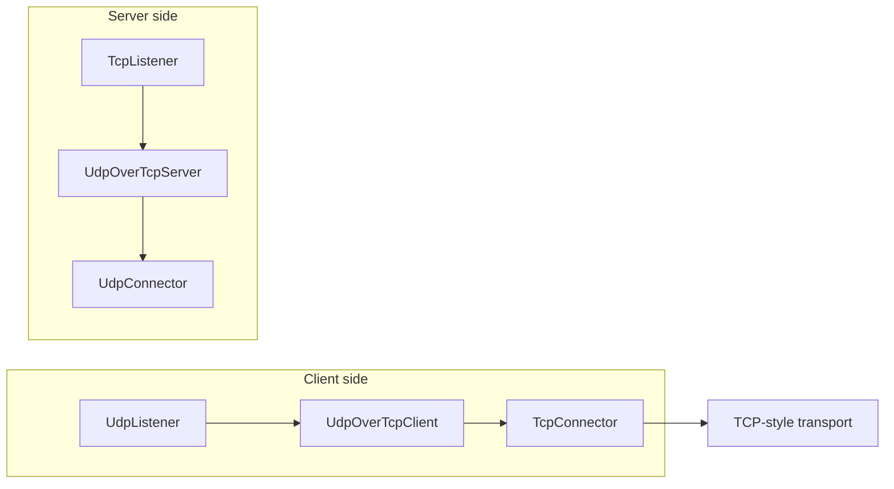

<!-- Written from version 106 of the English doc. -->

# UdpOverTcpClient

`UdpOverTcpClient` بسته‌های UDP-style را روی یک byte stream TCP-style حمل می‌کند. این نود با prefix کردن هر payload خروجی با یک length field دو بایتی، packet boundary را حفظ می‌کند و نتیجه را به نود stream-facing بعدی می‌فرستد.

این نود معمولاً با `UdpOverTcpServer` در سمت مقابل استفاده می‌شود.

## چرا این نود وجود دارد؟

UDP message-oriented است. TCP stream-oriented است. اگر یک UDP packet مستقیماً از طریق TCP stream فرستاده شود، receiver نمی‌تواند بفهمد یک packet اصلی کجا تمام می‌شود و packet بعدی کجا شروع می‌شود.

`UdpOverTcpClient` این مشکل را با framing هر packet حل می‌کند:

```text
2-byte length prefix + original packet payload
```

`UdpOverTcpServer` در سمت مقابل stream را می‌خواند، frameهای کامل را بازسازی می‌کند، prefix دو بایتی را حذف می‌کند، و payloadهای packet اصلی را دوباره emit می‌کند.

## جایگاه رایج

سمت client:

```text
UdpListener -> UdpOverTcpClient -> TcpConnector
UdpListener -> UdpOverTcpClient -> TlsClient -> TcpConnector
UdpListener -> UdpOverTcpClient -> EncryptionClient -> TcpConnector
TcpUdpListener -> UdpOverTcpClient -> TcpConnector
```

سمت server:

```text
TcpListener -> UdpOverTcpServer -> UdpConnector
TcpListener -> TlsServer -> UdpOverTcpServer -> UdpConnector
TcpListener -> EncryptionServer -> UdpOverTcpServer -> UdpConnector
```

نود قبل از `UdpOverTcpClient` معمولاً packet-facing است و نود بعد از آن باید یک مسیر stream قابل اعتماد فراهم کند.

## نمودار جریان



این الگوی رایج برای حمل applicationهای UDP مثل DNS یا ترافیک WireGuard-like روی مسیری که فقط TCP-friendly است کاربرد دارد.

## نمونه ساده

```json
{
  "name": "udp-over-tcp-client",
  "type": "UdpOverTcpClient",
  "settings": {},
  "next": "stream-out"
}
```

connector سمت stream متناظر:

```json
{
  "name": "stream-out",
  "type": "TcpConnector",
  "settings": {
    "address": "198.51.100.10",
    "port": 443,
    "nodelay": true
  }
}
```

## فیلدهای ضروری

فیلدهای سطح بالا:

| فیلد | نوع | توضیح |
| --- | --- | --- |
| `name` | string | نام دلخواه نود. باید داخل فایل config یکتا باشد. |
| `type` | string | باید دقیقاً `"UdpOverTcpClient"` باشد. |
| `next` | string | نود stream-facing که bytes فریم‌شده را حمل می‌کند. در استفاده معمول لازم است. |

`settings` می‌تواند `{}` باشد. پیاده‌سازی فعلی هیچ setting اختصاصی tunnel نمی‌خواند.

## تنظیمات اختیاری

در پیاده‌سازی فعلی هیچ setting اختصاصی tunnel وجود ندارد.

رفتار socket، TLS، encryption، routing یا destination مربوط به نودهای اطراف است؛ مثل `TcpConnector`، `TlsClient`، `EncryptionClient`، `UdpListener` یا `TcpUdpListener`.

## مدل Framing

برای هر upstream payload از نود قبلی، `UdpOverTcpClient` یک length طول دو بایتی unsigned big-endian prepend می‌کند و نتیجه را upstream به نود بعدی forward می‌کند.

```text
00 2a <42 bytes of packet payload>
```

در مسیر downstream برگشت، bytes از نود stream بعدی در یک read stream داخلی جمع می‌شوند. وقتی یک frame کامل با length prefix آماده شد، header دو بایتی حذف می‌شود و payload بازسازی‌شده downstream به نود قبلی forward می‌شود.

length prefix فقط transport framing است و بخشی از payload اصلی UDP نیست.

## Protocol Marker

frame عادی از length غیرصفر استفاده می‌کند. length `0` برای یک marker داخلی protocol رزرو شده است:

```text
00 00 <protocol-byte>
```

در upstream `Init`، client source protocol line را بررسی می‌کند:

| source protocol | رفتار marker |
| --- | --- |
| UDP دقیق | marker ارسال نمی‌شود. server با دیدن اولین data frame، destination protocol را UDP پیش‌فرض می‌گیرد. |
| TCP دقیق | marker با `IP_PROTO_TCP` ارسال می‌شود. |
| سایر حالت‌ها یا ambiguous | marker با `IP_PROTO_UDP` ارسال می‌شود. |

این marker به `UdpOverTcpServer` اجازه می‌دهد قبل از initialize کردن نود بعدی، destination protocol را تنظیم کند. این در chainهای mixed-protocol که انتهایشان `TcpUdpConnector` است مفید است.

## محدودیت اندازه Packet

حداکثر payload قابل قبول در پیاده‌سازی فعلی:

```text
65535 - 20 - 8 - 2 = 65505 bytes
```

عدد `2` همان header length `UdpOverTcp` است. packetهای بزرگ‌تر از این حد log و drop می‌شوند. payloadهای خالی در debug build نامعتبر در نظر گرفته می‌شوند.

## Buffering و Overflow

bytes ورودی stream از نود بعدی تا زمانی که حداقل یک frame کامل decode شود، داخل read stream نگه داشته می‌شوند.

آستانه overflow فعلی read stream:

```text
2 * kMaxAllowedUDPPacketLength
```

اگر buffer از این حد بزرگ‌تر شود، implementation یک warning log می‌کند و read stream را خالی می‌کند. فقط به خاطر این overflow، line بسته نمی‌شود.

## رفتار Lifecycle

در upstream `Init`، client:

1. read stream per-line خودش را initialize می‌کند
2. upstream `Init` را به نود بعدی forward می‌کند
3. در صورت نیاز protocol marker را می‌فرستد

در upstream payload، packet نود قبلی را frame می‌کند و به stream side می‌فرستد.

در downstream payload، bytes فریم‌شده از stream side را decode می‌کند و packetهای بازسازی‌شده را downstream به نود قبلی برمی‌گرداند.

در `Finish` از هر سمت، per-line state محلی را destroy می‌کند و `Finish` را در جهت WaterWall درست forward می‌کند. این نود `lineDestroy()` صدا نمی‌زند.

`UpStreamEst` و `DownStreamInit` در پیاده‌سازی فعلی disabled هستند.

## Padding

این نود header دو بایتی frame را با `sbufShiftLeft()` prepend می‌کند، بنابراین مقدار زیر را advertise می‌کند:

```text
required_padding_left = 2
```

این padding requirement را از محاسبات chain حذف نکنید؛ مسیر framing به آن وابسته است.

## متادیتای نود

| ویژگی | مقدار |
| --- | --- |
| Node flag | `kNodeFlagNone` |
| نود قبلی | مجاز، در استفاده معمول لازم |
| نود بعدی | مجاز، در استفاده معمول لازم |
| layer group | `kNodeLayerAnything` |
| `required_padding_left` | `2` |
| line state | read stream buffer |

## اشتباه‌های رایج

- بدون `UdpOverTcpServer` در سمت مقابل از این نود استفاده نکنید.
- بعد از client نود packet-only نگذارید؛ سمت بعدی stream bytes فریم‌شده دریافت می‌کند.
- انتظار نداشته باشید این نود خودش TCP connection بسازد؛ بعد از آن `TcpConnector` یا transport stream دیگری بگذارید.
- header دو بایتی را بخشی از payload اصلی UDP فرض نکنید.
- packet بزرگ‌تر از `65505` bytes نفرستید.
