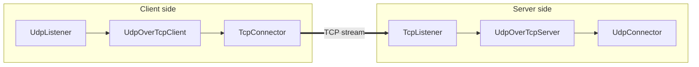

<!--
Documentation version: 152
-->

# UdpOverTcpClient

`UdpOverTcpClient` datagramهای UDP را روی یک byte stream از نوع TCP حمل می‌کند. برای حفظ مرز packet‌ها، یک فیلد دو بایتی length به ابتدای هر payload اضافه می‌کند و نتیجه را به node stream-facing بعدی می‌فرستد.

این node معمولاً با `UdpOverTcpServer` در سمت مقابل استفاده می‌شود.

## چرا این node وجود دارد؟ {#چرا-این-نود-وجود-دارد}

UDP بر پایه message است، اما TCP فقط یک stream پیوسته از بایت‌ها می‌دهد. اگر UDP packet را مستقیم وارد TCP stream کنیم، گیرنده راهی برای تشخیص پایان یک packet و شروع packet بعدی ندارد.

`UdpOverTcpClient` این مشکل را با framing هر packet حل می‌کند:

```text
2-byte length prefix + original packet payload
```

`UdpOverTcpServer` در سمت مقابل stream را می‌خواند، frame‌های کامل را بیرون می‌کشد، prefix دو بایتی را حذف می‌کند و payload اصلی هر packet را دوباره تحویل می‌دهد.

## جایگاه رایج

سمت client:

```text
UdpListener -> UdpOverTcpClient -> TcpConnector
UdpListener -> UdpOverTcpClient -> TlsClient -> TcpConnector
UdpListener -> UdpOverTcpClient -> EncryptionClient -> TcpConnector
TcpUdpListener -> Router (UDP branch) -> UdpOverTcpClient -> TcpConnector
```

سمت server:

```text
TcpListener -> UdpOverTcpServer -> UdpConnector
TcpListener -> TlsServer -> UdpOverTcpServer -> UdpConnector
TcpListener -> EncryptionServer -> UdpOverTcpServer -> UdpConnector
```

node قبل از `UdpOverTcpClient` معمولاً packet-facing است و node بعد از آن باید یک مسیر stream قابل اعتماد فراهم کند.

## نمودار جریان


```mermaid
flowchart LR
    subgraph ClientSide["Client side"]
      direction LR
      UL[UdpListener] --> UOTC[UdpOverTcpClient] --> TC[TcpConnector]
    end

    subgraph ServerSide["Server side"]
      direction LR
      TL[TcpListener] --> UOTS[UdpOverTcpServer] --> UC[UdpConnector]
    end

    TC == "TCP stream" ==> TL
```

این الگو برای عبور application‌های UDP مانند DNS یا ترافیک شبیه WireGuard از مسیری مناسب است که فقط با TCP کار می‌کند.

## نمونه ساده

```json
{
  "name": "udp-over-tcp-client",
  "type": "UdpOverTcpClient",
  "settings": {},
  "next": "stream-out"
}
```

connector سمت stream متناظر:

```json
{
  "name": "stream-out",
  "type": "TcpConnector",
  "settings": {
    "address": "198.51.100.10",
    "port": 443,
    "nodelay": true
  }
}
```

## فیلدهای ضروری

فیلدهای سطح بالا:

| فیلد | نوع | توضیح |
| --- | --- | --- |
| `name` | string | نام دلخواه node. باید داخل فایل config یکتا باشد. |
| `type` | string | باید دقیقاً `"UdpOverTcpClient"` باشد. |
| `next` | string | node stream-facing که بایت‌های frameشده را حمل می‌کند. در استفاده معمول لازم است. |

`settings` می‌تواند `{}` باشد؛ پیاده‌سازی فعلی setting اختصاصی برای این tunnel ندارد.

## تنظیمات اختیاری

در پیاده‌سازی فعلی هیچ setting اختصاصی tunnel وجود ندارد.

رفتار socket، TLS، encryption، routing یا destination مربوط به node‌های اطراف است؛ مثل `TcpConnector`، `TlsClient`، `EncryptionClient`، `UdpListener` یا `TcpUdpListener`.

## مدل framing {#مدل-framing}

`UdpOverTcpClient` به ابتدای هر upstream payload یک length دو بایتی، unsigned و big-endian اضافه می‌کند و frame حاصل را در جهت upstream به node بعدی می‌فرستد.

```text
00 2a <42 bytes of packet payload>
```

در مسیر برگشت، بایت‌های node بعدی در یک read stream داخلی جمع می‌شوند. به‌محض کامل شدن frame، header دو بایتی حذف می‌شود و payload بازسازی‌شده در جهت downstream به node قبلی برمی‌گردد.

length prefix فقط برای framing مسیر transport است و جزئی از payload اصلی UDP نیست.

هر payload callback در سمت datagram دقیقاً یک datagram از نوع UDP است. این nodeها همیشه UDP حمل
می‌کنند و metadata مربوط به source protocol، framing را تغییر نمی‌دهد. listener چندپروتکلی باید ترافیک
TCP را پیش از client به مسیر جداگانه‌ای هدایت کند.

## محدودیت اندازه packet {#محدودیت-اندازه-packet}

حداکثر اندازه datagram خروجی در پیاده‌سازی فعلی:

```text
65535 - 20 - 8 - 2 = 65505 bytes
```

datagram بزرگ‌تر از این حد به‌صورت کامل drop می‌شود. payload خروجی خالی invariant موجود در Debug را
نقض می‌کند و در Release، drop می‌شود. frame ورودی با length صفر نامعتبر است و carrier را می‌بندد.

## Buffering و Overflow

بایت‌های ورودی stream تا کامل شدن frameها نگه داشته می‌شوند. آستانه suffix ناقص read stream:

```text
2 * kMaxAllowedUDPPacketLength = 131010 bytes
```

frameهای کامل پیش از بررسی suffix ناقص پردازش می‌شوند. charge نگهداری buffer حداکثر ۴ MiB است و
پیش از رد ورودی، compaction سودمند امتحان می‌شود. frame نامعتبر، شکست تخصیص یا عبور از محدودیت، carrier
را از طریق owner آن می‌بندد. ورودی reentrant decoder با stream نگهداری‌شده، محدودیت مشترک ۲ MiB بایت
و ۴ MiB charge دارد. بایت‌های دلخواه stream برای ادامهٔ parsing حذف نمی‌شوند.

## رفتار lifecycle {#رفتار-lifecycle}

در upstream `Init`، client framing state خود را مقداردهی می‌کند و بی‌درنگ `Init` را به node بعدی
می‌فرستد. Transport Est، Pause و Resume نیز بی‌درنگ عبور می‌کنند.

در upstream payload، datagram مربوط به node قبلی frame می‌شود و به stream side می‌رود.
در downstream payload، frameهای stream خوانده می‌شوند و datagramهای بازسازی‌شده به node قبلی برمی‌گردند.

با دریافت `Finish` از هر سمت، state محلی از بین می‌رود و `Finish` در جهت دور شدن از فرستنده ادامه
پیدا می‌کند. این node `lineDestroy()` را فراخوانی نمی‌کند.

`UpStreamEst` و `DownStreamInit` در پیاده‌سازی فعلی غیرفعال‌اند.

## پشتیبانی از splice

هر دو node، buffer عادی و body موجود در pipe خصوصی را می‌پذیرند. هر datagram خروجی، body خود را حفظ
می‌کند، یک length prefix دو بایتی در padding واقعی می‌گیرد و با یک callback تحویل می‌شود. datagram بزرگ‌تر
از حد مجاز به‌صورت کامل drop می‌شود. decoder فقط header دو بایتی length را cache می‌کند و هر datagram
کامل را در یک buffer مستقل تحویل می‌دهد؛ هنگام کمبود منابع pipe، از buffer عادی استفاده می‌شود.

مرز datagramهای UDP حفظ می‌شود و carrier TCP همچنان امکان splice دارد. fallback لازم برای ارسال UDP
در خود UDP sender انجام می‌شود. frameهای کامل ورودی پذیرفته‌شده پس از Pause هم پردازش می‌شوند؛
Finish یا رد پذیرش پردازش را متوقف می‌کند.

## padding {#padding}

این node با `sbufShiftLeft()` یک header دو بایتی به ابتدای frame اضافه می‌کند، بنابراین مقدار زیر را اعلام می‌کند:

```text
required_padding_left = 2
```

این نیازمندی padding را از محاسبه chain حذف نکنید؛ framing به آن وابسته است.

## اشتباه‌های رایج

- بدون `UdpOverTcpServer` در سمت مقابل از این node استفاده نکنید.
- بعد از client node packet-only نگذارید؛ سمت بعدی stream بایت‌های frameشده دریافت می‌کند.
- انتظار نداشته باشید این node خودش TCP connection بسازد؛ بعد از آن `TcpConnector` یا transport stream دیگری بگذارید.
- header دو بایتی را بخشی از payload اصلی UDP فرض نکنید.
- datagram UDP بزرگ‌تر از `65505` بایت نفرستید.

## متادیتای node {#متادیتای-نود}

متادیتای برگرفته از کد منبع:

| ویژگی | مقدار |
| --- | --- |
| node flags | `kNodeFlagSupportsSplice` |
| `can_have_prev` | `true` |
| `can_have_next` | `true` |
| `layer_group` | `kNodeLayer4` |
| `layer_group_prev_node` | `kNodeLayer4` |
| `layer_group_next_node` | `kNodeLayer4` |
| `required_padding_left` | `2` بایت |
