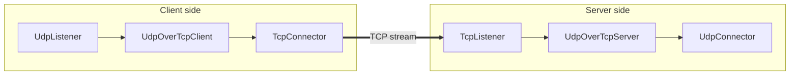

<!-- Written from version 107 of the English doc. -->

# UdpOverTcpServer

`UdpOverTcpServer` peer سمت مقابل برای `UdpOverTcpClient` است. این نود یک byte stream طول‌گذاری‌شده را از نود stream-facing قبلی می‌گیرد، packet boundary را بازسازی می‌کند، و payloadهای packet بازسازی‌شده را به نود بعدی forward می‌کند.

پاسخ‌های نود بعدی با همان length prefix دو بایتی frame می‌شوند و downstream از طریق stream به سمت قبلی برمی‌گردند.

## جایگاه رایج

سمت server:

```text
TcpListener -> UdpOverTcpServer -> UdpConnector
TcpListener -> TlsServer -> UdpOverTcpServer -> UdpConnector
TcpListener -> EncryptionServer -> UdpOverTcpServer -> UdpConnector
```

سمت client متناظر:

```text
UdpListener -> UdpOverTcpClient -> TcpConnector
UdpListener -> UdpOverTcpClient -> TlsClient -> TcpConnector
TcpUdpListener -> UdpOverTcpClient -> TcpConnector
```

سمت قبلی `UdpOverTcpServer` باید یک مسیر stream باشد. سمت بعدی packet payloadهای بازسازی‌شده را دریافت می‌کند.

## نمودار جریان



## نمونه ساده

```json
[
  {
    "name": "stream-in",
    "type": "TcpListener",
    "settings": {
      "address": "0.0.0.0",
      "port": 443,
      "nodelay": true
    },
    "next": "udp-over-tcp-server"
  },
  {
    "name": "udp-over-tcp-server",
    "type": "UdpOverTcpServer",
    "settings": {},
    "next": "udp-out"
  },
  {
    "name": "udp-out",
    "type": "UdpConnector",
    "settings": {
      "address": "127.0.0.1",
      "port": 51820
    }
  }
]
```

## فیلدهای ضروری

فیلدهای سطح بالا:

| فیلد | نوع | توضیح |
| --- | --- | --- |
| `name` | string | نام دلخواه نود. باید داخل فایل config یکتا باشد. |
| `type` | string | باید دقیقاً `"UdpOverTcpServer"` باشد. |
| `next` | string | نودی که packet payloadهای بازسازی‌شده را دریافت می‌کند. در استفاده معمول لازم است. |

`settings` می‌تواند `{}` باشد. پیاده‌سازی فعلی هیچ setting اختصاصی tunnel نمی‌خواند.

## تنظیمات اختیاری

در پیاده‌سازی فعلی هیچ setting اختصاصی tunnel وجود ندارد.

رفتار transport، destination، socket، TLS، encryption یا routing مربوط به نودهای همسایه است؛ مثل `TcpListener`، `TlsServer`، `EncryptionServer`، `UdpConnector` یا `TcpUdpConnector`.

## مدل Framing

server انتظار دارد frameهای عادی این قالب را داشته باشند:

```text
2-byte unsigned big-endian payload length + packet payload
```

bytes ورودی از stream side قبلی تا کامل شدن یک frame کامل جمع می‌شوند. سپس header دو بایتی حذف می‌شود و packet بازسازی‌شده upstream به نود بعدی forward می‌شود.

پاسخ‌های نود بعدی در جهت مخالف هستند: server length دو بایتی را prepend می‌کند و bytes فریم‌شده را downstream به stream side قبلی می‌فرستد.

## Init با تأخیر برای نود بعدی

`UdpOverTcpServer` در upstream `Init` فقط per-line state خودش را initialize می‌کند، اما بلافاصله نود بعدی را initialize نمی‌کند. این نود صبر می‌کند تا destination protocol را از stream ورودی تشخیص دهد.

دو حالت وجود دارد:

| اولین item فریم‌شده | رفتار server |
| --- | --- |
| protocol marker با length `0` | protocol byte بعدی خوانده می‌شود، `line->routing_context.dest_ctx` روی TCP یا UDP تنظیم می‌شود، سپس نود بعدی initialize می‌شود. |
| data frame عادی | UDP فرض می‌شود، destination protocol روی UDP تنظیم می‌شود، نود بعدی initialize می‌شود، و سپس packet بازسازی‌شده forward می‌شود. |

تا وقتی نود بعدی initialize نشده، upstream `Pause` و `Resume` نادیده گرفته می‌شوند و upstream `Finish` به `next` forward نمی‌شود.

## Protocol Marker

protocol marker یک frame رزرو‌شده است:

```text
00 00 <protocol-byte>
```

فقط `IP_PROTO_TCP` و `IP_PROTO_UDP` پذیرفته می‌شوند. marker نامعتبر log می‌شود، read stream خالی می‌شود و line از آن marker به upstream initialize نمی‌شود.

این marker توسط `UdpOverTcpClient` زمانی ساخته می‌شود که لازم است server protocol metadata را برای chainهای mixed-protocol حفظ کند. در حالت معمول UDP-only، marker ارسال نمی‌شود و server با اولین frame عادی UDP را فرض می‌کند.

## محدودیت اندازه Packet

حداکثر payload قابل قبول در پیاده‌سازی فعلی:

```text
65535 - 20 - 8 - 2 = 65505 bytes
```

packetهای بزرگ‌تر از این حد در مسیر reply framing log و drop می‌شوند. payloadهای خالی در debug build نامعتبر در نظر گرفته می‌شوند.

## Buffering و Overflow

bytes ورودی stream تا کامل شدن frameها buffer می‌شوند. آستانه overflow فعلی read stream:

```text
2 * kMaxAllowedUDPPacketLength
```

اگر buffer از این حد بزرگ‌تر شود، implementation یک warning log می‌کند و read stream را خالی می‌کند. فقط به خاطر این overflow، line بسته نمی‌شود.

## رفتار Lifecycle

در upstream `Init`، server read stream خودش را initialize می‌کند و منتظر protocol marker یا اولین data frame می‌ماند.

در upstream payload:

1. bytes به read stream اضافه می‌شوند
2. وقتی protocol مشخص شد، نود بعدی initialize می‌شود
3. frameهای کامل decode می‌شوند
4. packet payloadهای بازسازی‌شده upstream به نود بعدی forward می‌شوند

در downstream payload از نود بعدی، packet با length prefix دو بایتی frame می‌شود و downstream به stream side قبلی forward می‌شود.

در downstream `Finish`، per-line state محلی destroy می‌شود و downstream `Finish` به سمت قبلی forward می‌شود.

در upstream `Finish`، per-line state محلی destroy می‌شود. upstream `Finish` فقط وقتی به نود بعدی forward می‌شود که نود بعدی از قبل initialize شده باشد.

`UpStreamEst` و `DownStreamInit` در پیاده‌سازی فعلی disabled هستند.

## Padding

این نود در مسیر reply header دو بایتی frame را با `sbufShiftLeft()` prepend می‌کند، بنابراین مقدار زیر را advertise می‌کند:

```text
required_padding_left = 2
```

## متادیتای نود

| ویژگی | مقدار |
| --- | --- |
| Node flag | `kNodeFlagNone` |
| نود قبلی | مجاز، در استفاده معمول لازم |
| نود بعدی | مجاز، در استفاده معمول لازم |
| layer group | `kNodeLayerAnything` |
| `required_padding_left` | `2` |
| line state | read stream buffer و upstream-initialized flag |

## اشتباه‌های رایج

- بدون `UdpOverTcpClient` در سمت مقابل از این نود استفاده نکنید.
- آن را مستقیماً بعد از نود packet-only نگذارید؛ سمت قبلی باید stream bytes فریم‌شده فراهم کند.
- انتظار نداشته باشید خودش TCP listen کند؛ قبل از آن `TcpListener` یا adapter stream-facing دیگری بگذارید.
- بعد از آن stream-only node نگذارید مگر اینکه عمداً از protocol marker path استفاده می‌کنید و نود بعدی آن metadata را می‌فهمد.
- packet بزرگ‌تر از `65505` bytes نفرستید.
