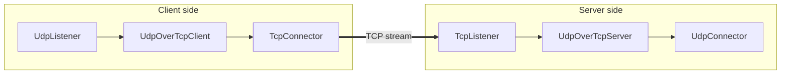

<!--
Documentation version: 152
-->

# UdpOverTcpServer

`UdpOverTcpServer` peer سمت مقابل `UdpOverTcpClient` است. یک byte stream دارای length prefix را از نود stream-facing قبلی می‌گیرد، مرز packetها را دوباره پیدا می‌کند و payload هر packet را به نود بعدی می‌فرستد.

پاسخ نود بعدی هم با همان length prefix دو بایتی frame می‌شود و از طریق stream در جهت downstream برمی‌گردد.

## جایگاه رایج

سمت server:

```text
TcpListener -> UdpOverTcpServer -> UdpConnector
TcpListener -> TlsServer -> UdpOverTcpServer -> UdpConnector
TcpListener -> EncryptionServer -> UdpOverTcpServer -> UdpConnector
```

سمت client متناظر:

```text
UdpListener -> UdpOverTcpClient -> TcpConnector
UdpListener -> UdpOverTcpClient -> TlsClient -> TcpConnector
TcpUdpListener -> UdpOverTcpClient -> TcpConnector
```

نود قبلی `UdpOverTcpServer` باید یک مسیر stream فراهم کند؛ نود بعدی payloadهای بازسازی‌شده packet را دریافت می‌کند.

## نمودار جریان



## نمونه ساده

```json
[
  {
    "name": "stream-in",
    "type": "TcpListener",
    "settings": {
      "address": "0.0.0.0",
      "port": 443,
      "nodelay": true
    },
    "next": "udp-over-tcp-server"
  },
  {
    "name": "udp-over-tcp-server",
    "type": "UdpOverTcpServer",
    "settings": {},
    "next": "udp-out"
  },
  {
    "name": "udp-out",
    "type": "UdpConnector",
    "settings": {
      "address": "127.0.0.1",
      "port": 51820
    }
  }
]
```

## فیلدهای ضروری

فیلدهای سطح بالا:

| فیلد | نوع | توضیح |
| --- | --- | --- |
| `name` | string | نام دلخواه نود. باید داخل فایل config یکتا باشد. |
| `type` | string | باید دقیقاً `"UdpOverTcpServer"` باشد. |
| `next` | string | نودی که packet payloadهای بازسازی‌شده را دریافت می‌کند. در استفاده معمول لازم است. |

`settings` می‌تواند `{}` باشد؛ پیاده‌سازی فعلی setting اختصاصی برای این tunnel ندارد.

## تنظیمات اختیاری

در پیاده‌سازی فعلی هیچ setting اختصاصی tunnel وجود ندارد.

رفتار transport، destination، socket، TLS، encryption یا routing مربوط به نودهای همسایه است؛ مثل `TcpListener`، `TlsServer`، `EncryptionServer`، `UdpConnector` یا `TcpUdpConnector`.

## مدل Framing

server انتظار دارد frameهای عادی این قالب را داشته باشند:

```text
2-byte unsigned big-endian payload length + packet payload
```

byteهای ورودی از سمت stream قبلی تا کامل شدن یک frame جمع می‌شوند. سپس header دو بایتی حذف می‌شود و packet بازسازی‌شده در جهت upstream به نود بعدی می‌رود.

پاسخ‌های نود بعدی مسیر برعکس را طی می‌کنند: server یک length دو بایتی به ابتدا اضافه می‌کند و frame حاصل را در جهت downstream به نود stream قبلی می‌فرستد.

## Init با تأخیر برای نود بعدی

با دریافت upstream `Init`، `UdpOverTcpServer` فقط per-line state خود را مقداردهی می‌کند و هنوز نود بعدی را راه نمی‌اندازد. ابتدا باید protocol مقصد از stream ورودی مشخص شود.

دو حالت وجود دارد:

| اولین item فریم‌شده | رفتار server |
| --- | --- |
| protocol marker با length `0` | byte مربوط به protocol خوانده می‌شود، `line->routing_context.dest_ctx` روی TCP یا UDP قرار می‌گیرد و سپس نود بعدی مقداردهی می‌شود. |
| data frame عادی | protocol مقصد UDP در نظر گرفته می‌شود، نود بعدی مقداردهی می‌شود و بعد packet بازسازی‌شده به آن می‌رود. |

تا پیش از مقداردهی نود بعدی، upstream `Pause` و `Resume` نادیده گرفته می‌شوند و upstream `Finish` هم به `next` نمی‌رود.

## Protocol Marker

protocol marker یک frame رزرو‌شده است:

```text
00 00 <protocol-byte>
```

فقط `IP_PROTO_TCP` و `IP_PROTO_UDP` معتبرند. marker نامعتبر در log ثبت و read stream خالی می‌شود؛ نود نیز با آن marker، upstream line را مقداردهی نمی‌کند.

`UdpOverTcpClient` این marker را زمانی می‌سازد که server باید metadata مربوط به protocol را برای یک chain چندپروتکلی حفظ کند. در حالت معمول UDP-only، marker فرستاده نمی‌شود و server با نخستین frame عادی UDP را انتخاب می‌کند.

## محدودیت اندازه Packet

حداکثر payload قابل قبول در پیاده‌سازی فعلی:

```text
65535 - 20 - 8 - 2 = 65505 bytes
```

packetهای بزرگ‌تر از این حد هنگام framing پاسخ در log ثبت و دور ریخته می‌شوند. در buildهای debug، payload خالی هم نامعتبر است.

## Buffering و Overflow

bytes ورودی stream تا کامل شدن frameها buffer می‌شوند. آستانه overflow فعلی read stream:

```text
2 * kMaxAllowedUDPPacketLength
```

اگر buffer از این حد عبور کند، پیاده‌سازی یک warning در log می‌نویسد و read stream را خالی می‌کند؛ این overflow به‌تنهایی باعث بسته شدن line نمی‌شود.

## رفتار Lifecycle

با upstream `Init`، server ابتدا read stream خود را مقداردهی می‌کند و سپس منتظر protocol marker یا نخستین data frame می‌ماند.

در upstream payload:

1. byteها به read stream اضافه می‌شوند
2. با مشخص شدن protocol، نود بعدی مقداردهی می‌شود
3. frameهای کامل از stream بیرون کشیده می‌شوند
4. payloadهای بازسازی‌شده در جهت upstream به نود بعدی می‌روند

در downstream payload، نود یک length prefix دو بایتی به packet اضافه می‌کند و frame حاصل را به سمت stream قبلی می‌فرستد.

با downstream `Finish`، per-line state محلی از بین می‌رود و `Finish` به سمت قبلی ادامه پیدا می‌کند.

با upstream `Finish` نیز per-line state محلی از بین می‌رود. این `Finish` تنها زمانی به نود بعدی می‌رسد که آن نود قبلاً مقداردهی شده باشد.

`UpStreamEst` و `DownStreamInit` در پیاده‌سازی فعلی غیرفعال‌اند.

## Padding

این نود هنگام ساخت پاسخ با `sbufShiftLeft()` یک header دو بایتی به ابتدای frame اضافه می‌کند، بنابراین مقدار زیر را اعلام می‌کند:

```text
required_padding_left = 2
```

## اشتباه‌های رایج

- بدون `UdpOverTcpClient` در سمت مقابل از این نود استفاده نکنید.
- آن را مستقیماً بعد از نود packet-only نگذارید؛ سمت قبلی باید stream bytes فریم‌شده فراهم کند.
- انتظار نداشته باشید خودش TCP listen کند؛ قبل از آن `TcpListener` یا adapter stream-facing دیگری بگذارید.
- بعد از آن stream-only node نگذارید مگر اینکه عمداً از protocol marker path استفاده می‌کنید و نود بعدی آن metadata را می‌فهمد.
- packet بزرگ‌تر از `65505` bytes نفرستید.

## متادیتای نود

متادیتای برگرفته از کد منبع:

| ویژگی | مقدار |
| --- | --- |
| node flags | `kNodeFlagNone` |
| `can_have_prev` | `true` |
| `can_have_next` | `true` |
| `layer_group` | `kNodeLayer4` |
| `layer_group_prev_node` | `kNodeLayer4` |
| `layer_group_next_node` | `kNodeLayer4` |
| `required_padding_left` | `2` bytes |
