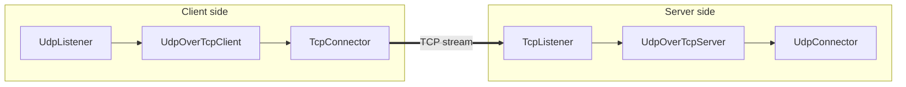

<!--
Documentation version: 152
-->

# UdpOverTcpServer

`UdpOverTcpServer` peer سمت مقابل `UdpOverTcpClient` است. یک byte stream دارای length prefix را از node stream-facing قبلی می‌گیرد، مرز packet‌ها را دوباره پیدا می‌کند و payload هر packet را به node بعدی می‌فرستد.

پاسخ node بعدی هم با همان length prefix دو بایتی frame می‌شود و از طریق stream در جهت downstream برمی‌گردد.

## جایگاه رایج

سمت server:

```text
TcpListener -> UdpOverTcpServer -> UdpConnector
TcpListener -> TlsServer -> UdpOverTcpServer -> UdpConnector
TcpListener -> EncryptionServer -> UdpOverTcpServer -> UdpConnector
```

سمت client متناظر:

```text
UdpListener -> UdpOverTcpClient -> TcpConnector
UdpListener -> UdpOverTcpClient -> TlsClient -> TcpConnector
TcpUdpListener -> Router (UDP branch) -> UdpOverTcpClient -> TcpConnector
```

node قبلی `UdpOverTcpServer` باید یک مسیر stream فراهم کند؛ node بعدی payload‌های بازسازی‌شده packet را دریافت می‌کند.

## نمودار جریان


```mermaid
flowchart LR
    subgraph ClientSide["Client side"]
      direction LR
      UL[UdpListener] --> UOTC[UdpOverTcpClient] --> TC[TcpConnector]
    end

    subgraph ServerSide["Server side"]
      direction LR
      TL[TcpListener] --> UOTS[UdpOverTcpServer] --> UC[UdpConnector]
    end

    TC == "TCP stream" ==> TL
```

## نمونه ساده

```json
[
  {
    "name": "stream-in",
    "type": "TcpListener",
    "settings": {
      "address": "0.0.0.0",
      "port": 443,
      "nodelay": true
    },
    "next": "udp-over-tcp-server"
  },
  {
    "name": "udp-over-tcp-server",
    "type": "UdpOverTcpServer",
    "settings": {},
    "next": "udp-out"
  },
  {
    "name": "udp-out",
    "type": "UdpConnector",
    "settings": {
      "address": "127.0.0.1",
      "port": 51820
    }
  }
]
```

## فیلدهای ضروری

فیلدهای سطح بالا:

| فیلد | نوع | توضیح |
| --- | --- | --- |
| `name` | string | نام دلخواه node. باید داخل فایل config یکتا باشد. |
| `type` | string | باید دقیقاً `"UdpOverTcpServer"` باشد. |
| `next` | string | node‌ای که packet payload‌های بازسازی‌شده را دریافت می‌کند. در استفاده معمول لازم است. |

`settings` می‌تواند `{}` باشد؛ پیاده‌سازی فعلی setting اختصاصی برای این tunnel ندارد.

## تنظیمات اختیاری

در پیاده‌سازی فعلی هیچ setting اختصاصی tunnel وجود ندارد.

رفتار transport، destination، socket، TLS، encryption یا routing مربوط به node‌های همسایه است؛ مثل `TcpListener`، `TlsServer`، `EncryptionServer`، `UdpConnector` یا `TcpUdpConnector`.

## مدل framing {#مدل-framing}

server انتظار دارد frame‌های عادی این قالب را داشته باشند:

```text
2-byte unsigned big-endian payload length + packet payload
```

بایت‌های ورودی از سمت stream قبلی تا کامل شدن یک frame جمع می‌شوند. سپس header دو بایتی حذف می‌شود و packet بازسازی‌شده در جهت upstream به node بعدی می‌رود.

پاسخ‌های node بعدی مسیر برعکس را طی می‌کنند: server یک length دو بایتی به ابتدا اضافه می‌کند و frame حاصل را در جهت downstream به node stream قبلی می‌فرستد.

هر payload callback در سمت datagram دقیقاً یک datagram از نوع UDP است. این nodeها همیشه UDP حمل
می‌کنند و metadata مربوط به source protocol، framing را تغییر نمی‌دهد. listener چندپروتکلی باید ترافیک
TCP را پیش از client به مسیر جداگانه‌ای هدایت کند.

## محدودیت اندازه packet {#محدودیت-اندازه-packet}

حداکثر اندازه datagram خروجی در پیاده‌سازی فعلی:

```text
65535 - 20 - 8 - 2 = 65505 bytes
```

datagram بزرگ‌تر از این حد به‌صورت کامل drop می‌شود. payload خروجی خالی invariant موجود در Debug را
نقض می‌کند و در Release، drop می‌شود. frame ورودی با length صفر نامعتبر است و carrier را می‌بندد.

## Buffering و Overflow

بایت‌های ورودی stream تا کامل شدن frameها نگه داشته می‌شوند. آستانه suffix ناقص read stream:

```text
2 * kMaxAllowedUDPPacketLength = 131010 bytes
```

frameهای کامل پیش از بررسی suffix ناقص پردازش می‌شوند. charge نگهداری buffer حداکثر ۴ MiB است و
پیش از رد ورودی، compaction سودمند امتحان می‌شود. frame نامعتبر، شکست تخصیص یا عبور از محدودیت، carrier
را از طریق owner آن می‌بندد. ورودی reentrant decoder با stream نگهداری‌شده، محدودیت مشترک ۲ MiB بایت
و ۴ MiB charge دارد. بایت‌های دلخواه stream برای ادامهٔ parsing حذف نمی‌شوند.

## رفتار lifecycle {#رفتار-lifecycle}

در upstream `Init`، server framing state خود را مقداردهی می‌کند، protocol مقصد را روی UDP می‌گذارد
و بی‌درنگ node بعدی را مقداردهی می‌کند. Transport Est، Pause و Resume نیز بی‌درنگ عبور می‌کنند.

در upstream payload، بایت‌ها به read stream اضافه می‌شوند و datagramهای کامل در جهت upstream به
node بعدی می‌روند. در downstream payload، هر datagram پاسخ یک length prefix دو بایتی می‌گیرد و
در جهت downstream به سمت stream قبلی می‌رود.

با دریافت `Finish` از هر سمت، state محلی از بین می‌رود و `Finish` در جهت دور شدن از فرستنده ادامه
پیدا می‌کند. این node `lineDestroy()` را فراخوانی نمی‌کند.

`UpStreamEst` و `DownStreamInit` در پیاده‌سازی فعلی غیرفعال‌اند.

## پشتیبانی از splice

هر دو node، buffer عادی و body موجود در pipe خصوصی را می‌پذیرند. هر datagram خروجی، body خود را حفظ
می‌کند، یک length prefix دو بایتی در padding واقعی می‌گیرد و با یک callback تحویل می‌شود. datagram بزرگ‌تر
از حد مجاز به‌صورت کامل drop می‌شود. decoder فقط header دو بایتی length را cache می‌کند و هر datagram
کامل را در یک buffer مستقل تحویل می‌دهد؛ هنگام کمبود منابع pipe، از buffer عادی استفاده می‌شود.

مرز datagramهای UDP حفظ می‌شود و carrier TCP همچنان امکان splice دارد. fallback لازم برای ارسال UDP
در خود UDP sender انجام می‌شود. frameهای کامل ورودی پذیرفته‌شده پس از Pause هم پردازش می‌شوند؛
Finish یا رد پذیرش پردازش را متوقف می‌کند.

## padding {#padding}

این node هنگام ساخت پاسخ با `sbufShiftLeft()` یک header دو بایتی به ابتدای frame اضافه می‌کند، بنابراین مقدار زیر را اعلام می‌کند:

```text
required_padding_left = 2
```

## اشتباه‌های رایج

- بدون `UdpOverTcpClient` در سمت مقابل از این node استفاده نکنید.
- آن را مستقیماً بعد از node packet-only نگذارید؛ سمت قبلی باید stream بایت‌های frameشده فراهم کند.
- انتظار نداشته باشید خودش TCP listen کند؛ قبل از آن `TcpListener` یا adapter stream-facing دیگری بگذارید.
- سمت بعدی باید مرز datagramهای UDP را حفظ کند و مقصد UDP داشته باشد.
- datagram UDP بزرگ‌تر از `65505` بایت نفرستید.

## متادیتای node {#متادیتای-نود}

متادیتای برگرفته از کد منبع:

| ویژگی | مقدار |
| --- | --- |
| node flags | `kNodeFlagSupportsSplice` |
| `can_have_prev` | `true` |
| `can_have_next` | `true` |
| `layer_group` | `kNodeLayer4` |
| `layer_group_prev_node` | `kNodeLayer4` |
| `layer_group_next_node` | `kNodeLayer4` |
| `required_padding_left` | `2` بایت |
