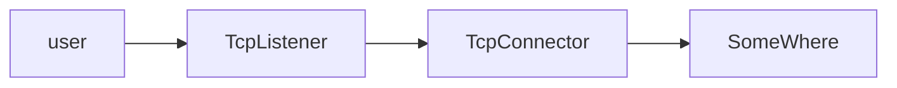
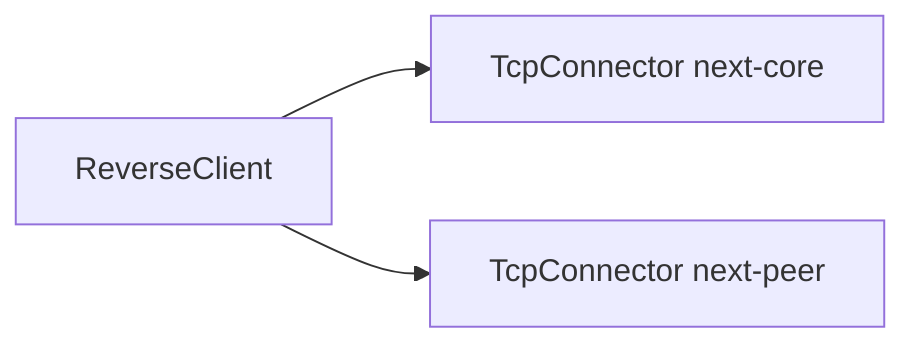
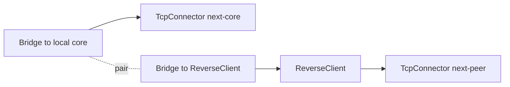
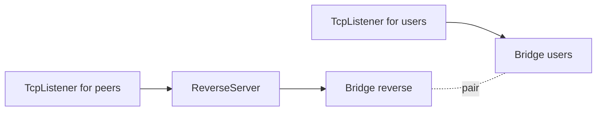
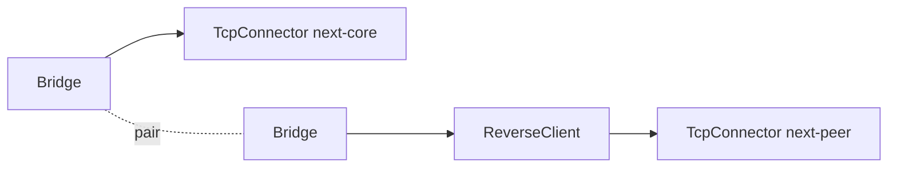
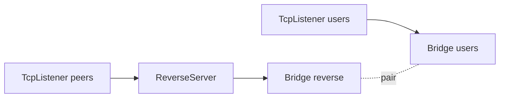

# Bridge

## معرفی کلی

| ویژگی | مقدار | توضیح |
| --- | --- | --- |
| نوع نود | Tunnel چندجهته | جهت اصلی این نود با جهت داده و جایگاه آن در زنجیره مشخص می‌شود. |
| لایه شبکه | تمام لایه‌ها | خودش payload را parse یا تبدیل نمی‌کند و callbackها را relay می‌کند. |
| جهت پشتیبانی | دوطرفه | داده‌ای که وارد یک Bridge می‌شود از Bridge جفت در جهت مخالف خارج می‌شود. |
| موقعیت در زنجیره | ابتدا یا انتهای یک شاخه | معمولاً برای اتصال دو شاخه جدا در یک config استفاده می‌شود. |
| وابستگی | وابسته به جفت و همسایه‌ها | بدون Bridge جفت و چیدمان درست همسایه‌ها کاربردی ندارد. |

`Bridge` دو نقطه جدا در یک کانفیگ WaterWall را به هم وصل می‌کند. این نود
payload را تغییر نمی‌دهد، socket باز نمی‌کند و protocol جدیدی اضافه نمی‌کند؛
فقط callbackهای line مثل `Init`، `Payload`، `Finish`، `Pause` و `Resume` را بین
دو Bridge جفت‌شده، اما در جهت مخالف، عبور می‌دهد.

## چرا Bridge ساخته شد

در زمان نگارش مستند اولیه، این نود عملاً برای ساخت تونل معکوس
(`ReverseClient` / `ReverseServer`) طراحی شد و هنوز هم رایج‌ترین کاربرد آن
همین است.

در اغلب نودهای لایه انتقال WaterWall، جهت حرکت «چپ به راست» است؛ یعنی اتصال
از ابتدای زنجیره شروع می‌شود و با `next` به سمت جلو می‌رود.

ساده‌ترین نمونه، port forwarding است:



برای ساخت reverse tunnel دو مشکل اصلی وجود داشت:

- در سمت `ReverseClient` معمولاً Listener نداریم؛ این نود باید خودش اتصال‌های
  آماده به سمت `ReverseServer` ایجاد کند.
- یک `ReverseClient` عملاً به دو مسیر نیاز دارد: مسیر peer و مسیر مقصد محلی
  مثل xray-core. اما مدل عادی WaterWall برای هر node فقط یک `next` دارد.

### ایده اول: دو next برای ReverseClient

یک ایده این بود که `ReverseClient` دو مسیر داخلی داشته باشد:

```json
{
  "name": "reverse_client",
  "type": "ReverseClient",
  "settings": {
    "next-core": "local_core_path",
    "next-peer": "remote_peer_path"
  }
}
```



این طرح کنار گذاشته شد، چون `ReverseClient` را به یک node خاص با مدل chain
اختصاصی تبدیل می‌کرد و از مدل استاندارد `next` دور می‌شد.

### ایده پذیرفته‌شده: Bridge

در طراحی نهایی، `next` خود `ReverseClient` برای مسیر peer استفاده می‌شود؛ یعنی
مسیری که در نهایت به `ReverseServer` می‌رسد:

```json
{
  "name": "reverse_client",
  "type": "ReverseClient",
  "settings": {},
  "next": "next_peer_node"
}
```

اما مسیر مقصد محلی، مثلاً xray-core، باید از «پشت» `ReverseClient` وصل شود.
این کار با یک جفت Bridge انجام می‌شود:



به این ترتیب، هر داده‌ای که وارد یک Bridge شود انگار وارد Bridge جفتش شده است،
اما از جهت مخالف خارج می‌شود. این همان چیزی است که برای reverse tunnel نیاز
داشتیم، بدون اینکه مدل تک-`next` در WaterWall شکسته شود.

در سمت `ReverseServer` هم همین ایده استفاده می‌شود:



## راهنمای پیکربندی

دو Bridge باید به شکل جفت تنظیم شوند:

```json
{
  "name": "bridge1",
  "type": "Bridge",
  "settings": {
    "pair": "bridge2"
  },
  "next": "next_node_name"
}
```

```json
{
  "name": "bridge2",
  "type": "Bridge",
  "settings": {
    "pair": "bridge1"
  },
  "next": "another_next_node"
}
```

فیلد `next` از نظر JSON همیشه اجباری نیست، چون یک Bridge ممکن است در ابتدا یا
انتهای یک شاخه قرار بگیرد. اما چیدمان باید طوری باشد که سمتی که Bridge می‌خواهد
از آن خارج شود واقعاً همسایه داشته باشد.

## تنظیمات

| گزینه | نوع | توضیح |
| --- | --- | --- |
| `pair` | string | نام Bridge جفت در همان config. این مقدار اجباری است. |

اگر `pair` وجود نداشته باشد یا node با آن نام پیدا نشود، startup شکست می‌خورد.
برای رفتار قابل پیش‌بینی، دو Bridge را به صورت متقابل pair کنید:

```text
bridge1.settings.pair = bridge2
bridge2.settings.pair = bridge1
```

## رفتار جهت‌ها

Bridge داده را transform نمی‌کند؛ فقط جهت callback را برعکس می‌کند:

| رویداد ورودی به Bridge فعلی | فراخوانی روی Bridge جفت | خروج از Bridge جفت |
| --- | --- | --- |
| upstream `Init` / `Est` / `Payload` / `Finish` / `Pause` / `Resume` | `tunnelPrevDownStream*` | سمت previous جفت |
| downstream `Init` / `Est` / `Payload` / `Finish` / `Pause` / `Resume` | `tunnelNextUpStream*` | سمت next جفت |

به همین دلیل Bridge شبیه آینه عمل می‌کند: مسیر را به Bridge جفت می‌فرستد و جهت
WaterWall را برعکس می‌کند.

## مثال کامل برای ReverseClient



```json
{
  "name": "outbound_to_core",
  "type": "TcpConnector",
  "settings": {
    "nodelay": true,
    "address": "127.0.0.1",
    "port": 443
  }
}
```

```json
{
  "name": "bridge1",
  "type": "Bridge",
  "settings": {
    "pair": "bridge2"
  },
  "next": "outbound_to_core"
}
```

```json
{
  "name": "bridge2",
  "type": "Bridge",
  "settings": {
    "pair": "bridge1"
  },
  "next": "reverse_client"
}
```

```json
{
  "name": "reverse_client",
  "type": "ReverseClient",
  "settings": {
    "minimum-unused": 4
  },
  "next": "outbound_to_peer"
}
```

```json
{
  "name": "outbound_to_peer",
  "type": "TcpConnector",
  "settings": {
    "nodelay": true,
    "address": "1.1.1.1",
    "port": 443
  }
}
```

در این ساختار، `next` خود `ReverseClient` مسیر peer است و مسیر core/local از
طریق Bridge جفت‌شده وصل می‌شود.

## مثال کامل برای ReverseServer



```json
{
  "name": "users_inbound",
  "type": "TcpListener",
  "settings": {
    "address": "0.0.0.0",
    "port": 443,
    "nodelay": true
  },
  "next": "bridge_users"
}
```

```json
{
  "name": "bridge_users",
  "type": "Bridge",
  "settings": {
    "pair": "bridge_reverse"
  }
}
```

```json
{
  "name": "bridge_reverse",
  "type": "Bridge",
  "settings": {
    "pair": "bridge_users"
  }
}
```

```json
{
  "name": "reverse_server",
  "type": "ReverseServer",
  "settings": {},
  "next": "bridge_reverse"
}
```

```json
{
  "name": "peers_inbound",
  "type": "TcpListener",
  "settings": {
    "address": "0.0.0.0",
    "port": 8443,
    "nodelay": true,
    "whitelist": ["1.1.1.1/32"]
  },
  "next": "reverse_server"
}
```

در این مثال بهتر است Listener مربوط به peer با `whitelist` یا لایه امنیتی
معادل محدود شود. در سناریوی واقعی معمولاً TLS، mux، router یا لایه‌های دیگر هم
به این مسیر اضافه می‌شوند.

## نکته‌ها

- `Bridge` نود adapter نیست و به address یا port وصل نمی‌شود.
- payload را frame، prepend، encrypt، decode یا rewrite نمی‌کند.
- `required_padding_left` آن `0` است.
- packet/stream converter نیست؛ فقط callbackهای WaterWall را بین دو نقطه relay
  می‌کند.
- بدون pair و چیدمان درست شاخه‌ها، Bridge رفتار مفیدی ندارد.
