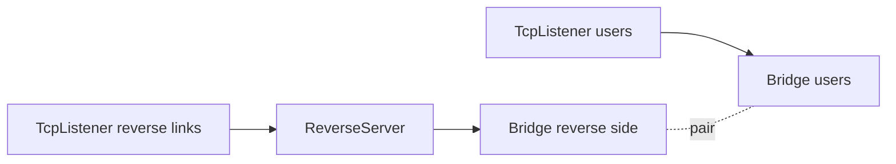
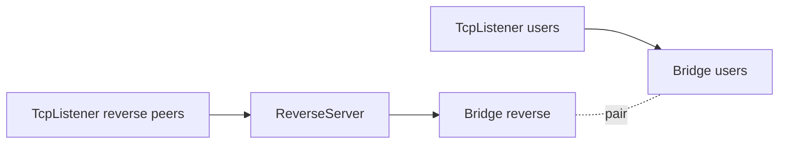

# ReverseServer

`ReverseServer` سمت server برای `ReverseClient` است. این نود از یک سمت
connectionهای reverse آماده را از `ReverseClient` می‌گیرد، و از سمت دیگر
connectionهای واقعی user/local را دریافت می‌کند. سپس یک half از هر سمت را با
هم pair می‌کند تا ترافیک از تونل reverse عبور کند.

این نود معمولاً روی ماشینی قرار می‌گیرد که reachable است و می‌تواند هم
connectionهای peer و هم connectionهای user/local را دریافت کند.

## چرا معمولاً Bridge لازم است

`ReverseServer` باید دو منبع connection را به هم وصل کند:

- reverse linkهایی که از `ReverseClient` آمده‌اند
- connectionهای واقعی user/local که باید از آن reverse linkها استفاده کنند

در configهای رایج این دو مسیر با یک جفت `Bridge` وصل می‌شوند:



listener مربوط به peers مسیر reverse linkها را به `ReverseServer` می‌دهد.
listener مربوط به users ترافیک واقعی را به Bridge جفت‌شده می‌دهد. سپس
`ReverseServer` یک reverse half و یک local/user half را pair می‌کند.

این نکته مهم است: `ReverseServer` یک tunnel ساده چپ به راست نیست؛ یک matcher
دینامیک بین دو نوع connection است.

## عملکرد

- reverse linkهای آمده از `ReverseClient` را می‌پذیرد.
- handshake داخلی reverse link را validate می‌کند.
- connectionهای local/user را از سمت دیگر topology می‌پذیرد.
- تا زمان پیدا شدن peer، مقدار محدودی داده را buffer می‌کند.
- یک reverse half و یک local/user half را pair می‌کند.
- payload، finish، pause و resume را بین دو سمت paired عبور می‌دهد.
- handshakeهای نامعتبر را drop می‌کند.
- اگر داده buffer شده زیاد شود، half منتظر را drop می‌کند.
- برای pair شدن بین workerها می‌تواند reverse half را از مسیر pipe داخلی به
  worker دیگر منتقل کند.

## نمونه topology



روی listener مربوط به reverse peers معمولاً whitelist می‌گذاریم تا فقط ماشین
`ReverseClient` بتواند reverse link باز کند.

## نمونه تنظیم

```json
{
  "name": "reverse-server",
  "type": "ReverseServer",
  "settings": {
    "reverse-secret-length": 640,
    "reverse-secret": "shared-secret"
  },
  "next": "bridge_reverse"
}
```

نمونه ساده:

```json
{
  "name": "users_inbound",
  "type": "TcpListener",
  "settings": {
    "address": "0.0.0.0",
    "port": 443,
    "nodelay": true
  },
  "next": "bridge_users"
}
```

```json
{
  "name": "bridge_users",
  "type": "Bridge",
  "settings": {
    "pair": "bridge_reverse"
  }
}
```

```json
{
  "name": "bridge_reverse",
  "type": "Bridge",
  "settings": {
    "pair": "bridge_users"
  }
}
```

```json
{
  "name": "reverse_server",
  "type": "ReverseServer",
  "settings": {},
  "next": "bridge_reverse"
}
```

```json
{
  "name": "reverse_peer_inbound",
  "type": "TcpListener",
  "settings": {
    "address": "0.0.0.0",
    "port": 8443,
    "nodelay": true,
    "whitelist": [
      "203.0.113.10/32"
    ]
  },
  "next": "reverse_server"
}
```

## تنظیمات

| گزینه | نوع | پیش‌فرض | توضیح |
| --- | --- | --- | --- |
| `reverse-secret-length` | integer | `640` | طول handshake داخلی. باید در بازه `1..1024` باشد. |
| `reverse-secret` | ASCII string | unset | byteهای handshake مورد انتظار را با secret به صورت تکرارشونده XOR می‌کند. |

`ReverseServer` و `ReverseClient` باید مقدارهای یکسانی برای این گزینه‌ها داشته
باشند.

## مدل Pairing

`ReverseServer` برای هر worker دو لیست انتظار نگه می‌دارد:

| half منتظر | معنی |
| --- | --- |
| reverse-link half | connection آمده از `ReverseClient` که handshake را پاس کرده است. |
| local/user half | connection واقعی که منتظر reverse link است. |

وقتی reverse-link half payload بدهد، اول handshake بررسی می‌شود. اگر درست بود،
handshake حذف می‌شود و باقی payload تا زمان pair شدن نگه داشته می‌شود.

وقتی local/user half payload بدهد، اگر reverse-link آماده وجود داشته باشد pair
می‌شود؛ در غیر این صورت payload آن موقتاً buffer می‌شود.

بعد از pair شدن:

| سمت ورودی | رفتار |
| --- | --- |
| reverse-link payload | به سمت local/user با upstream payload فرستاده می‌شود. |
| local/user payload | به سمت reverse-link با downstream payload فرستاده می‌شود. |
| finish | سمت مقابل هم بسته می‌شود. |
| pause/resume | فقط بعد از pair شدن به سمت مقابل reflect می‌شود. |

## محدودیت Buffer

هر half که هنوز pair نشده است می‌تواند مقدار محدودی داده buffer کند:

```text
65535 bytes per waiting half
```

اگر این مقدار بیشتر شود، آن half drop می‌شود.

## نکته‌های lifecycle

- روی upstream init، reverse-link half ساخته می‌شود و فوراً downstream
  establishment به previous side گزارش می‌شود.
- روی downstream init، local/user half ساخته می‌شود و فوراً upstream
  establishment به next side گزارش می‌شود.
- این establishment یعنی half توسط `ReverseServer` پذیرفته شده، نه اینکه
  tunnel حتماً pair و آماده forwarding شده باشد.
- `Pause` و `Resume` قبل از pair شدن forward نمی‌شوند.
- `required_padding_left = 0` است؛ این نود بعد از handshake header جدید prepend
  نمی‌کند.
