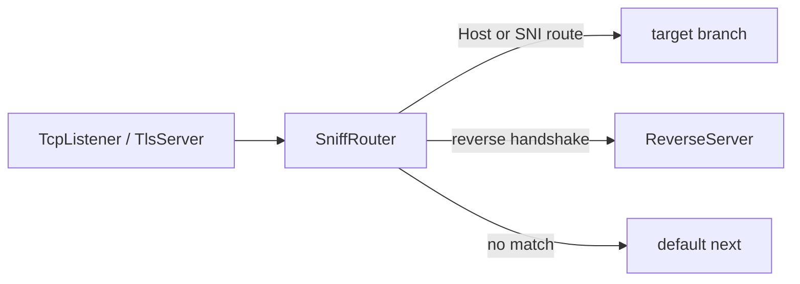

# SniffRouter

`SniffRouter` یک content router لایه ۴ است. این نود اولین upstream payload هر
connection را می‌بیند، از روی byteهای قابل مشاهده تصمیم می‌گیرد و کل connection
را به اولین route مناسب می‌فرستد.

این نود از `Router` ساده‌تر و تخصصی‌تر است. اگر فقط routing بر اساس HTTP/1
Host، TLS ClientHello SNI یا handshake داخلی `ReverseClient`/`ReverseServer`
می‌خواهید، `SniffRouter` گزینه خوبی است. اگر source IP، port، GeoIP، GeoSite،
username/password یا conditionهای ترکیبی می‌خواهید، از `Router` استفاده کنید.

## مدل ذهنی

- upstream `Init` فوراً به branchها forward نمی‌شود.
- نود منتظر اولین upstream payload می‌ماند.
- payload اول موقتاً buffer می‌شود.
- routeها به ترتیب JSON بررسی می‌شوند.
- اولین route که match شود برنده است.
- اگر هیچ routeای match نشود، مسیر top-level `next` استفاده می‌شود.
- branch انتخاب‌شده initialize می‌شود و byteهای buffer شده به همان branch
  replay می‌شوند.
- payloadهای بعدی دیگر دوباره classify نمی‌شوند.



:::warning
`SniffRouter` برای انتخاب مسیر به byteهای سمت client نیاز دارد. اگر protocol
از نوع server-first باشد، تا وقتی upstream payload نرسد branch انتخاب نمی‌شود.
:::

## جایگاه رایج

بعد از TLS termination برای HTTP Host:

```text
TcpListener -> TlsServer -> SniffRouter
                              |-- host a.example.com -> backend_a
                              |-- host b.example.com -> backend_b
                              `-- default next       -> camouflage_site
```

قبل از TLS termination برای SNI:

```text
TcpListener -> SniffRouter
                 |-- SNI a.example.com -> tls_site_a
                 |-- SNI b.example.com -> tls_site_b
                 `-- default next      -> default_tls_site
```

برای جدا کردن reverse tunnel از سایت camouflage بعد از decrypt شدن stream:

```text
TcpListener -> TlsServer -> SniffRouter
                              |-- reverse handshake -> ReverseServer
                              `-- default next      -> TcpConnector nginx
```

reverse detection باید handshake را به صورت decrypted ببیند. اگر SniffRouter
قبل از TLS termination باشد، handshake رمز شده است و match نمی‌شود.

## نمونه تنظیم

HTTP Host routing:

```json
{
  "name": "sniff-router",
  "type": "SniffRouter",
  "settings": {
    "routes": [
      {
        "domains": [
          "a.example.com",
          "b.example.com"
        ],
        "next": "example_backend"
      },
      {
        "domains": [
          "*.static.example.com"
        ],
        "next": "static_backend"
      }
    ]
  },
  "next": "default_backend"
}
```

TLS SNI routing:

```json
{
  "name": "sniff-router",
  "type": "SniffRouter",
  "settings": {
    "routes": [
      {
        "detection": "tls",
        "domains": [
          "site-a.example.com"
        ],
        "next": "tls_site_a"
      }
    ]
  },
  "next": "default_tls_site"
}
```

## فیلدهای اصلی

| فیلد | نوع | توضیح |
| --- | --- | --- |
| `name` | string | نام نود. |
| `type` | string | باید دقیقاً `"SniffRouter"` باشد. |
| `next` | string | اجباری؛ مسیر fallback وقتی هیچ routeای match نشود. |

`settings` می‌تواند حذف یا خالی باشد. بدون route، همه connectionها به `next`
می‌روند.

## تنظیمات

| گزینه | نوع | پیش‌فرض | توضیح |
| --- | --- | --- | --- |
| `routes` | array | unset | لیست routeها به ترتیب priority. اگر وجود داشته باشد باید array غیرخالی باشد. |
| `reverse-secret-length` | integer | `640` | طول handshake برای reverse detection. بازه معتبر `1..1024`. |
| `reverse-secret` | ASCII string | unset | secret برای ساخت signature reverse handshake. باید با Reverse nodes یکی باشد. |

## Route Object

| فیلد | نوع | ضروری | توضیح |
| --- | --- | --- | --- |
| `domains` | string یا array | برای `http1` و `tls` ضروری | domain patternها. |
| `domain` | string | نه | alias برای یک domain. با `domains` همزمان استفاده نشود. |
| `detection` | string یا array | نه | پیش‌فرض `http1`. |
| `next` | string | بله | target node برای route. |
| `target` | string | نه | alias برای route `next`. |

مقدارهای `detection`:

| مقدار | معنی |
| --- | --- |
| `http1` | خواندن HTTP/1 Host. |
| `tls` | خواندن TLS ClientHello SNI. |
| `reverse` | تشخیص reverse-link handshake. |
| `reverse-tls` | alias برای `reverse`. |
| `reverse-handshake` | alias برای `reverse`. |

مقدارهای حذف‌شده:

| مقدار قدیمی | مقدار جدید |
| --- | --- |
| `http` | `http1` |
| `client-hello` | `tls` |
| `tls-client-hello` | `tls` |

اگر route شامل `reverse` باشد، reverse match به `domains` نگاه نمی‌کند. اگر
همزمان `http1` یا `tls` هم در همان route باشد، برای آن detectionهای domain-based
همچنان `domains` لازم است.

## ترتیب Routeها

routeها به ترتیب JSON بررسی می‌شوند و اولین match برنده است. routeهای خاص را
قبل از wildcardها قرار دهید.

```json
{
  "routes": [
    {
      "domain": "api.example.com",
      "next": "api_backend"
    },
    {
      "domain": "*.example.com",
      "next": "wildcard_backend"
    }
  ]
}
```

## Domain Matching

matching دامنه case-insensitive است. الگوهای config lowercase می‌شوند و نقطه
انتهایی حذف می‌شود.

| pattern | معنی |
| --- | --- |
| `example.com` | match دقیق. |
| `*.example.com` | subdomainها را match می‌کند، اما خود `example.com` را نه. |
| `*` | هر Host/SNI غیرخالی. |

الگوهای نامعتبر:

- رشته خالی
- `*.` بدون suffix
- wildcardهایی غیر از فرم `*.example.com`
- URL مثل `https://example.com`
- host:port مثل `example.com:443`
- مقدارهای شامل `/` یا `\`

اگر HTTP Host روی wire پورت داشته باشد، sniffer پورت را قبل از matching حذف
می‌کند؛ مثلاً `example.com:443` با `example.com` match می‌شود.

## HTTP Host Detection

پیش‌فرض routeها `http1` است:

```json
{
  "domains": [
    "app.example.com"
  ],
  "next": "app_backend"
}
```

برای HTTPS معمولاً SniffRouter را بعد از `TlsServer` می‌گذاریم:

```text
TcpListener -> TlsServer -> SniffRouter
```

HTTP/2 cleartext preface، HTTP/1 Host ندارد؛ بنابراین اگر detection دیگری match
نشود، به `next` می‌رود.

## TLS SNI Detection

برای SNI:

```json
{
  "detection": "tls",
  "domains": [
    "*.example.com"
  ],
  "next": "tls_branch"
}
```

این حالت معمولاً قبل از TLS termination استفاده می‌شود:

```text
TcpListener -> SniffRouter -> TlsServer
```

اگر SNI پیدا نشود یا با routeها match نشود، مسیر fallback یعنی top-level `next`
استفاده می‌شود.

## Reverse Detection

`reverse` handshake داخلی `ReverseClient`/`ReverseServer` را تشخیص می‌دهد:

```json
{
  "name": "sniff-router",
  "type": "SniffRouter",
  "settings": {
    "routes": [
      {
        "detection": "reverse",
        "next": "reverse_server"
      }
    ]
  },
  "next": "tcp_to_nginx"
}
```

این برای حالتی مفید است که یک TLS entrypoint هم reverse tunnel و هم سایت
camouflage را با یک SNI مشترک حمل می‌کند. Host/SNI routing نمی‌تواند این دو را
جدا کند، اما reverse link بعد از decrypt شدن یک signature مشخص دارد.

signature پیش‌فرض:

```text
640 bytes of 0xFF
```

اگر `reverse-secret-length` یا `reverse-secret` تنظیم شود، SniffRouter همان
الگوریتم `ReverseClient` و `ReverseServer` را استفاده می‌کند: byteهای handshake
پیش‌فرض تکرار می‌شوند و با byteهای ASCII مربوط به `reverse-secret` به صورت
تکرارشونده XOR می‌شوند.

نکته‌های مهم:

- handshake باید دقیقاً ابتدای decrypted stream باشد.
- SniffRouter فقط peek می‌کند و byteها را دست‌نخورده به `ReverseServer` replay
  می‌کند.
- `ReverseServer` دوباره handshake را validate و strip می‌کند.
- reverse route به `domains` نگاه نمی‌کند.
- اگر payload اول فقط prefix handshake باشد، SniffRouter منتظر payload بعدی
  نمی‌ماند و مستقیم مسیر default `next` را انتخاب می‌کند.
- اگر proxy جلویی PROXY protocol header اضافه می‌کند، باید قبل از SniffRouter
  حذف شود.

## بافر Payload اول

برای HTTP Host و TLS SNI، SniffRouter می‌تواند تا کامل شدن request یا
ClientHello مقدار بیشتری byte بخواهد. پنجره sniffing محدود است:

```text
8192 bytes
```

بعد از انتخاب route، payloadهای بعدی دیگر classify نمی‌شوند.

## Target Branchها

`next` یا `target` داخل هر route نام یک node واقعی در همان config است.
SniffRouter در زمان ساخت chain، targetها را وارد chain خودش می‌کند تا:

- targetها line state داشته باشند.
- downstream traffic از branchها دوباره از SniffRouter برگردد.
- lifecycle chain حفظ شود.

target نباید خود SniffRouter باشد و نباید قبلاً به previous ناسازگار وصل شده
باشد.

## Lifecycle

| callback | رفتار |
| --- | --- |
| upstream `Init` | فقط state داخلی SniffRouter را initialize می‌کند. |
| اولین upstream `Payload` | buffer، classify، initialize target/default و replay. |
| payloadهای بعدی | مستقیم به target یا default می‌روند. |
| upstream `Pause` / `Resume` | فقط بعد از انتخاب route forward می‌شوند. |
| upstream `Est` | فقط به default branch forward می‌شود. |
| upstream `Finish` | state داخلی را destroy می‌کند و branch انتخاب‌شده را finish می‌کند. |
| downstream callbacks | به previous node برمی‌گردند. |

## SniffRouter یا Router؟

از `SniffRouter` استفاده کنید اگر فقط این‌ها را لازم دارید:

- HTTP Host routing
- TLS SNI routing
- reverse handshake detection

از `Router` استفاده کنید اگر این‌ها را می‌خواهید:

- source/destination IP یا port
- GeoIP یا GeoSite
- username/password
- conditionهای ترکیبی با AND
- routing بر اساس metadataهای بیشتر

## Metadata نود

| ویژگی | مقدار |
| --- | --- |
| node flags | `kNodeFlagChainHead | kNodeFlagChainEnd` |
| `can_have_prev` | `true` |
| `can_have_next` | `true` |
| `layer_group` | `kNodeLayer4` |
| `layer_group_prev_node` | `kNodeLayerAnything` |
| `layer_group_next_node` | `kNodeLayerAnything` |
| `required_padding_left` | `0` bytes |

`SniffRouter` header جدید prepend نمی‌کند و به left padding نیاز ندارد.
